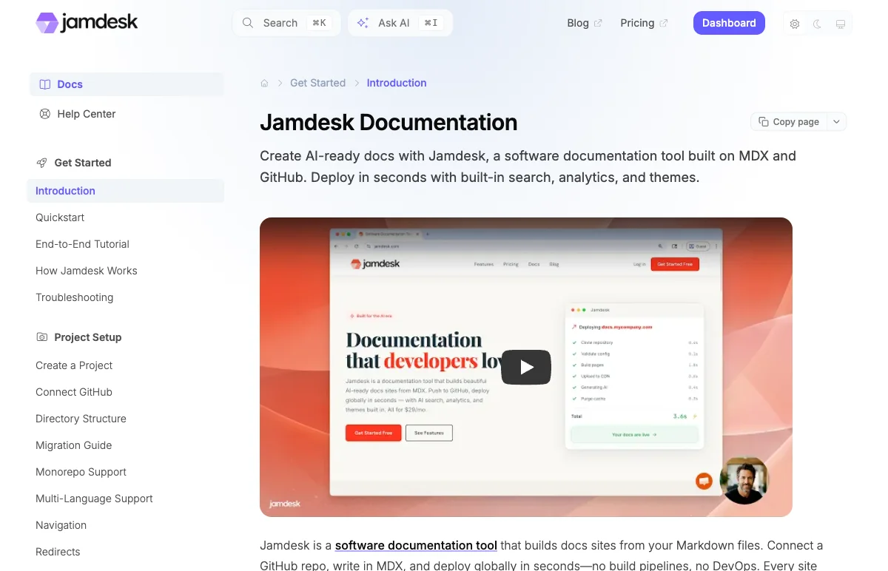

<p align="center">
  <a href="https://www.jamdesk.com">
    <picture>
      <source media="(prefers-color-scheme: dark)" srcset="images/logo-dark.webp">
      <source media="(prefers-color-scheme: light)" srcset="images/logo-light.webp">
      
    </picture>
  </a>
</p>

<p align="center">
  <a href="https://www.jamdesk.com/docs"></a>
  <a href="https://www.npmjs.com/package/jamdesk"></a>
  <a href="LICENSE"></a>
</p>

# Jamdesk Documentation

Source files for the [Jamdesk documentation](https://www.jamdesk.com/docs) site. This repo contains the MDX content, not the Jamdesk platform source code. It also serves as a working example of a Jamdesk project: the same `docs.json` + `.mdx` files structure that any Jamdesk user would create.

[Jamdesk](https://www.jamdesk.com) is a documentation platform that builds docs sites from MDX files in a GitHub repo. Push and your site deploys to a global CDN. It supports OpenAPI specs, AI chat (RAG + Claude), MCP server integration, automatic `llms.txt` generation, built-in analytics, and custom domains.

<p align="center">
  <a href="https://www.jamdesk.com/docs">
    
  </a>
</p>

## Repo Structure

```
jamdesk-docs/
├── docs.json              # Site config (navigation, theme, colors, redirects)
├── introduction.mdx       # Homepage
├── quickstart.mdx         # Getting started guide
├── ai/                    # AI features (chat, MCP, llms.txt, Claude Code, Cursor)
├── api-reference/         # OpenAPI example pages
├── builds/                # Build system docs
├── cli/                   # CLI documentation
├── components/            # 22 MDX component reference pages
├── content/               # Writing guides (MDX, code blocks, frontmatter, SEO)
├── customization/         # Theming, branding, custom CSS/JS
├── deploy/                # Deployment (custom domains, Vercel, Cloudflare, AWS)
├── development/           # Local preview, VS Code extension
├── help/                  # Help Center (account, billing, troubleshooting)
├── integrations/          # GitHub, Google Analytics, Plausible, Slack
├── images/                # Logos and screenshots
├── openapi/               # OpenAPI spec files
└── setup/                 # Project configuration and analytics
```

## Local Development

This repo is content only. To preview locally, install the [Jamdesk CLI](https://www.jamdesk.com/docs/cli/overview):

```bash
npm install -g jamdesk
jamdesk dev
```

The dev server starts at `http://localhost:3000` with hot reload.

## Contributing

Contributions are welcome: typo fixes, clarifications, new examples, or missing docs.

**Quick edits:** Click the pencil icon on any file in GitHub to edit directly. Changes auto-deploy when merged.

**Larger changes:**

1. Fork this repo
2. Create a branch (`git checkout -b fix/typo-in-quickstart`)
3. Edit the `.mdx` files (every page needs `title` and `description` frontmatter)
4. Preview locally with `jamdesk dev` (optional)
5. Submit a pull request

**Found an issue?** [Open an issue](https://github.com/jamdesk/jamdesk-docs/issues) to report inaccuracies, request new content, or suggest improvements.

### Writing Guidelines

- Start with **why**, then show **how**; include working examples
- Use MDX components: `<Steps>`, `<Tabs>`, `<Card>`, `<Callout>`, `<Accordion>`, `<Code>`
- Link related pages at the bottom with "What's Next?" cards
- Page paths in `docs.json` navigation omit the `.mdx` extension

### Adding a Page

1. Create an `.mdx` file in the appropriate directory
2. Add `title` and `description` frontmatter
3. Add the page path to `docs.json` under the correct navigation group

## Configuration

All site configuration lives in [`docs.json`](docs.json): navigation structure, theme, colors, API settings, redirects, and integrations. The schema is published at [`jamdesk.com/docs.json`](https://www.jamdesk.com/docs.json) and can be referenced with `"$schema": "https://www.jamdesk.com/docs.json"` for editor autocompletion. See the [docs.json reference](https://www.jamdesk.com/docs/reference/docs-json-reference) for full documentation.

## Links

- [Jamdesk website](https://www.jamdesk.com)
- [Documentation](https://www.jamdesk.com/docs)
- [Dashboard](https://dashboard.jamdesk.com)
- [CLI on npm](https://www.npmjs.com/package/jamdesk)
- [GitHub](https://github.com/jamdesk)
- [@JamdeskHQ on X](https://x.com/JamdeskHQ)
- [LinkedIn](https://www.linkedin.com/company/jamdesk)

## License

This project is licensed under the [Apache License 2.0](LICENSE).
