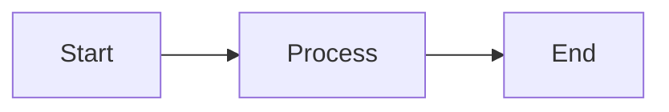
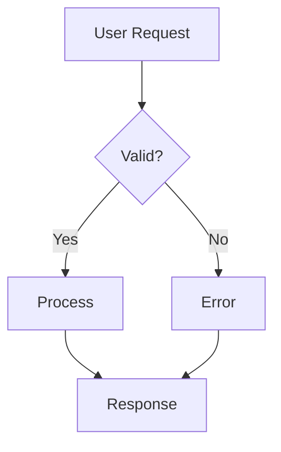
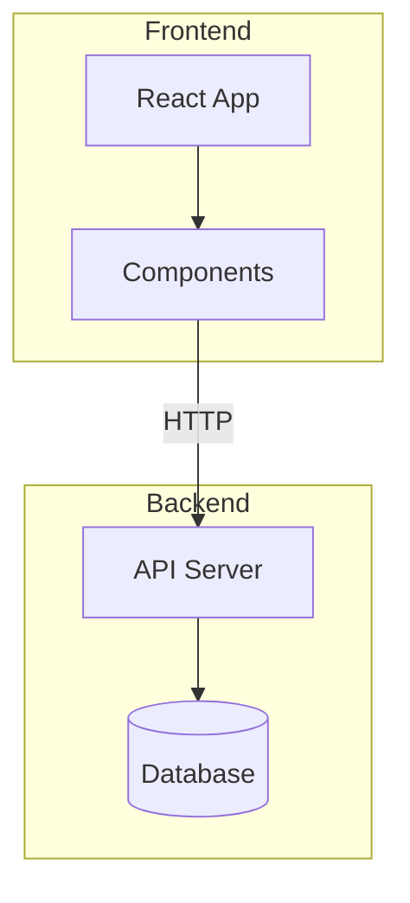
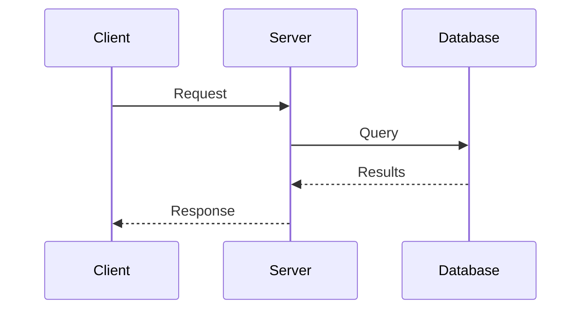
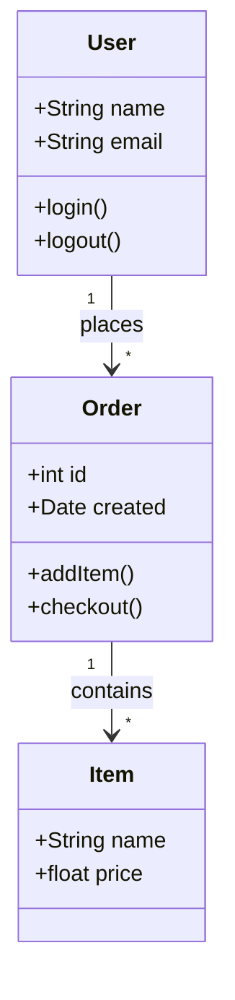
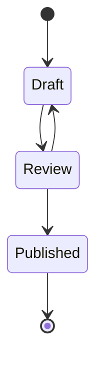
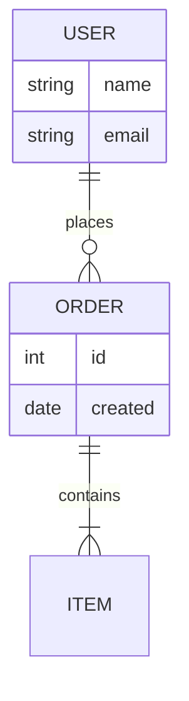
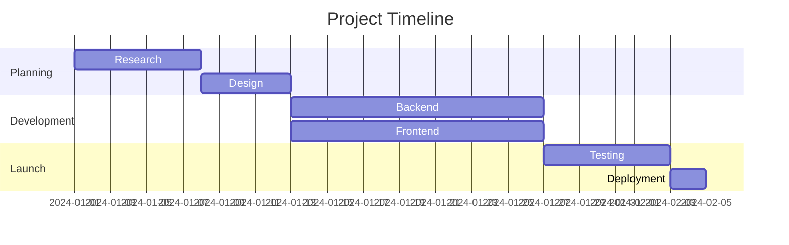
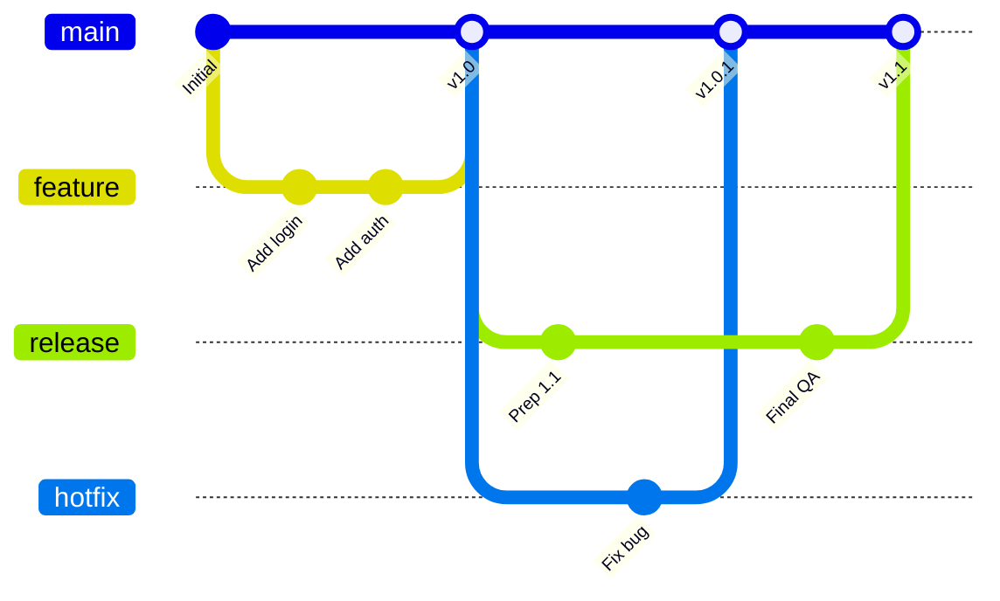
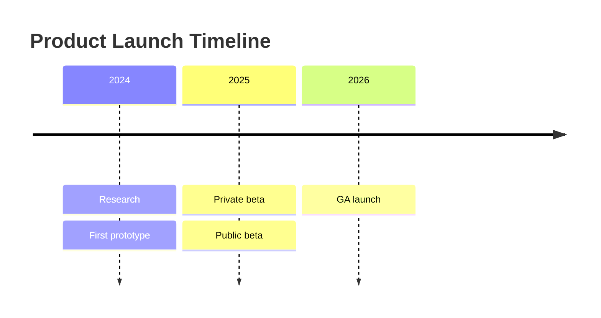

在围栏代码块中以文本形式编写图表。Jamdesk 会在构建时将其渲染为 SVG。

<Tip>
  在 [Jamdesk Mermaid 编辑器](https://jamdesk.com/utilities/mermaid-editor) 中起草并预览图表。
  这是一个开源的基于浏览器的编辑器和查看器。编写 Mermaid 语法，实时查看渲染结果，然后将其粘贴到此处的
  `mermaid` 围栏代码块中。
</Tip>

<Tip>
  Jamdesk 还支持在 `d2` 围栏代码块中使用 [D2 图表](/cn/components/d2)。
  如果图表需要嵌套容器、包含主键和外键的 SQL 架构，或者你想切换布局引擎，可以使用 D2。
  本页面中的 Mermaid 示例在 [D2 页面](/cn/components/d2)上都有对应版本。
</Tip>

## 基本用法

使用带有 `mermaid` 语言标识符的围栏代码块：

````mdx

````


## 图表类型

### 流程图

方向可以是从上到下（`TD`）、从左到右（`LR`）、从下到上（`BT`）或从右到左（`RL`）。



````mdx

````

#### 子图

使用子图将相关节点组合在一起。这有助于将复杂流程图组织为逻辑部分，例如“前端”和“后端”，或流水线的不同阶段。



````mdx

````

### 时序图

时序图展示组件如何随时间交互。API 调用流程和身份验证握手适合使用时序图表示。参与者以垂直生命线显示，消息在参与者之间流动。



````mdx

````

### 类图

类图表示面向对象系统的结构，例如数据模型或服务的核心类型。类图会显示类及其属性、方法，以及类之间的关系。



````mdx

````

### 状态图

状态图用于建模对象或流程的生命周期。它展示所有可能的状态及其之间的转换。订单状态和文档审批流程是典型示例。



````mdx

````

### 实体关系图

ER 图用于记录数据库架构和数据模型，展示实体（表）、实体属性（列）及其关系。符号表示基数：一对一、一对多或多对多。



````mdx

````

### 甘特图

甘特图用于可视化项目计划和时间线。任务以横跨时间线的水平条显示，展示持续时间、依赖关系和并行工作。项目计划或路线图非常适合使用甘特图表示。



````mdx

````

### Git 图

Git 图用于可视化分支策略和版本控制流程。它们展示提交、分支、合并以及仓库的整体历史。每个分支都使用不同颜色，便于识别。



````mdx

````

### 时间线图

时间线展示各个时期发生的事件。以 `timeline` 关键字开头，可选择添加 `title`，然后为每个时期添加一行，并使用冒号分隔事件：



````mdx

````

### 饼图

饼图将比例数据显示为圆形的扇区。当各部分组成一个整体时，例如市场份额或调查结果，可以使用饼图。为保证可读性，扇区数量应控制在 6 个或更少。

```mermaid
pie title Browser Market Share
    "Chrome" : 65
    "Safari" : 19
    "Firefox" : 10
    "Edge" : 4
    "Other" : 2
```

````mdx
```mermaid
pie title Browser Market Share
    "Chrome" : 65
    "Safari" : 19
    "Firefox" : 10
    "Edge" : 4
    "Other" : 2
```
````

## 流程图形状

不同形状在流程图中表示不同含义：

| 语法       | 形状       | 用途               |
| ---------- | ---------- | ------------------ |
| `[text]`   | 矩形       | 流程步骤、操作     |
| `(text)`   | 圆角矩形   | 开始/结束点        |
| `{text}`   | 菱形       | 决策、条件         |
| `([text])` | 体育场形   | 事件、触发器       |
| `[[text]]` | 子程序     | 预定义流程         |
| `[(text)]` | 圆柱体     | 数据库、存储       |

## 箭头类型

箭头表示流程方向和关系类型：

| 语法        | 描述         | 用途           |
| ----------- | ------------ | -------------- |
| `-->`       | 实线箭头     | 普通流程       |
| `---`       | 实线         | 关联关系       |
| `-.->`      | 虚线箭头     | 可选或异步流程 |
| `==>`       | 粗箭头       | 重要路径       |
| `--text-->` | 带标签的箭头 | 描述转换       |

## 调整宽图表大小

对于甘特图或复杂 Git 图等宽图表，可以直接使用 `Mermaid` 组件并设置 `minWidth` 属性，确保图表不会被压缩：

```mdx
<Mermaid minWidth="700px">
gantt
    title Wide Project Timeline
    ...
</Mermaid>
```

## 样式提示

<Tip>
  Mermaid 图表会自动适应浅色和深色模式。在两种主题下，颜色都经过优化以确保可读性。
</Tip>

要创建有效的图表：

- 保持简单：将复杂流程拆分为多个较小的图表。
- 为箭头添加标签，解释转换过程。
- 选择一种方向：高大的图表使用 `TD`（从上到下），宽图表使用 `LR`（从左到右）。
- 每个图表最多包含 10–15 个节点，以确保清晰易读。

## 了解更多

如需查看完整的 Mermaid 语法参考，包括样式、主题和其他图表类型等高级功能，请参阅 [Mermaid 官方文档](https://mermaid.js.org/intro/)。

## 接下来做什么？

<Columns cols={2}>
  <Card title="D2 图表" icon="diagram-project" href="/cn/components/d2">
    使用 D2 构建架构图、容器图和 SQL 架构
  </Card>
  <Card title="组件概览" icon="puzzle-piece" href="/cn/components/overview">
    浏览所有可用组件
  </Card>
  <Card title="MDX 基础" icon="file-code" href="/cn/content/mdx-basics">
    了解如何在 MDX 中使用组件
  </Card>
</Columns>