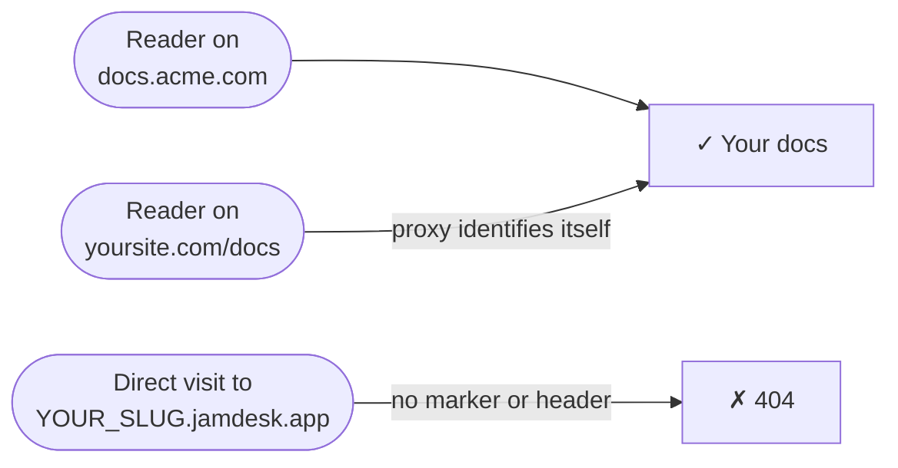

您的文档托管在 `YOUR_SLUG.jamdesk.app`。连接自定义域名后，该子域名仍会响应请求，但其提供的每个页面都会包含指向您域名的 `<link rel="canonical">` 标签，因此搜索引擎会将您的域名而不是子域名编入索引。对于大多数项目来说，这已经足够。

**Custom domain only** 更进一步：它会关闭访客直接访问子域名的能力。直接访问 `YOUR_SLUG.jamdesk.app` 会返回 404，您的文档只能通过您自己的域名访问。

屏幕截图显示的是英文界面。



<Warning>
这会隐藏您的子域名，但不是密码保护。任何通过您的域名访问的人仍然可以看到您的文档。若要控制*谁*可以阅读文档，请使用[密码保护](/cn/setup/password-protection)；两者可以配合使用。
</Warning>

## 启用此功能

<Steps>
  <Step title="验证您的自定义域名">
    在仪表板中添加并验证您的域名 — 请参阅[自定义域名](/cn/deploy/custom-domains)。该开关要求域名状态为 **Active**。
  </Step>
  <Step title="检查您的代理（仅限反向代理设置）">
    如果您的域名是指向 Jamdesk 的普通 CNAME（例如 `docs.acme.com`），请跳过此步骤 — 无需进行任何配置。如果您通过代理在 `yoursite.com/docs` 提供文档，则代理必须在转发的每个请求中标识自身 — 请参阅下方的[代理设置](#代理设置)。
  </Step>
  <Step title="打开开关">
    在仪表板中打开项目的 **Settings**，展开 **Custom Domain** 卡片，然后启用 **Custom domain only**。Jamdesk 会先检查您的线上域名，只有设置通过检查后才会启用该开关 — 如果检查失败，消息会明确告诉您需要修复的问题。

    <Frame>
      
    </Frame>
  </Step>
</Steps>

更改会在一分钟内到达每台边缘服务器。

## 代理设置

只有在请求标识自身来自您的代理时，`YOUR_SLUG.jamdesk.app` 才会提供请求内容 — 通过 `X-Jamdesk-Forwarded-Host` 标头或 `?jd_proxy=1` 查询标记均可。每份设置指南都已包含正确的方式：

- **[Vercel](/cn/deploy/vercel)** — `vercel.json` 重写会携带 `?jd_proxy=1`；Edge Middleware 会设置该标头
- **[Cloudflare Workers](/cn/deploy/cloudflare)** — Worker 会设置该标头
- **[AWS CloudFront](/cn/deploy/aws)** — 源站自定义标头
- **[反向代理](/cn/deploy/reverse-proxy)** — nginx、Apache、Caddy 和 HAProxy 会设置该标头

如果您已按照其中一份指南操作，则无需进一步设置。

如果您通过反向代理使用 [MCP](/cn/ai/mcp-server) 或[聊天小组件](/cn/ai/chat)，请像处理 `/docs` 一样转发 `/api/mcp/:path*` 和 `/api/chat/:path*`。在 Vercel 上：

```json vercel.json
{
  "rewrites": [
    { "source": "/api/mcp/:path*", "destination": "https://YOUR_SLUG.jamdesk.app/api/mcp/:path*?jd_proxy=1" },
    { "source": "/api/chat/:path*", "destination": "https://YOUR_SLUG.jamdesk.app/api/chat/:path*?jd_proxy=1" }
  ]
}
```

如果您的自定义域名通过 CNAME 指向 Jamdesk，则您域名上的 MCP 和聊天功能无需任何更改即可继续工作 — 将 MCP 客户端指向 `https://docs.acme.com/_mcp` 即可。

## 需要了解的信息

- **裸子域名上的所有内容都会返回 404** — 页面、`sitemap.xml`、`robots.txt`、`llms.txt` 和 Markdown 导出均如此。浏览器会显示简单的 Jamdesk 未找到页面。
- **图片仍可访问。** 图片、视频和社交分享预览（OG）图片不受影响 — 仪表板的网站预览会直接从子域名加载这些资源。
- **您不会把自己锁在外面。** 如果您域名的 DNS 发生故障，Jamdesk 会停止执行此限制，子域名会恢复提供服务，直到域名恢复。如果是您自己的代理配置出现问题（例如从重写规则中移除了标记），请在修复期间关闭该开关。
- **[Search API](/cn/jamdesk-api/docs-search-api) 不受影响** — 它通过 API 密钥进行身份验证。

## 下一步

<Columns cols={3}>
  <Card title="Vercel" icon="cloud-arrow-up" href="/cn/deploy/vercel">
    添加 jd_proxy 标记或 Edge Middleware
  </Card>
  <Card title="自定义域名" icon="globe" href="/cn/deploy/custom-domains">
    注册并验证您的域名
  </Card>
  <Card title="密码保护" icon="lock" href="/cn/setup/password-protection">
    控制谁可以阅读您的文档
  </Card>
</Columns>