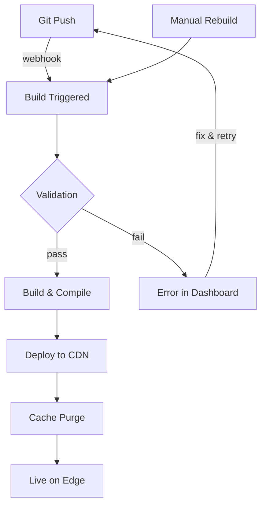

Jamdesk 会自动处理完整的构建和部署生命周期。推送到 GitHub 后，您的文档将在几分钟内上线。

屏幕截图显示的是英文界面。

## 构建生命周期



## 构建触发方式

| 触发方式 | 工作原理 | 使用场景 |
|---------|--------------|----------|
| **Git Push** | 连接的分支收到推送时触发 Webhook | 常规开发 |
| **Dashboard** | 在项目设置中点击“Rebuild” | 配置更改后强制刷新 |

<Note>
构建会进行防抖处理。10 秒内的多次提交会合并为一次构建。
</Note>

## 构建期间发生的事情

Jamdesk 会克隆您的代码仓库，验证 `docs.json` 和 MDX 语法，编译为包含搜索索引的优化 HTML，然后部署到 Cloudflare R2。大多数网站可在 30-90 秒内完成构建。

如需查看包含架构图的完整流程分解，请参阅 [Jamdesk 的工作原理](/cn/how-jamdesk-works)。

## 部署状态

在仪表板中查看构建状态：

| 状态 | 含义 |
|--------|---------|
| **Building** | 构建进行中 |
| **Deployed** | 已在您的域名上线 |
| **Failed** | 构建错误 - 请检查日志 |
| **Queued** | 等待上一次构建完成 |

“构建历史”部分会显示最近的部署及其状态，并可触发手动重新构建：

<SizedImage src="/images/dashboard/build-history.webp" alt="构建历史，显示最近的部署、Successful 状态徽章、提交信息和 Rebuild 按钮" />

## 手动重新构建

无需推送更改即可触发重新构建：

1. 在仪表板中进入您的项目
2. 打开 **Settings**
3. 点击 **Rebuild**

以下情况可以使用此功能：
- 更新环境变量
- 修复卡住的构建
- 平台更新后刷新

## 环境变量

在 **Settings** → **Environment** 中设置构建时变量：

```bash
ANALYTICS_ID=G-XXXXXXXXXX
API_BASE_URL=https://api.example.com
```

变量在构建过程中可用，也可以在您的 docs.json 或 MDX 文件中引用。

## 构建日志

查看详细的构建日志以进行调试：

1. 在项目中进入 **Deployments**
2. 点击某个特定的部署
3. 查看完整的构建日志

日志中常见的问题包括：
- 无效的 MDX 语法
- 缺少图像或资源
- 损坏的内部链接
- 配置错误

## 回滚

恢复到之前的版本：

1. 进入 **Deployments**
2. 找到要恢复的部署
3. 点击 **Rollback**

之前的版本会立即上线，同时开始新的构建。

## 分支部署

<Note>
分支部署适用于 Pro 套餐。
</Note>

在合并前预览更改：

1. 推送到功能分支
2. Jamdesk 会在 `branch-name.your-project.jamdesk.app` 创建预览
3. 准备就绪后进行审查并合并

## 接下来做什么？

<Columns cols={2}>
  <Card title="部署概览" icon="cloud-arrow-up" href="/cn/deploy/overview">
    在子域名、自定义域名或子路径托管之间进行选择
  </Card>
  <Card title="子路径托管" icon="route" href="/cn/deploy/subpath-hosting">
    在 example.com/docs 托管文档
  </Card>
</Columns>