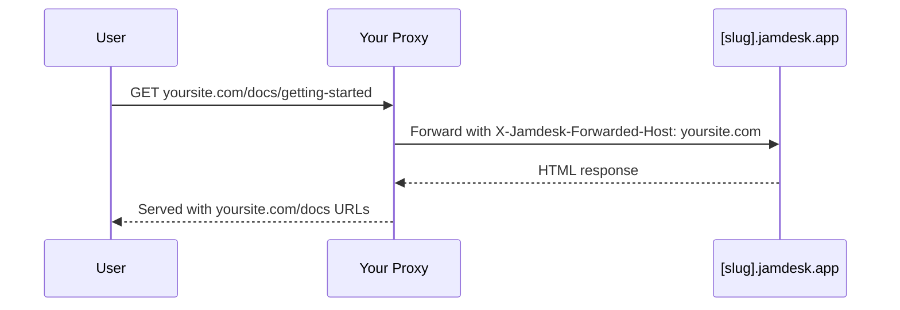

无需使用单独的子域名，即可在域名的子路径托管文档：默认使用 `yoursite.com/docs`，也可以使用 `yoursite.com/help` 等自定义路径段。有关所有部署选项，请参阅[部署概览](/cn/deploy/overview)。

屏幕截图显示的是英文界面。

## 为什么使用子路径？

与 `docs.yoursite.com` 这样的子域名相比，子路径可以让读者留在主域名下，并让文档页面为该域名贡献搜索权重，而不是将排名信号分散到两个主机。

## 工作原理

Web 服务器或 CDN 会将 `/docs/*` 的请求代理到 Jamdesk 站点，同时保留浏览器中的原始 URL：

代理会将包含你域名的 `X-Jamdesk-Forwarded-Host` 标头传递给 Jamdesk。Jamdesk 使用此标头来：

1. **验证你的域名**是否有权提供内容
2. **应用你的配置**（来自仪表板）

因此，代理配置只需设置一次：如果你在仪表板中更改设置，无需更新代理。

## 按提供商设置

选择你的托管提供商以开始使用：

<Columns cols={2}>
  <Card title="Cloudflare" icon="cloud" href="/cn/deploy/cloudflare">
    使用 Cloudflare Workers 代理 /docs 流量
  </Card>
  <Card title="AWS" icon="aws" href="/cn/deploy/aws">
    使用 Route 53 配置 CloudFront
  </Card>
  <Card title="Vercel" icon="triangle" href="/cn/deploy/vercel">
    向 vercel.json 添加重写规则
  </Card>
  <Card title="反向代理" icon="server" href="/cn/deploy/reverse-proxy">
    nginx、Apache 或其他代理服务器
  </Card>
</Columns>

## 前提条件

配置代理之前：

1. 在[设置]（https://dashboard.jamdesk.com）的 Settings → Custom Domain 下**添加你的域名**
2. **打开“Host at a subpath”**
3. **选择你的子路径**（可选；请参阅下方的[选择子路径](#选择子路径)），然后点击 **Save**

你的 Jamdesk 子域名（例如 `acme.jamdesk.app`）会显示在仪表板中。代理配置需要使用该子域名。

<Note>
保存子路径托管的更改（打开或关闭该功能，或更改子路径本身）会触发文档的完整构建。这是必需的，因为 URL 结构会发生变化（例如从 `/introduction` 变为 `/docs/introduction`）。
</Note>

## 选择子路径

默认情况下，文档通过 `/docs` 提供。要使用其他路径（例如 `/help` 或 `/support`），请在切换开关旁的子路径字段中输入该路径。字段为空时，切换开关显示为 `Host at a subpath (e.g. /docs)`；输入值后，它会实时更新为即将启用的路径（例如 `Host at /help`）。

<Frame>
  
</Frame>

该字段只接受单个小写路径段：只能包含字母、数字和中间连字符，不能以连字符开头或结尾，最多 63 个字符。部分路径段为保留值，会直接被拒绝，包括 `api`、`jd`、`wp-admin` 等常见管理路径，以及文档可能使用的区域代码（`fr`、`es`、`de` 等）。保留这些值可确保你的子路径不会与 Jamdesk 已提供的路由冲突。

将字段留空可保留默认路径 `/docs`。

## 重命名或移除子路径

更改子路径，或清空子路径以恢复默认值，不会破坏已被索引或加入书签的链接：

- **`/docs` 永远不会停止提供服务。** 即使切换到 `/help` 这样的自定义子路径，原始的 `/docs/*` 路径仍会在你的 `[slug].jamdesk.app` 子域名上响应，也会通过任何仍指向这些路径的代理响应。规范链接会立即转移到新的子路径，因此搜索引擎会在那里重新编入索引。任何已经指向 `/docs` 的链接都不会失效，这意味着你可以按照自己的进度更新代理配置，无需争分夺秒。
- **重命名自定义子路径时，旧路径会转发一次。** 如果将 `/help` 重命名为 `/guide`，对 `/help/*` 的请求会通过 308 重定向到对应的 `/guide/*` 路径。此历史记录只有一层：如果再次将 `/guide` 重命名为 `/support`，现在 `/guide/*` 会重定向到 `/support/*`，但两次重命名之前的路径段 `/help/*` 不再被跟踪，因此这些链接将停止解析——它们会进入“未找到”页面，有时还会先重定向到一个看起来异常的组合路径。如果你依赖重定向来保留旧链接，请不要连续重命名；应改为将外部链接更新为当前子路径。
- **恢复到 `/docs`** 的工作方式相同：之前的自定义子路径（保留一层历史记录）会重定向到 `/docs/*`。

<Warning>
这**不**意味着 `/docs` 会重定向到你选择的子路径。因为 `/docs` 会一直直接提供服务，所以没有这样做的必要。只有当你离开某个*自定义*子路径时，才会应用一层重定向。
</Warning>

配置代理后，请访问 `https://yoursite.com/docs`（或你配置的子路径）进行测试。文档应能正常加载，所有资源和链接也应正常工作。

## 是否需要隐藏 jamdesk.app 子域名？

不需要。你的 `[slug].jamdesk.app` 子域名仍可访问（它是代理转发到的上游源站），但不会在搜索结果中与你的网站竞争：

- **注册域名后**，直接从子域名提供的每个页面都会包含规范链接，指向你域名上的同一页面，因此搜索引擎会将所有排名信号集中到你的域名。
- **注册域名之前**，子路径模式下的子域名页面会标记为 `noindex`，因此完全不会进入索引。

如果你还希望让子域名上的内容本身无法访问（而不仅是不被索引），请启用[密码保护](/cn/setup/password-protection)：此后子域名会提供解锁屏幕，而不是你的文档。

## 接下来做什么？

<Columns cols={2}>
  <Card title="部署概览" icon="cloud-arrow-up" href="/cn/deploy/overview">
    比较子域名、自定义域名和子路径托管
  </Card>
  <Card title="自定义域名" icon="globe" href="/cn/deploy/custom-domains">
    验证 DNS 并排查域名设置问题
  </Card>
</Columns>