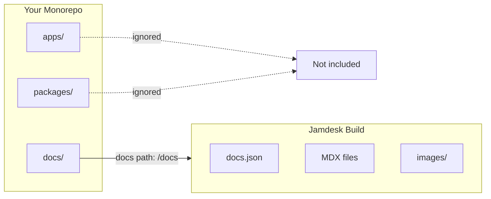

如果您的 `docs.json` 位于子目录中（例如 `docs/`、`packages/docs/` 或其他目录），请在项目设置中启用 monorepo 模式并指定路径。Jamdesk 会将构建范围限定在该目录，并忽略目录外的所有内容。

屏幕截图显示的是英文界面。

<Note>
**前提条件：** 配置 monorepo 支持前，您需要一个连接到 [GitHub 仓库](/cn/setup/connecting-github)的 [Jamdesk 项目](/cn/setup/creating-projects)。
</Note>

## Jamdesk 如何限定构建范围



## 快速设置

<Steps>
  <Step title="打开项目设置">
    前往您的 Jamdesk 项目[仪表板](https://dashboard.jamdesk.com)，然后进入 **Settings**。
  </Step>

  <Step title="启用 monorepo 模式">
    在 **Git Repository** 部分，打开 **Set up as monorepo** 开关。

    <Frame>
      
    </Frame>
  </Step>

  <Step title="输入文档路径">
    指定包含 `docs.json` 文件的目录路径。

    <Frame>
      
    </Frame>

    预览会显示 Jamdesk 查找配置文件的位置。
  </Step>

  <Step title="保存并重新构建">
    点击 **Save Changes** 以应用设置。下一次构建将使用新路径。
  </Step>
</Steps>

## 了解文档路径

文档路径用于告知 Jamdesk 在仓库中的哪个位置查找 `docs.json` 配置文件。

<Warning>
仅输入目录路径，不要输入文件名。请使用 `docs`，而不是 `docs/docs.json`。
</Warning>

### 路径示例

| 仓库结构 | 文档路径值 |
|---------------------|-----------------|
| `my-repo/docs/docs.json` | `docs` |
| `my-repo/packages/docs/docs.json` | `packages/docs` |
| `my-repo/apps/website/docs/docs.json` | `apps/website/docs` |
| `my-repo/documentation/docs.json` | `documentation` |

### 包含的内容

设置文档路径后，Jamdesk 只会处理该目录中的文件：

- **内容文件**（`.mdx`、`.md`）会被编译为页面
- **子目录中的资源**（例如 `images/`）会被包含
- **配置**（`docs.json`）定义您的站点

构建期间会忽略文档路径之外的文件。

## 常见 monorepo 结构

选择与您的项目结构匹配的模式：

<Tabs>
  <Tab title="专用 /docs">
    文档位于顶级目录中。

    ```bash
    monorepo/
    ├── packages/
    ├── apps/
    └── docs/                    # Docs path: docs
        ├── docs.json
        ├── introduction.mdx
        └── guides/
    ```

    **文档路径：** `docs`
  </Tab>

  <Tab title="/packages 中的包">
    将文档作为工作区包。

    ```bash
    monorepo/
    ├── packages/
    │   ├── core/
    │   ├── cli/
    │   └── docs/                # Docs path: packages/docs
    │       ├── docs.json
    │       └── pages/
    └── apps/
    ```

    **文档路径：** `packages/docs`
  </Tab>

  <Tab title="应用内部">
    文档嵌套在应用程序中。

    ```bash
    monorepo/
    ├── apps/
    │   └── website/
    │       ├── src/
    │       └── docs/            # Docs path: apps/website/docs
    │           ├── docs.json
    │           └── introduction.mdx
    └── packages/
    ```

    **文档路径：** `apps/website/docs`
  </Tab>

  <Tab title="自定义目录">
    使用任意自定义目录名称。

    ```bash
    monorepo/
    ├── src/
    ├── tests/
    └── documentation/           # Docs path: documentation
        ├── docs.json
        └── getting-started.mdx
    ```

    **文档路径：** `documentation`
  </Tab>
</Tabs>

## 使用资源

`docs.json` 中的资源路径始终相对于文档目录，而不是仓库根目录。

### 示例

如果您的文档位于 `packages/docs/`：

```json packages/docs/docs.json
{
  "logo": {
    "light": "/images/logo.svg"
  },
  "favicon": "/images/favicon.svg"
}
```

这些路径指向：
- `packages/docs/images/logo.svg`
- `packages/docs/images/favicon.svg`

<Warning>
不要使用相对于仓库根目录的绝对路径。以下配置无法正常工作：

```json
"favicon": "/packages/docs/images/favicon.svg"
```
</Warning>

### 在 MDX 文件中

内容中的图片也遵循相同规则：

```mdx

```

此路径指向 `[docs-path]/images/tabs-preview.png` 中的图片。

## 内部链接

无论仓库结构如何，内部链接的工作方式都相同。请使用相对于文档根目录的路径：

```mdx
[See the quickstart guide](/quickstart)
[Installation steps](/quickstart#installation)
```

这些路径对应您的导航结构，而不是文件系统。

## 构建行为

Jamdesk 只监视您配置的文档路径中的更改：

- 对 `packages/docs/**` 的更改会触发构建
- 对 `packages/core/**` 的更改不会触发构建

这样可以让构建专注于文档更改并保持快速。

<Tip>
**需要在其他代码发生更改时重新构建？**

如果您从源代码生成文档（例如从代码注释生成 API 文档），请从仪表板手动触发重新构建，或在 CI 流程中设置 Webhook。
</Tip>

## 工作区工具兼容性

Jamdesk 支持所有主流 monorepo 工具。除了设置文档路径外，无需进行特殊配置。

| 工具 | 支持 |
|------|-----------|
| npm workspaces | 是 |
| Yarn workspaces | 是 |
| pnpm workspaces | 是 |
| Turborepo | 是 |
| Nx | 是 |
| Lerna | 是 |

## 故障排除

<AccordionGroup>
  <Accordion title="找不到 docs.json 错误" icon="circle-exclamation">
    1. 验证仓库中的实际路径是否与您输入的路径完全一致
    2. 确保该位置存在 `docs.json`
    3. 检查是否有拼写错误——路径区分大小写
    4. 请记住：使用 `docs`，而不是 `docs/docs.json`

    **快速检查：** 在您的仓库中，文件应位于 `[your-docs-path]/docs.json`
  </Accordion>

  <Accordion title="资源未加载" icon="image">
    资源路径必须相对于文档目录。

    **正确**——相对于文档目录：
    ```json
    "favicon": "/images/favicon.svg"
    ```

    **错误**——相对于仓库根目录：
    ```json
    "favicon": "/packages/docs/images/favicon.svg"
    ```

    检查图片是否确实存在于 `[docs-path]/images/` 中。
  </Accordion>

  <Accordion title="更改未触发构建" icon="rotate">
    只有配置的文档路径中的更改才会触发自动构建。

    1. 验证您修改的文件位于文档路径内
    2. 检查您是否推送到了正确的分支
    3. 在 GitHub 仓库设置中查看 Webhook 投递状态

    如果需要在文档路径之外的更改触发构建，请使用手动重新构建或 CI Webhook。
  </Accordion>
</AccordionGroup>

## 下一步

<Columns cols={2}>
  <Card title="连接 GitHub" icon="github" href="/cn/setup/connecting-github">
    连接您的仓库以自动构建
  </Card>
  <Card title="目录结构" icon="folder-tree" href="/cn/setup/directory-structure">
    构建可扩展的文档结构
  </Card>
</Columns>