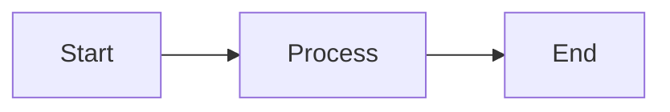
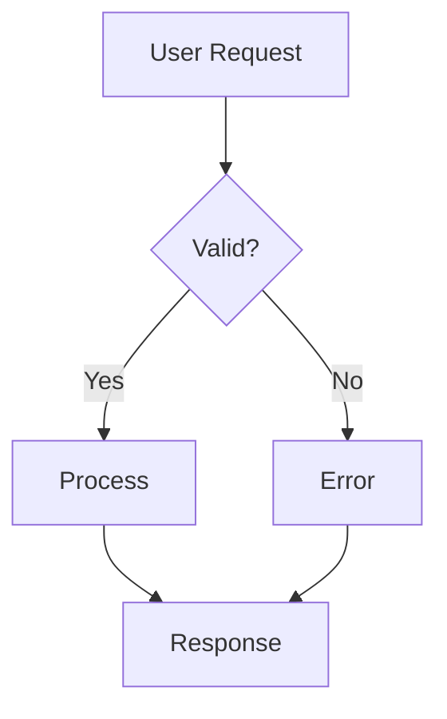
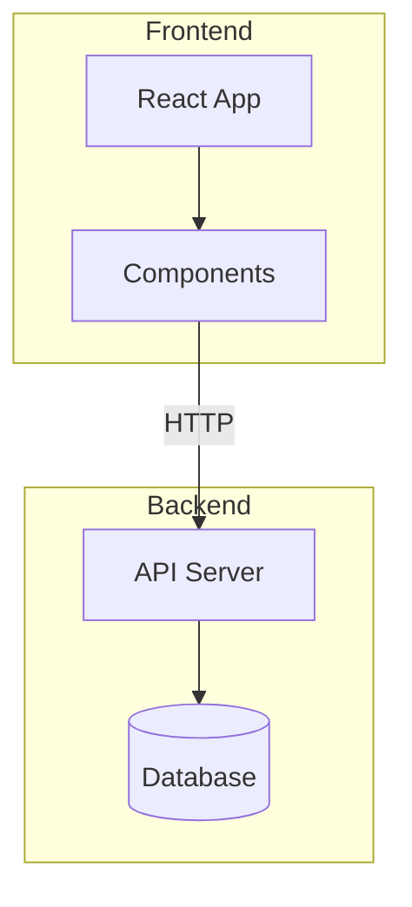
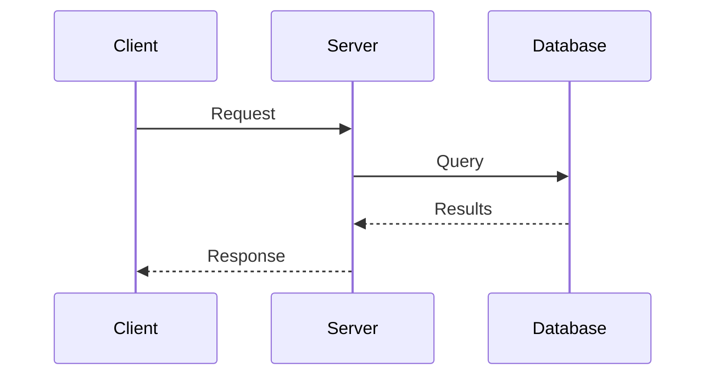
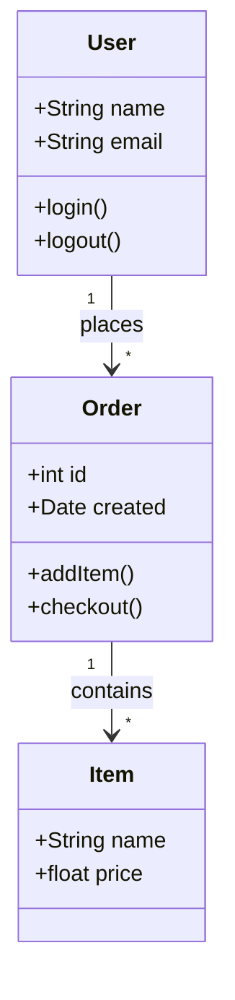
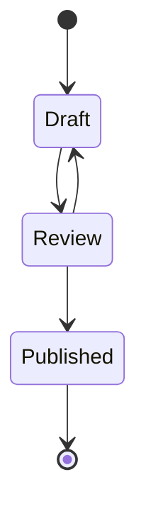
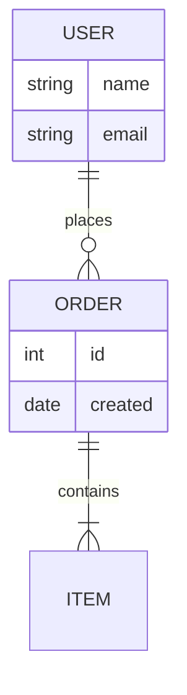
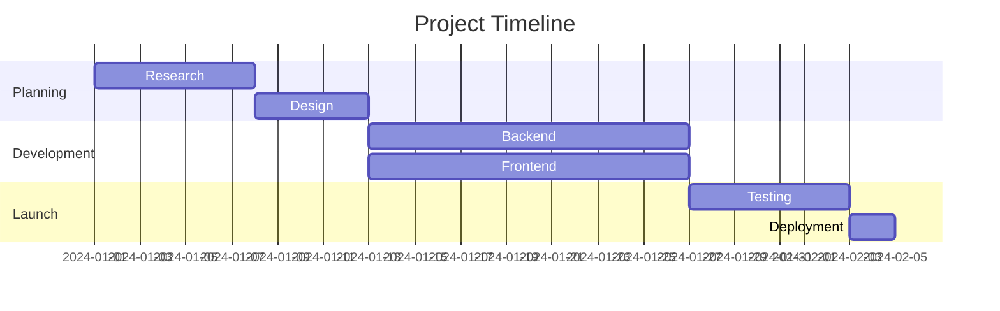
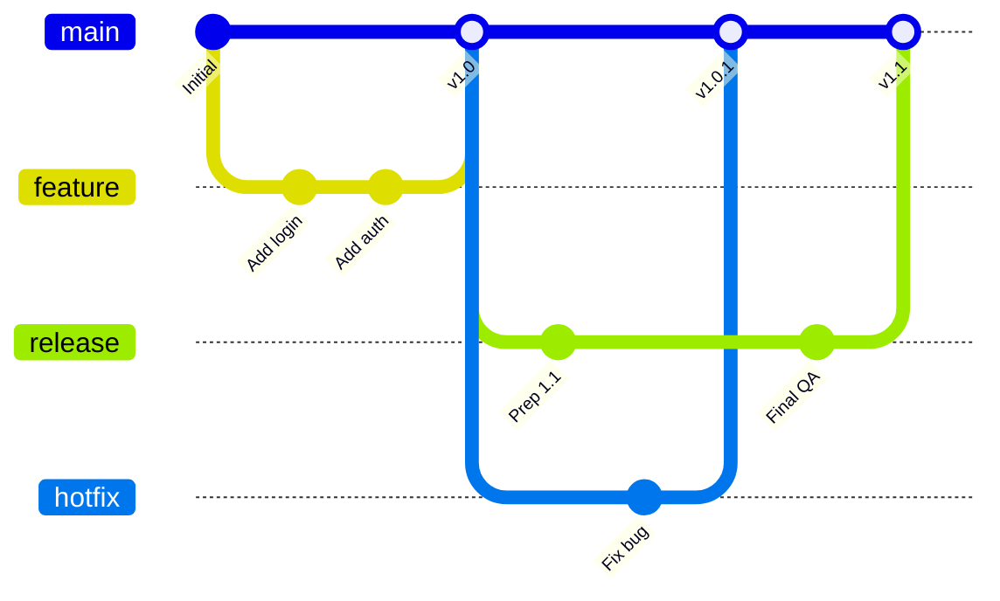
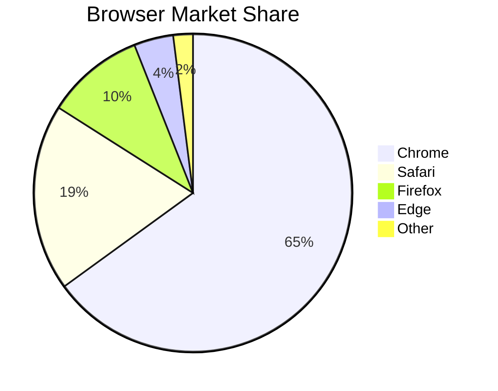

Write diagrams as text in fenced code blocks. Jamdesk renders them as SVG at build time.

<Tip>
  Jamdesk also supports [D2 diagrams](/components/d2) in `d2` fenced blocks.
  Reach for D2 when a diagram needs nested containers, an SQL schema with
  primary and foreign keys, or you want to swap layout engines. The Mermaid
  examples on this page have D2 equivalents on the [D2 page](/components/d2).
</Tip>

## Basic Usage

Use a fenced code block with the `mermaid` language identifier:

````mdx

````


## Diagram Types

### Flowcharts

Direction can be top-down (`TD`), left-right (`LR`), bottom-up (`BT`), or right-left (`RL`).



````mdx

````

#### Subgraphs

Group related nodes together using subgraphs. This helps organize complex flowcharts into logical sections like "Frontend" and "Backend" or different stages of a pipeline.



````mdx

````

### Sequence Diagrams

Sequence diagrams show how components interact over time. They're ideal for documenting API calls, authentication flows, or any communication between services. Participants appear as vertical lifelines, with messages flowing between them.



````mdx

````

### Class Diagrams

Class diagrams represent the structure of object-oriented systems. Use them to document data models, show relationships between entities, or design system architecture. They display classes with their attributes, methods, and how they relate to each other.



````mdx

````

### State Diagrams

State diagrams model the lifecycle of an object or process. They show all possible states and the transitions between them. Use state diagrams to document order statuses, document workflows, or any system with distinct phases.



````mdx

````

### Entity Relationship Diagrams

ER diagrams document database schemas and data models. They show entities (tables), their attributes (columns), and relationships between them. The symbols indicate cardinality: one-to-one, one-to-many, or many-to-many.



````mdx

````

### Gantt Charts

Gantt charts visualize project schedules and timelines. Tasks are displayed as horizontal bars across a timeline, showing duration, dependencies, and parallel work. Use them for project planning, sprint documentation, or roadmaps.



````mdx

````

### Git Graphs

Git graphs visualize branching strategies and version control workflows. They show commits, branches, merges, and the overall history of a repository. Each branch is color-coded for easy identification.



````mdx

````

### Pie Charts

Pie charts display proportional data as slices of a circle. Use them to show market share, survey results, resource allocation, or any data where parts make up a whole. Keep slices to 6 or fewer for readability.



````mdx

````

## Flowchart Shapes

Different shapes convey different meanings in flowcharts:

| Syntax     | Shape               | Use For |
| ---------- | ------------------- | ------- |
| `[text]`   | Rectangle           | Process steps, actions |
| `(text)`   | Rounded rectangle   | Start/end points |
| `{text}`   | Diamond             | Decisions, conditions |
| `([text])` | Stadium             | Events, triggers |
| `[[text]]` | Subroutine          | Predefined processes |
| `[(text)]` | Cylinder            | Databases, storage |

## Arrow Types

Arrows indicate flow direction and relationship types:

| Syntax      | Description      | Use For |
| ----------- | ---------------- | ------- |
| `-->`       | Solid arrow      | Normal flow |
| `---`       | Solid line       | Associations |
| `-.->`      | Dotted arrow     | Optional or async flow |
| `==>`       | Thick arrow      | Important paths |
| `--text-->` | Arrow with label | Describe the transition |

## Sizing Wide Diagrams

For wide diagrams like Gantt charts or complex Git graphs, you can use the `Mermaid` component directly with a `minWidth` prop to ensure the diagram doesn't get compressed:

```mdx
<Mermaid minWidth="700px">
gantt
    title Wide Project Timeline
    ...
</Mermaid>
```

## Styling Tips

<Tip>
  Mermaid diagrams automatically adapt to light and dark modes. Colors are
  optimized for readability in both themes.
</Tip>

For effective diagrams:

- Keep it simple: break complex flows into multiple smaller diagrams.
- Label your arrows to explain transitions.
- Pick one direction: `TD` (top-down) for tall diagrams, `LR` (left-right) for wide ones.
- Cap each diagram at 10-15 nodes for clarity.

## Learn More

For the complete Mermaid syntax reference, including advanced features like styling, theming, and additional diagram types, see the [official Mermaid documentation](https://mermaid.js.org/intro/).

## What's Next?

<Columns cols={2}>
  <Card title="D2 Diagrams" icon="diagram-project" href="/components/d2">
    Architecture, containers, and SQL schemas with D2
  </Card>
  <Card title="Components Overview" icon="puzzle-piece" href="/components/overview">
    Browse all available components
  </Card>
  <Card title="MDX Basics" icon="file-code" href="/content/mdx-basics">
    Learn how to use components in MDX
  </Card>
</Columns>
