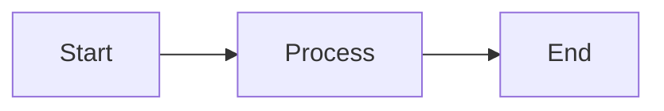
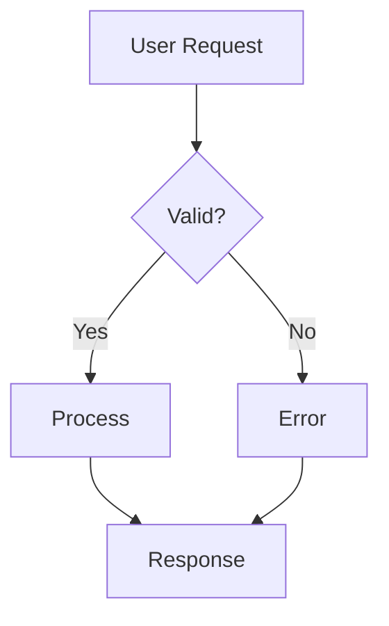
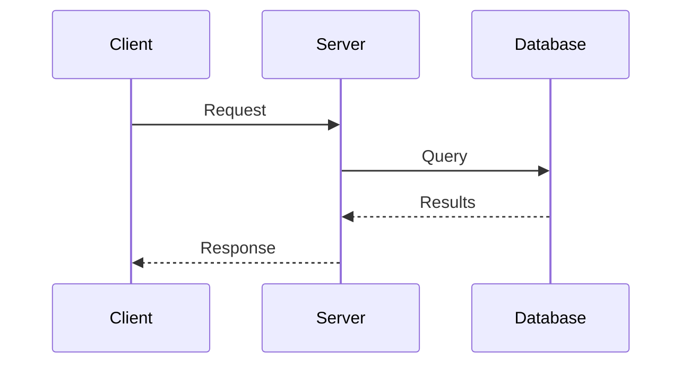
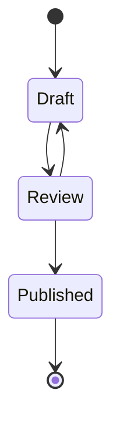
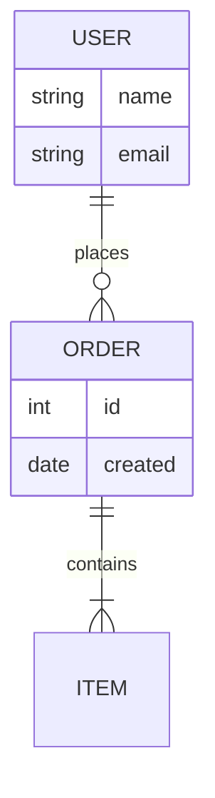
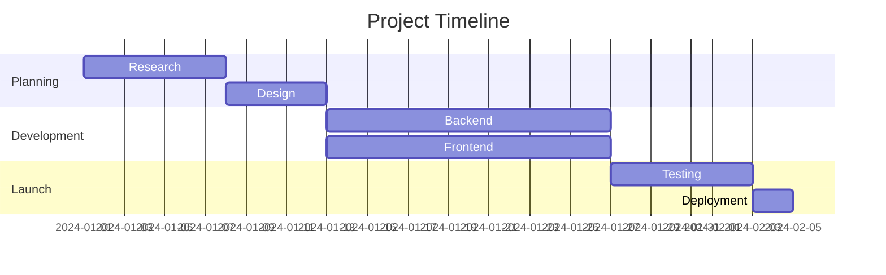
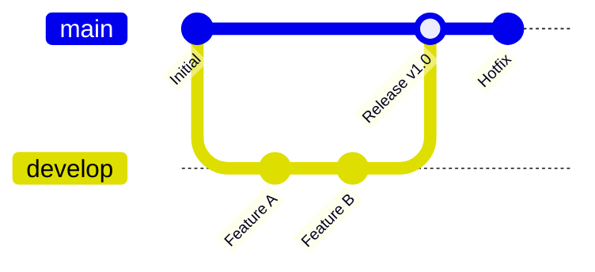

Mermaid lets you create diagrams and visualizations using text-based syntax. Diagrams render automatically from code blocks marked with the `mermaid` language.

## Basic Usage

Use a fenced code block with the `mermaid` language identifier:

````mdx

````


## Diagram Types

Mermaid supports many diagram types. Here are the most commonly used:

### Flowcharts



````mdx

````

### Sequence Diagrams



````mdx

````

### State Diagrams



````mdx

````

### Entity Relationship Diagrams



````mdx

````

### Gantt Charts



````mdx

````

### Git Graphs



````mdx

````

## Flowchart Shapes

| Syntax     | Shape               |
| ---------- | ------------------- |
| `[text]`   | Rectangle           |
| `(text)`   | Rounded rectangle   |
| `{text}`   | Diamond (decision)  |
| `([text])` | Stadium             |
| `[[text]]` | Subroutine          |
| `[(text)]` | Cylinder (database) |

## Arrow Types

| Syntax      | Description      |
| ----------- | ---------------- |
| `-->`       | Solid arrow      |
| `---`       | Solid line       |
| `-.->`      | Dotted arrow     |
| `==>`       | Thick arrow      |
| `--text-->` | Arrow with label |

## Styling Tips

<Tip>
  Mermaid diagrams automatically adapt to light and dark modes using the neutral
  theme.
</Tip>

For complex diagrams, keep these tips in mind:

- **Keep it simple** - Break complex flows into multiple smaller diagrams
- **Use labels** - Add text to arrows to explain transitions
- **Consistent direction** - `TD` (top-down) or `LR` (left-right) based on your content width

## Learn More

For the complete Mermaid syntax reference, see the [official Mermaid documentation](https://mermaid.js.org/intro/).
