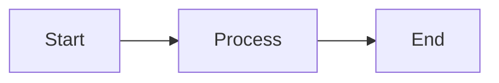
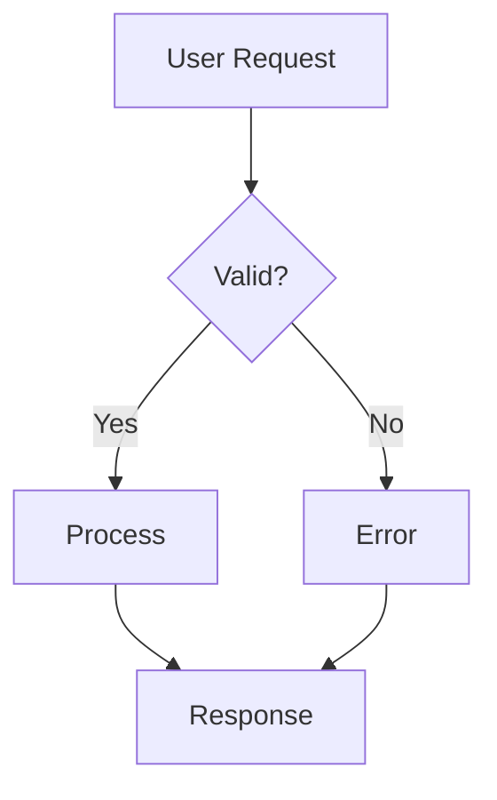
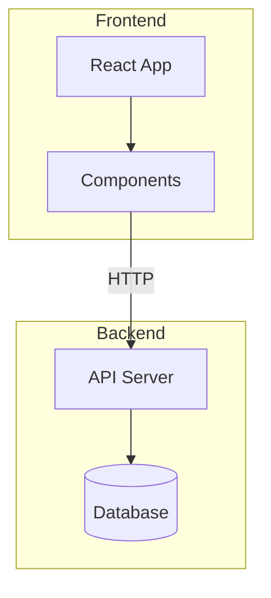
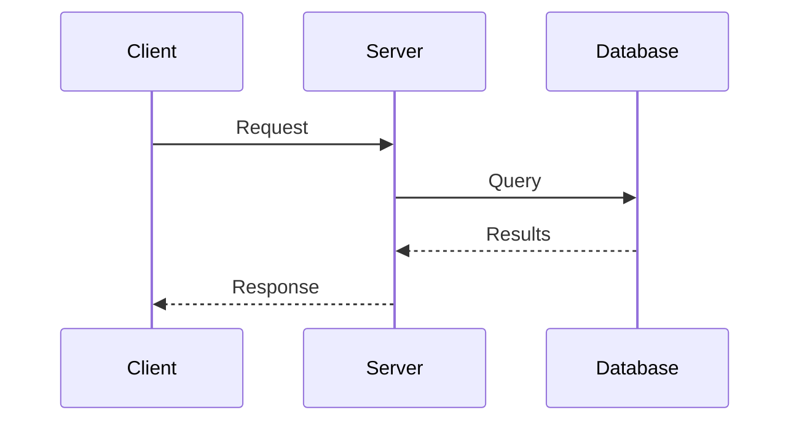
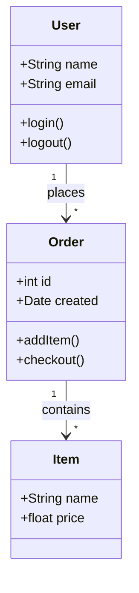
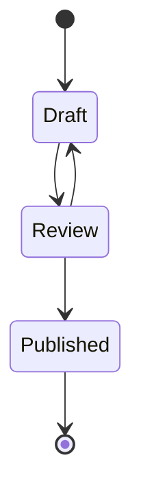
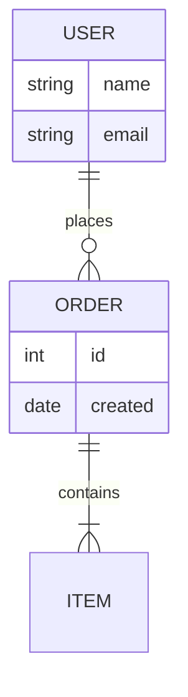
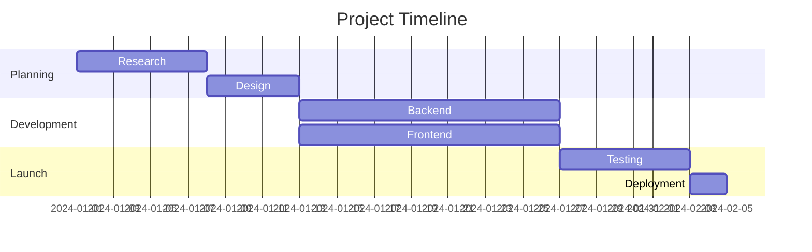
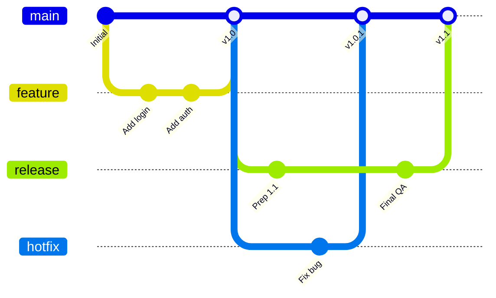
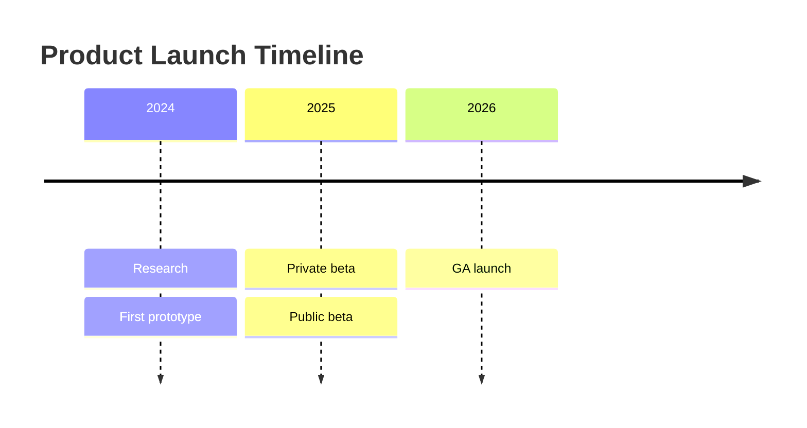

Schreiben Sie Diagramme als Text in abgegrenzten Codeblöcken. Jamdesk rendert sie zur Build-Zeit als SVG.

<Tip>
  Entwerfen und prüfen Sie Ihr Diagramm im [Jamdesk Mermaid-Editor](https://jamdesk.com/utilities/mermaid-editor),
  einem Open-Source-Editor und -Viewer im Browser. Schreiben Sie Mermaid-Syntax, sehen Sie sie
  live gerendert und fügen Sie sie dann hier in einen abgegrenzten `mermaid`-Block ein.
</Tip>

<Tip>
  Jamdesk unterstützt auch [D2-Diagramme](/de/components/d2) in abgegrenzten `d2`-Blöcken.
  Verwenden Sie D2, wenn ein Diagramm verschachtelte Container, ein SQL-Schema mit
  Primär- und Fremdschlüsseln benötigt oder Sie Layout-Engines austauschen möchten. Die Mermaid-
  Beispiele auf dieser Seite haben D2-Entsprechungen auf der [D2-Seite](/de/components/d2).
</Tip>

## Grundlegende Verwendung

Verwenden Sie einen abgegrenzten Codeblock mit der Programmiersprachenkennung `mermaid`:

````mdx

````


## Diagrammtypen

### Flussdiagramme

Die Richtung kann von oben nach unten (`TD`), von links nach rechts (`LR`), von unten nach oben (`BT`) oder von rechts nach links (`RL`) sein.



````mdx

````

#### Unterdiagramme

Gruppieren Sie verwandte Knoten mithilfe von Unterdiagrammen. Dies hilft dabei, komplexe Flussdiagramme in logische Bereiche wie „Frontend“ und „Backend“ oder verschiedene Phasen einer Pipeline zu gliedern.



````mdx

````

### Sequenzdiagramme

Sequenzdiagramme zeigen, wie Komponenten im Zeitverlauf interagieren. Verwenden Sie ein Sequenzdiagramm für API-Aufrufflüsse und Authentifizierungs-Handshakes. Teilnehmer werden als vertikale Lebenslinien dargestellt, zwischen denen Nachrichten fließen.



````mdx

````

### Klassendiagramme

Klassendiagramme stellen die Struktur objektorientierter Systeme dar, beispielsweise eines Datenmodells oder der zentralen Typen eines Dienstes. Sie zeigen Klassen mit ihren Attributen, Methoden und Beziehungen zueinander.



````mdx

````

### Zustandsdiagramme

Zustandsdiagramme modellieren den Lebenszyklus eines Objekts oder Prozesses. Sie zeigen alle möglichen Zustände und die Übergänge zwischen ihnen. Bestellstatus und Workflows zur Dokumentfreigabe sind typische Beispiele.



````mdx

````

### Entity-Relationship-Diagramme

ER-Diagramme dokumentieren Datenbankschemas und Datenmodelle. Sie zeigen Entitäten (Tabellen), ihre Attribute (Spalten) und die Beziehungen zwischen ihnen. Die Symbole geben die Kardinalität an: eins zu eins, eins zu viele oder viele zu viele.



````mdx

````

### Gantt-Diagramme

Gantt-Diagramme visualisieren Projektpläne und Zeitachsen. Aufgaben werden als horizontale Balken entlang einer Zeitachse dargestellt und zeigen Dauer, Abhängigkeiten und parallele Arbeit. Ein Projektplan oder eine Roadmap eignet sich dafür besonders gut.



````mdx

````

### Git-Graphen

Git-Graphen visualisieren Branching-Strategien und Workflows der Versionskontrolle. Sie zeigen Commits, Branches, Merges und den gesamten Verlauf eines Repositorys. Jeder Branch ist zur einfachen Identifizierung farbcodiert.



````mdx

````

### Zeitachsen

Zeitachsen zeigen Ereignisse über Zeiträume hinweg. Beginnen Sie mit dem Schlüsselwort `timeline`, einem
optionalen `title` und anschließend einer Zeile pro Zeitraum, wobei Ereignisse durch Doppelpunkte getrennt werden:



````mdx

````

### Kreisdiagramme

Kreisdiagramme stellen proportionale Daten als Segmente eines Kreises dar. Verwenden Sie sie, wenn Teile ein Ganzes bilden, etwa bei Marktanteilen oder Umfrageergebnissen. Beschränken Sie sich für eine gute Lesbarkeit auf höchstens 6 Segmente.

```mermaid
pie title Browser Market Share
    "Chrome" : 65
    "Safari" : 19
    "Firefox" : 10
    "Edge" : 4
    "Other" : 2
```

````mdx
```mermaid
pie title Browser Market Share
    "Chrome" : 65
    "Safari" : 19
    "Firefox" : 10
    "Edge" : 4
    "Other" : 2
```
````

## Flussdiagrammformen

Verschiedene Formen vermitteln in Flussdiagrammen unterschiedliche Bedeutungen:

| Syntax     | Form                | Verwendung |
| ---------- | ------------------- | ---------- |
| `[text]`   | Rechteck            | Prozessschritte, Aktionen |
| `(text)`   | Abgerundetes Rechteck | Start-/Endpunkte |
| `{text}`   | Raute               | Entscheidungen, Bedingungen |
| `([text])` | Stadion             | Ereignisse, Auslöser |
| `[[text]]` | Unterroutine        | Vordefinierte Prozesse |
| `[(text)]` | Zylinder            | Datenbanken, Speicher |

## Pfeiltypen

Pfeile geben die Flussrichtung und Beziehungstypen an:

| Syntax      | Beschreibung       | Verwendung |
| ----------- | ------------------ | ---------- |
| `-->`       | Durchgezogener Pfeil | Normaler Fluss |
| `---`       | Durchgezogene Linie | Assoziationen |
| `-.->`      | Gepunkteter Pfeil  | Optionaler oder asynchroner Fluss |
| `==>`       | Dicker Pfeil       | Wichtige Pfade |
| `--text-->` | Pfeil mit Beschriftung | Übergang beschreiben |

## Breite Diagramme skalieren

Für breite Diagramme wie Gantt-Diagramme oder komplexe Git-Graphen können Sie die Komponente `Mermaid` direkt mit einer `minWidth`-Prop verwenden, damit das Diagramm nicht zusammengedrückt wird:

```mdx
<Mermaid minWidth="700px">
gantt
    title Wide Project Timeline
    ...
</Mermaid>
```

## Tipps zur Gestaltung

<Tip>
  Mermaid-Diagramme passen sich automatisch an helle und dunkle Modi an. Die Farben sind
  für gute Lesbarkeit in beiden Designs optimiert.
</Tip>

Für wirkungsvolle Diagramme:

- Halten Sie es einfach: Teilen Sie komplexe Abläufe in mehrere kleinere Diagramme auf.
- Beschriften Sie Ihre Pfeile, um Übergänge zu erläutern.
- Wählen Sie eine Richtung: `TD` (von oben nach unten) für hohe Diagramme, `LR` (von links nach rechts) für breite.
- Begrenzen Sie jedes Diagramm zur besseren Übersicht auf 10-15 Knoten.

## Weitere Informationen

Die vollständige Referenz zur Mermaid-Syntax, einschließlich erweiterter Funktionen wie Gestaltung, Themes und zusätzlicher Diagrammtypen, finden Sie in der [offiziellen Mermaid-Dokumentation](https://mermaid.js.org/intro/).

## Wie geht es weiter?

<Columns cols={2}>
  <Card title="D2-Diagramme" icon="diagram-project" href="/de/components/d2">
    Architektur, Container und SQL-Schemas mit D2
  </Card>
  <Card title="Komponentenübersicht" icon="puzzle-piece" href="/de/components/overview">
    Alle verfügbaren Komponenten durchsuchen
  </Card>
  <Card title="MDX-Grundlagen" icon="file-code" href="/de/content/mdx-basics">
    Erfahren Sie, wie Sie Komponenten in MDX verwenden
  </Card>
</Columns>