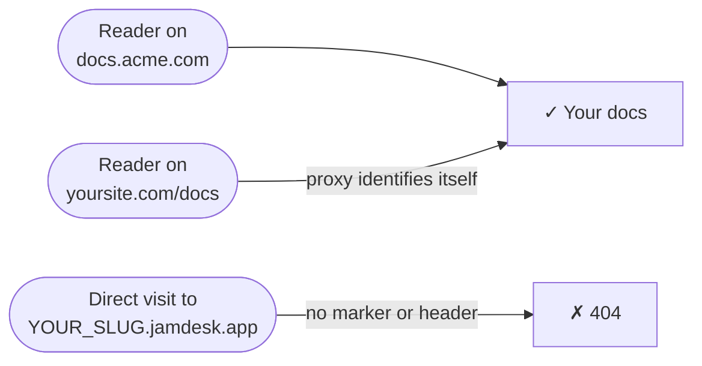

Ihre Dokumentation wird unter `YOUR_SLUG.jamdesk.app` gehostet. Wenn Sie eine benutzerdefinierte Domain verbinden, antwortet diese Subdomain weiterhin – aber jede von ihr bereitgestellte Seite enthält ein `<link rel="canonical">`-Tag, das auf Ihre Domain verweist. Dadurch indexieren Suchmaschinen Ihre Domain, niemals die Subdomain. Für die meisten Projekte ist das alles, was Sie benötigen.

Die Screenshots zeigen die Benutzeroberfläche auf Englisch.

**Nur benutzerdefinierte Domain** geht einen Schritt weiter: Die Subdomain wird für direkte Besucher deaktiviert. Ein direkter Aufruf von `YOUR_SLUG.jamdesk.app` liefert einen 404-Fehler, und Ihre Dokumentation ist nur über Ihre eigene Domain erreichbar.



<Warning>
Dadurch wird Ihre Subdomain verborgen – es handelt sich nicht um einen Passwortschutz. Jeder, der Ihre Domain aufruft, kann Ihre Dokumentation weiterhin sehen. Um zu steuern, *wer* sie lesen kann, verwenden Sie den [Passwortschutz](/de/setup/password-protection); beides funktioniert zusammen.
</Warning>

## Aktivierung

<Steps>
  <Step title="Ihre benutzerdefinierte Domain überprüfen">
    Fügen Sie Ihre Domain im Dashboard hinzu und überprüfen Sie sie – siehe [Benutzerdefinierte Domains](/de/deploy/custom-domains). Der Umschalter erfordert eine Domain mit dem Status **Active**.
  </Step>
  <Step title="Ihren Proxy überprüfen (nur bei Reverse-Proxy-Konfigurationen)">
    Wenn Ihre Domain ein einfacher, auf Jamdesk verweisender CNAME ist (z. B. `docs.acme.com`), überspringen Sie diesen Schritt – es gibt nichts zu konfigurieren. Wenn Sie Dokumentation unter `yoursite.com/docs` über einen Proxy bereitstellen, muss der Proxy sich bei jeder weitergeleiteten Anfrage identifizieren – siehe unten [Proxy-Konfigurationen](#proxy-konfigurationen).
  </Step>
  <Step title="Den Umschalter aktivieren">
    Öffnen Sie im Dashboard die **Settings** Ihres Projekts, erweitern Sie die Karte **Custom Domain** und aktivieren Sie **Custom domain only**. Jamdesk überprüft zuerst Ihre aktive Domain und aktiviert den Umschalter erst, wenn Ihre Konfiguration erfolgreich geprüft wurde – wenn die Prüfung fehlschlägt, teilt Ihnen die Meldung genau mit, was Sie korrigieren müssen.

    <Frame>
      
    </Frame>
  </Step>
</Steps>

Änderungen erreichen innerhalb einer Minute jeden Edge-Server.

## Proxy-Konfigurationen

Eine Anfrage an `YOUR_SLUG.jamdesk.app` wird nur bereitgestellt, wenn sie sich als über Ihren Proxy kommend identifiziert – entweder mit dem Header `X-Jamdesk-Forwarded-Host` oder dem Abfragemarker `?jd_proxy=1`. Jeder Konfigurationsleitfaden enthält bereits die richtige Option:

- **[Vercel](/de/deploy/vercel)** – Umschreibungen in `vercel.json` übertragen `?jd_proxy=1`; Edge Middleware setzt den Header
- **[Cloudflare Workers](/de/deploy/cloudflare)** – Der Worker setzt den Header
- **[AWS CloudFront](/de/deploy/aws)** – der benutzerdefinierte Origin-Header
- **[Reverse Proxy](/de/deploy/reverse-proxy)** – nginx, Apache, Caddy und HAProxy setzen den Header

Wenn Sie einem dieser Leitfäden gefolgt sind, ist Ihre Konfiguration bereits fertig.

Verwenden Sie [MCP](/de/ai/mcp-server) oder das [Chat-Widget](/de/ai/chat) über einen Reverse Proxy? Leiten Sie `/api/mcp/:path*` und `/api/chat/:path*` genauso weiter wie `/docs`. Auf Vercel:

```json vercel.json
{
  "rewrites": [
    { "source": "/api/mcp/:path*", "destination": "https://YOUR_SLUG.jamdesk.app/api/mcp/:path*?jd_proxy=1" },
    { "source": "/api/chat/:path*", "destination": "https://YOUR_SLUG.jamdesk.app/api/chat/:path*?jd_proxy=1" }
  ]
}
```

Wenn Ihre benutzerdefinierte Domain per CNAME auf Jamdesk verweist, funktionieren MCP und Chat auf Ihrer Domain ohne Änderungen weiter – richten Sie MCP-Clients auf `https://docs.acme.com/_mcp` und Sie sind fertig.

## Wissenswertes

- **Auf der reinen Subdomain liefern alle Aufrufe 404** – Seiten, `sitemap.xml`, `robots.txt`, `llms.txt` und Markdown-Exporte. Browser zeigen eine einfache Jamdesk-Fehlerseite an.
- **Bilder bleiben erreichbar.** Bilder, Videos und Social-Preview-Bilder (OG) sind ausgenommen – die Website-Vorschau im Dashboard lädt sie direkt von der Subdomain.
- **Sie können sich nicht selbst aussperren.** Wenn der DNS-Eintrag Ihrer Domain ausfällt, beendet Jamdesk die Durchsetzung der Sperre, und die Subdomain wird wieder bereitgestellt, bis sich die Domain erholt. Wenn Sie stattdessen Ihre eigene Proxy-Konfiguration beschädigen (z. B. indem Sie den Marker aus einer Umschreibung entfernen), deaktivieren Sie den Umschalter, während Sie das Problem beheben.
- Die [Search API](/de/jamdesk-api/docs-search-api) ist davon nicht betroffen – sie wird über einen API-Schlüssel authentifiziert.

## Was kommt als Nächstes?

<Columns cols={3}>
  <Card title="Vercel" icon="cloud-arrow-up" href="/de/deploy/vercel">
    Den jd_proxy-Marker oder Edge Middleware hinzufügen
  </Card>
  <Card title="Benutzerdefinierte Domains" icon="globe" href="/de/deploy/custom-domains">
    Ihre Domain registrieren und überprüfen
  </Card>
  <Card title="Passwortschutz" icon="lock" href="/de/setup/password-protection">
    Steuern, wer Ihre Dokumentation lesen kann
  </Card>
</Columns>