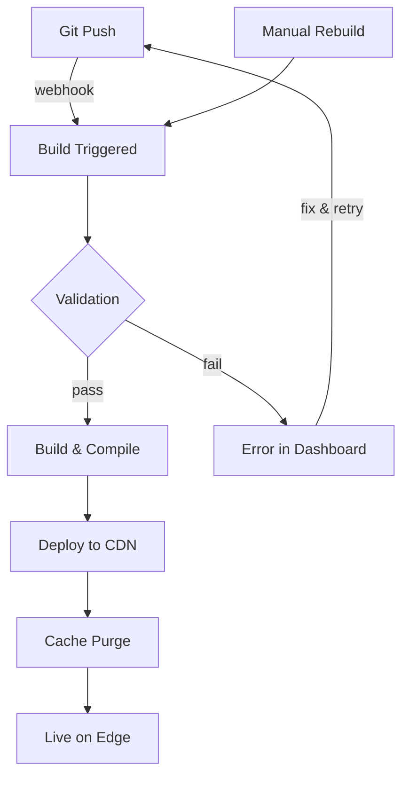

Jamdesk verarbeitet den gesamten Build- und Bereitstellungslebenszyklus automatisch. Pushen Sie zu GitHub, und Ihre Dokumentation ist innerhalb weniger Minuten live.

Die Screenshots zeigen die Benutzeroberfläche auf Englisch.

## Build-Lebenszyklus



## Build-Trigger

| Trigger | Funktionsweise | Anwendungsfall |
|---------|----------------|----------------|
| **Git Push** | Webhook wird beim Push in den verbundenen Branch ausgelöst | Normale Entwicklung |
| **Dashboard** | Klicken Sie in den Projekteinstellungen auf „Rebuild“ | Aktualisierung nach Konfigurationsänderungen erzwingen |

<Note>
Builds werden entprellt. Mehrere Commits innerhalb von 10 Sekunden werden zu einem einzigen Build zusammengefasst.
</Note>

## Was während eines Builds geschieht

Jamdesk klont Ihr Repository, validiert die Syntax von `docs.json` und MDX, kompiliert alles mit Suchindexierung zu optimiertem HTML und stellt es anschließend in Cloudflare R2 bereit. Die meisten Websites werden in 30–90 Sekunden erstellt.

Eine vollständige Aufschlüsselung der Pipeline mit Architekturdiagramm finden Sie unter [Funktionsweise von Jamdesk](/de/how-jamdesk-works).

## Bereitstellungsstatus

Prüfen Sie den Build-Status im Dashboard:

| Status | Bedeutung |
|--------|-----------|
| **Building** | Build wird ausgeführt |
| **Deployed** | Unter Ihrer Domain live |
| **Failed** | Build-Fehler – prüfen Sie die Logs |
| **Queued** | Wartet auf den vorherigen Build |

Der Abschnitt „Build History“ zeigt die letzten Bereitstellungen mit ihrem Status sowie die Möglichkeit, manuelle Builds auszulösen:

<SizedImage src="/images/dashboard/build-history.webp" alt="Build History mit den letzten Bereitstellungen, Status-Badges mit Successful, Commit-Informationen und Rebuild-Schaltfläche" />

## Manueller Build

Lösen Sie einen Build aus, ohne Änderungen zu pushen:

1. Öffnen Sie Ihr Projekt im Dashboard.
2. Öffnen Sie **Settings**.
3. Klicken Sie auf **Rebuild**.

Verwenden Sie diese Funktion in folgenden Fällen:
- Aktualisieren von Umgebungsvariablen
- Beheben eines festgefahrenen Builds
- Aktualisieren nach Plattformänderungen

## Umgebungsvariablen

Legen Sie Build-Variablen unter **Settings** → **Environment** fest:

```bash
ANALYTICS_ID=G-XXXXXXXXXX
API_BASE_URL=https://api.example.com
```

Die Variablen sind während des Build-Prozesses verfügbar und können in Ihren Dateien `docs.json` oder MDX referenziert werden.

## Build-Logs

Rufen Sie detaillierte Build-Logs zur Fehlerbehebung auf:

1. Öffnen Sie **Deployments** in Ihrem Projekt.
2. Klicken Sie auf eine bestimmte Bereitstellung.
3. Rufen Sie das vollständige Build-Log auf.

Häufige Probleme werden in den Logs angezeigt:
- Ungültige MDX-Syntax
- Fehlende Bilder oder Assets
- Fehlerhafte interne Links
- Konfigurationsfehler

## Rollbacks

Kehren Sie zu einer vorherigen Version zurück:

1. Öffnen Sie **Deployments**.
2. Suchen Sie die Bereitstellung, die Sie wiederherstellen möchten.
3. Klicken Sie auf **Rollback**.

Die vorherige Version wird sofort live geschaltet, während ein neuer Build gestartet wird.

## Branch-Bereitstellungen

<Note>
Branch-Bereitstellungen sind in Pro-Tarifen verfügbar.
</Note>

Sehen Sie sich Änderungen vor dem Mergen in der Vorschau an:

1. Pushen Sie in einen Feature-Branch.
2. Jamdesk erstellt eine Vorschau unter `branch-name.your-project.jamdesk.app`.
3. Prüfen und mergen Sie die Änderungen, sobald sie bereit sind.

## Wie geht es weiter?

<Columns cols={2}>
  <Card title="Übersicht der Bereitstellung" icon="cloud-arrow-up" href="/de/deploy/overview">
    Wählen Sie zwischen Hosting auf einer Subdomain, einer benutzerdefinierten Domain oder einem Subpfad
  </Card>
  <Card title="Hosting auf einem Subpfad" icon="route" href="/de/deploy/subpath-hosting">
    Hosten Sie Dokumentation unter example.com/docs
  </Card>
</Columns>