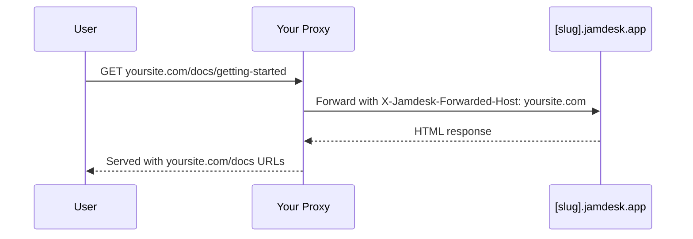

Hosten Sie Ihre Dokumentation unter einem Pfad Ihrer Domain statt unter einer separaten Subdomain: standardmäßig `yoursite.com/docs` oder einem benutzerdefinierten Segment wie `yoursite.com/help`. Eine Übersicht aller Optionen zum Bereitstellen finden Sie unter [Übersicht zur Bereitstellung](/de/deploy/overview).

Die Screenshots zeigen die Benutzeroberfläche auf Englisch.

## Warum einen Pfad verwenden?

Im Vergleich zu einer Subdomain wie `docs.yoursite.com` bleiben Leser bei einem Pfad auf Ihrer primären Domain. Außerdem tragen Ihre Dokumentationsseiten zur Suchautorität dieser Domain bei, statt Ranking-Signale auf zwei Hosts aufzuteilen.

## So funktioniert es

Ihr Webserver oder CDN leitet Anfragen von `/docs/*` an Ihre Jamdesk-Website weiter und behält dabei die ursprüngliche URL im Browser bei:

Der Proxy übergibt den Header `X-Jamdesk-Forwarded-Host` mit Ihrer Domain. Jamdesk verwendet ihn, um:

1. **Ihre Domain zu überprüfen**, damit sie zum Bereitstellen der Inhalte autorisiert ist
2. **Ihre Konfiguration anzuwenden**, die im Dashboard hinterlegt ist

Dadurch muss Ihre Proxy-Konfiguration nur einmal eingerichtet werden: Wenn Sie Einstellungen im Dashboard ändern, muss der Proxy nicht aktualisiert werden.

## Einrichtung nach Anbieter

Wählen Sie Ihren Hosting-Anbieter aus, um zu beginnen:

<Columns cols={2}>
  <Card title="Cloudflare" icon="cloud" href="/de/deploy/cloudflare">
    Verwenden Sie Cloudflare Workers, um `/docs`-Datenverkehr weiterzuleiten
  </Card>
  <Card title="AWS" icon="aws" href="/de/deploy/aws">
    Konfigurieren Sie CloudFront mit Route 53
  </Card>
  <Card title="Vercel" icon="triangle" href="/de/deploy/vercel">
    Fügen Sie Rewrites zu vercel.json hinzu
  </Card>
  <Card title="Reverse Proxy" icon="server" href="/de/deploy/reverse-proxy">
    nginx, Apache oder andere Proxy-Server
  </Card>
</Columns>

## Voraussetzungen

Bevor Sie Ihren Proxy konfigurieren:

1. **Fügen Sie Ihre Domain hinzu** in Ihrem [Jamdesk-Dashboard](https://dashboard.jamdesk.com) unter Settings → Custom Domain
2. **Aktivieren Sie „Host at a subpath“**
3. **Wählen Sie Ihren Pfad** (optional; siehe unten [Subpath auswählen](#subpath-auswählen)) und klicken Sie auf **Save**

Ihre Jamdesk-Subdomain (z. B. `acme.jamdesk.app`) wird im Dashboard angezeigt. Sie benötigen sie für Ihre Proxy-Konfiguration.

<Note>
Das Speichern einer Änderung am Hosting unter einem Pfad (Aktivieren oder Deaktivieren oder Ändern des Pfads) löst einen vollständigen Neuaufbau Ihrer Dokumentation aus. Dies ist erforderlich, weil sich die URL-Struktur ändert (beispielsweise zwischen `/introduction` und `/docs/introduction`).
</Note>

## Subpath auswählen

Standardmäßig wird Ihre Dokumentation unter `/docs` bereitgestellt. Wenn Sie etwas anderes wie `/help` oder `/support` verwenden möchten, geben Sie es in das Pfadfeld neben dem Umschalter ein. Wenn das Feld leer ist, zeigt der Umschalter `Host at a subpath (e.g. /docs)` an. Sobald Sie einen Wert eingeben, wird die Anzeige live auf den Pfad aktualisiert, den Sie aktivieren möchten (`Host at /help` usw.).

<Frame>
  
</Frame>

Das Feld akzeptiert ein einzelnes Segment in Kleinbuchstaben: nur Buchstaben, Ziffern und Bindestriche innerhalb des Segments, keine führenden oder abschließenden Bindestriche, maximal 63 Zeichen. Einige wenige Segmente sind reserviert und werden sofort abgelehnt, darunter `api`, `jd`, gängige Admin-Pfade wie `wp-admin` sowie alle Sprachcodes, die Ihre Dokumentation verwenden könnte (`fr`, `es`, `de` und ähnliche). Durch die Reservierung können diese Pfade niemals mit einer Route kollidieren, die Jamdesk bereits bereitstellt.

Lassen Sie das Feld leer, um den Standardwert `/docs` beizubehalten.

## Subpath umbenennen oder entfernen

Sie können Ihren Pfad ändern oder ihn leeren, um zum Standard zurückzukehren, ohne bereits indexierte oder mit Lesezeichen gespeicherte Links zu beschädigen:

- **`/docs` bleibt immer verfügbar.** Auch nachdem Sie zu einem benutzerdefinierten Pfad wie `/help` gewechselt haben, reagieren die ursprünglichen `/docs/*`-Pfade weiterhin auf Ihrer `[slug].jamdesk.app`-Subdomain und über jeden Proxy, der noch auf diese Pfade verweist. Kanonische Links wechseln sofort zu Ihrem neuen Pfad, sodass Suchmaschinen ihn dort neu indexieren. Bereits auf `/docs` verweisende Links funktionieren weiterhin. Sie können daher Ihre eigene Proxy-Konfiguration in Ihrem eigenen Tempo statt unter Zeitdruck aktualisieren.
- **Beim Umbenennen eines benutzerdefinierten Pfads wird der alte Pfad einmal weitergeleitet.** Wenn Sie `/help` in `/guide` umbenennen, werden Anfragen an `/help/*` per 308-Weiterleitung an den entsprechenden Pfad `/guide/*` geleitet. Diese Historie reicht eine Ebene tief: Wenn Sie anschließend `/guide` in `/support` umbenennen, leitet `/guide/*` nun an `/support/*` weiter. `/help/*` (das Segment von vor zwei Umbenennungen) wird jedoch nicht mehr erfasst, sodass diese Links nicht mehr aufgelöst werden und auf einer „Nicht gefunden“-Seite landen, manchmal nach einer Weiterleitung an einen ungewöhnlich aussehenden kombinierten Pfad. Verketten Sie keine Umbenennungen, wenn Sie darauf angewiesen sind, dass alte Links weitergeleitet werden. Aktualisieren Sie externe Links stattdessen auf den aktuellen Pfad.
- **Die Rückkehr zu `/docs`** funktioniert genauso: Ihr vorheriger benutzerdefinierter Pfad (eine Ebene Historie) wird an `/docs/*` weitergeleitet.

<Warning>
Das bedeutet **nicht**, dass `/docs` an den von Ihnen gewählten Pfad weiterleitet. Das ist nicht nötig, da `/docs` dauerhaft direkt verfügbar bleibt. Die Weiterleitung über eine Ebene gilt nur für einen *benutzerdefinierten* Pfad, den Sie verlassen.
</Warning>

Nachdem Sie Ihren Proxy konfiguriert haben, testen Sie ihn, indem Sie `https://yoursite.com/docs` (oder Ihren konfigurierten Pfad) aufrufen. Ihre Dokumentation sollte mit allen korrekt funktionierenden Assets und Links geladen werden.

## Muss ich die jamdesk.app-Subdomain verbergen?

Nein. Ihre `[slug].jamdesk.app`-Subdomain bleibt erreichbar (sie ist der Upstream-Ursprung, an den Ihr Proxy weiterleitet), konkurriert jedoch nicht mit Ihrer Website in den Suchergebnissen:

- **Wenn Ihre Domain registriert ist**, enthält jede direkt von der Subdomain bereitgestellte Seite einen kanonischen Link, der auf dieselbe Seite auf Ihrer Domain verweist. Dadurch führen Suchmaschinen alle Ranking-Signale dort zusammen.
- **Bevor eine Domain registriert ist**, werden Seiten der Subdomain im Pfadmodus mit `noindex` gekennzeichnet und gelangen daher überhaupt nicht in den Index.

Wenn die Inhalte auf der Subdomain selbst nicht zugänglich sein sollen (nicht nur aus dem Index entfernt), aktivieren Sie den [Passwortschutz](/de/setup/password-protection). Die Subdomain zeigt dann einen Entsperrbildschirm statt Ihrer Dokumentation an.

## Nächste Schritte?

<Columns cols={2}>
  <Card title="Übersicht zur Bereitstellung" icon="cloud-arrow-up" href="/de/deploy/overview">
    Hosting unter Subdomain, benutzerdefinierter Domain und Pfad vergleichen
  </Card>
  <Card title="Benutzerdefinierte Domains" icon="globe" href="/de/deploy/custom-domains">
    DNS überprüfen und Probleme bei der Domaineinrichtung beheben
  </Card>
</Columns>