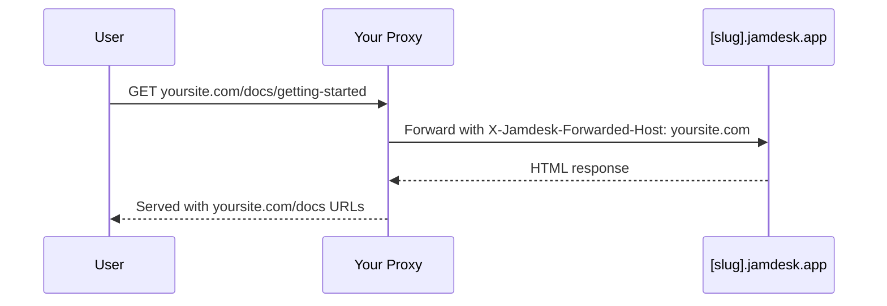

Hosten Sie Ihre Dokumentation unter einem Unterpfad Ihrer Domain statt unter einer separaten Subdomain: standardmäßig `yoursite.com/docs` oder ein eigenes Segment wie `yoursite.com/help`. Informationen zu allen Bereitstellungsoptionen finden Sie in der [Bereitstellungsübersicht](/de/deploy/overview).

Die Screenshots zeigen die Benutzeroberfläche auf Englisch.

## Warum einen Unterpfad verwenden?

Im Vergleich zu einer Subdomain wie `docs.yoursite.com` hält ein Unterpfad Leser auf Ihrer primären Domain. Außerdem tragen Ihre Dokumentationsseiten zur Suchautorität dieser Domain bei, anstatt Ranking-Signale auf zwei Hosts aufzuteilen.

## So funktioniert es

Ihr Webserver oder CDN leitet Anfragen von `/docs/*` an Ihre Jamdesk-Website weiter und behält dabei die ursprüngliche URL im Browser bei:

Der Proxy übermittelt den Header `X-Jamdesk-Forwarded-Host` mit Ihrer Domain. Jamdesk verwendet ihn, um:

1. **Ihre Domain zu verifizieren**, damit sie zum Bereitstellen der Inhalte autorisiert ist
2. **Ihre Konfiguration anzuwenden**, die Sie im Dashboard festgelegt haben

Dadurch ist die Konfiguration Ihres Proxys nur einmal erforderlich: Wenn Sie Einstellungen im Dashboard ändern, muss der Proxy nicht aktualisiert werden.

## Einrichtung nach Anbieter

Wählen Sie Ihren Hosting-Anbieter, um zu beginnen:

<Columns cols={2}>
  <Card title="Cloudflare" icon="cloud" href="/de/deploy/cloudflare">
    Verwenden Sie Cloudflare Workers, um den /docs-Datenverkehr weiterzuleiten
  </Card>
  <Card title="AWS" icon="aws" href="/de/deploy/aws">
    Konfigurieren Sie CloudFront mit Route 53
  </Card>
  <Card title="Vercel" icon="triangle" href="/de/deploy/vercel">
    Fügen Sie Umschreibungen zu vercel.json hinzu
  </Card>
  <Card title="Reverse Proxy" icon="server" href="/de/deploy/reverse-proxy">
    nginx, Apache oder andere Proxy-Server
  </Card>
</Columns>

## Voraussetzungen

Bevor Sie Ihren Proxy konfigurieren:

1. **Fügen Sie Ihre Domain hinzu** in Ihrem [Jamdesk-Dashboard](https://dashboard.jamdesk.com) unter Settings → Custom Domain
2. **Aktivieren Sie „Host at a subpath“**
3. **Wählen Sie Ihren Unterpfad** (optional; siehe unten [Ihren Unterpfad auswählen](#ihren-unterpfad-auswählen)) und klicken Sie auf **Save**

Ihre Jamdesk-Subdomain (z. B. `acme.jamdesk.app`) wird im Dashboard angezeigt. Sie benötigen sie für die Konfiguration Ihres Proxys.

<Note>
Das Speichern einer Änderung am Hosting unter einem Unterpfad (Aktivieren oder Deaktivieren beziehungsweise Ändern des Unterpfads) löst einen vollständigen Build Ihrer Dokumentation aus. Dies ist erforderlich, weil sich die URL-Struktur ändert (zum Beispiel zwischen `/introduction` und `/docs/introduction`).
</Note>

## Ihren Unterpfad auswählen

Standardmäßig wird Ihre Dokumentation unter `/docs` bereitgestellt. Wenn Sie etwas anderes verwenden möchten, etwa `/help` oder `/support`, geben Sie dies in das Unterpfadfeld neben dem Umschalter ein. Bei leerem Feld lautet der Umschalter „Host at a subpath (e.g. /docs)“; sobald Sie einen Wert eingeben, wird er live auf den Pfad aktualisiert, den Sie aktivieren möchten („Host at /help“ usw.).

<Frame>
  
</Frame>

Das Feld akzeptiert ein einzelnes kleingeschriebenes Segment: Buchstaben, Ziffern und Bindestriche nur innerhalb des Segments, ohne führenden oder abschließenden Bindestrich und mit maximal 63 Zeichen. Einige wenige Segmente sind reserviert und werden vollständig abgelehnt, darunter `api`, `jd`, übliche Administrationspfade wie `wp-admin` sowie alle Sprachcodes, die Ihre Dokumentation verwenden könnte (`fr`, `es`, `de` und ähnliche). Durch die Reservierung kann Ihr Unterpfad niemals mit einer Route kollidieren, die Jamdesk bereits bereitstellt.

Lassen Sie das Feld leer, um den Standardwert `/docs` beizubehalten.

## Unterpfad umbenennen oder entfernen

Sie können Ihren Unterpfad ändern oder leeren, um zum Standardwert zurückzukehren, ohne bereits indexierte oder mit Lesezeichen versehene Links zu beschädigen:

- **`/docs` wird immer bereitgestellt.** Auch nachdem Sie zu einem eigenen Unterpfad wie `/help` gewechselt haben, antworten die ursprünglichen `/docs/*`-Pfade weiterhin auf Ihrer `[slug].jamdesk.app`-Subdomain und über jeden Proxy, der noch auf diese Pfade verweist. Kanonische Links wechseln sofort zu Ihrem neuen Unterpfad, sodass Suchmaschinen sie dort erneut indexieren. Bereits auf `/docs` verweisende Links bleiben funktionsfähig. Dadurch können Sie Ihre eigene Proxy-Konfiguration in Ihrem eigenen Tempo statt unter Zeitdruck aktualisieren.
- **Beim Umbenennen eines eigenen Unterpfads wird der alte für eine Umbenennung weitergeleitet.** Wenn Sie `/help` in `/guide` umbenennen, werden Anfragen an `/help/*` per 308-Weiterleitung an den entsprechenden `/guide/*`-Pfad weitergeleitet. Dieser Verlauf ist nur eine Ebene tief: Benennen Sie `/guide` anschließend in `/support` um, leitet `/guide/*` nun an `/support/*` weiter. `/help/*` (das Segment von vor zwei Umbenennungen) wird jedoch nicht mehr verfolgt. Diese Links werden dann nicht mehr aufgelöst und führen zu einer „not found“-Seite, manchmal nach einer Weiterleitung an einen ungewöhnlich aussehenden kombinierten Pfad. Verketten Sie keine Umbenennungen, wenn Sie darauf angewiesen sind, dass die Weiterleitung alte Links übernimmt. Aktualisieren Sie stattdessen externe Links auf den aktuellen Unterpfad.
- **Die Rückkehr zu `/docs`** funktioniert genauso: Ihr vorheriger eigener Unterpfad (eine Verlaufsebene) wird an `/docs/*` weitergeleitet.

<Warning>
Das bedeutet **nicht**, dass `/docs` an einen beliebigen von Ihnen gewählten Unterpfad weiterleitet. Das ist nicht erforderlich, da `/docs` weiterhin direkt und dauerhaft bereitgestellt wird. Die Weiterleitung über eine Ebene gilt nur für einen eigenen Unterpfad, den Sie verlassen.
</Warning>

Nachdem Sie Ihren Proxy konfiguriert haben, testen Sie ihn, indem Sie `https://yoursite.com/docs` (oder Ihren konfigurierten Unterpfad) aufrufen. Ihre Dokumentation sollte mit allen Assets und funktionierenden Links geladen werden.

## Muss ich die Subdomain jamdesk.app ausblenden?

Nein. Ihre `[slug].jamdesk.app`-Subdomain bleibt erreichbar (sie ist der Upstream-Ursprung, an den Ihr Proxy weiterleitet), konkurriert jedoch nicht mit Ihrer Website in den Suchergebnissen:

- **Wenn Ihre Domain registriert ist**, enthält jede direkt von der Subdomain bereitgestellte Seite einen kanonischen Link, der auf dieselbe Seite auf Ihrer Domain verweist. Dadurch bündeln Suchmaschinen alle Ranking-Signale dort.
- **Bevor eine Domain registriert ist**, werden Seiten der Subdomain im Unterpfad-Modus mit `noindex` gekennzeichnet und gelangen daher überhaupt nicht in den Index.

Wenn der Inhalt selbst auf der Subdomain nicht zugänglich sein soll (nicht nur aus dem Index ausgeschlossen), aktivieren Sie den [Passwortschutz](/de/setup/password-protection). Die Subdomain stellt dann statt Ihrer Dokumentation einen Entsperrbildschirm bereit.

## Wie geht es weiter?

<Columns cols={2}>
  <Card title="Bereitstellungsübersicht" icon="cloud-arrow-up" href="/de/deploy/overview">
    Hosting über Subdomain, eigener Domain und Unterpfad vergleichen
  </Card>
  <Card title="Eigene Domains" icon="globe" href="/de/deploy/custom-domains">
    DNS verifizieren und die Domaineinrichtung überprüfen
  </Card>
</Columns>