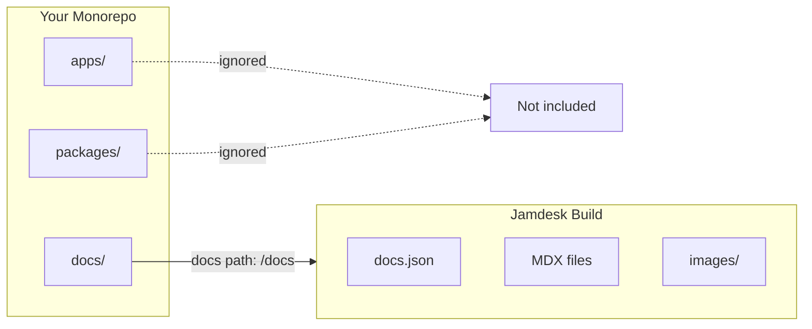

Wenn sich Ihre `docs.json` in einem Unterverzeichnis befindet – `docs/`, `packages/docs/` oder an einem anderen Ort –, aktivieren Sie den Monorepo-Modus in den Projekteinstellungen und geben Sie den Pfad an. Jamdesk beschränkt Builds auf dieses Verzeichnis und ignoriert alles außerhalb davon.

Die Screenshots zeigen die Benutzeroberfläche auf Englisch.

<Note>
**Voraussetzungen:** Sie benötigen ein mit einem [GitHub-Repository](/de/setup/connecting-github) verbundenes [Jamdesk-Projekt](/de/setup/creating-projects), bevor Sie die Monorepo-Unterstützung konfigurieren.
</Note>

## So beschränkt Jamdesk Ihren Build



## Schnelle Einrichtung

<Steps>
  <Step title="Projekteinstellungen öffnen">
    Öffnen Sie Ihr Projekt im [Jamdesk-Dashboard](https://dashboard.jamdesk.com) und gehen Sie zu **Settings**.
  </Step>

  <Step title="Monorepo-Modus aktivieren">
    Aktivieren Sie im Abschnitt **Git Repository** die Option **Set up as monorepo**.

    <Frame>
      
    </Frame>
  </Step>

  <Step title="Docs-Pfad eingeben">
    Geben Sie den Pfad zu dem Verzeichnis an, das Ihre `docs.json`-Datei enthält.

    <Frame>
      
    </Frame>

    Die Vorschau zeigt, wo Jamdesk nach Ihrer Konfigurationsdatei sucht.
  </Step>

  <Step title="Speichern und neu erstellen">
    Klicken Sie auf **Save Changes**, um die Änderungen anzuwenden. Ihr nächster Build verwendet den neuen Pfad.
  </Step>
</Steps>

## Den Docs-Pfad verstehen

Der Docs-Pfad gibt an, wo Jamdesk Ihre `docs.json`-Konfigurationsdatei innerhalb des Repositorys findet.

<Warning>
Geben Sie nur den Verzeichnispfad ein, nicht den Dateinamen. Verwenden Sie `docs` und nicht `docs/docs.json`.
</Warning>

### Pfadbeispiele

| Repository-Struktur | Wert des Docs-Pfads |
|---------------------|---------------------|
| `my-repo/docs/docs.json` | `docs` |
| `my-repo/packages/docs/docs.json` | `packages/docs` |
| `my-repo/apps/website/docs/docs.json` | `apps/website/docs` |
| `my-repo/documentation/docs.json` | `documentation` |

### Was eingeschlossen wird

Wenn Sie einen Docs-Pfad festlegen, verarbeitet Jamdesk nur Dateien innerhalb dieses Verzeichnisses:

- **Inhaltsdateien** (`.mdx`, `.md`) werden in Seiten kompiliert
- **Assets** in Unterverzeichnissen (z. B. `images/`) werden eingeschlossen
- **Konfiguration** (`docs.json`) definiert Ihre Website

Dateien außerhalb des Docs-Pfads werden bei Builds ignoriert.

## Gängige Monorepo-Muster

Wählen Sie das Muster, das Ihrer Projektstruktur entspricht:

<Tabs>
  <Tab title="Dediziertes /docs">
    Dokumentation in einem Verzeichnis der obersten Ebene.

    ```bash
    monorepo/
    ├── packages/
    ├── apps/
    └── docs/                    # Docs path: docs
        ├── docs.json
        ├── introduction.mdx
        └── guides/
    ```

    **Docs-Pfad:** `docs`
  </Tab>

  <Tab title="Paket in /packages">
    Dokumentation als Workspace-Paket.

    ```bash
    monorepo/
    ├── packages/
    │   ├── core/
    │   ├── cli/
    │   └── docs/                # Docs path: packages/docs
    │       ├── docs.json
    │       └── pages/
    └── apps/
    ```

    **Docs-Pfad:** `packages/docs`
  </Tab>

  <Tab title="Innerhalb einer App">
    Dokumentation innerhalb einer Anwendung.

    ```bash
    monorepo/
    ├── apps/
    │   └── website/
    │       ├── src/
    │       └── docs/            # Docs path: apps/website/docs
    │           ├── docs.json
    │           └── introduction.mdx
    └── packages/
    ```

    **Docs-Pfad:** `apps/website/docs`
  </Tab>

  <Tab title="Benutzerdefiniertes Verzeichnis">
    Beliebiger benutzerdefinierter Verzeichnisname.

    ```bash
    monorepo/
    ├── src/
    ├── tests/
    └── documentation/           # Docs path: documentation
        ├── docs.json
        └── getting-started.mdx
    ```

    **Docs-Pfad:** `documentation`
  </Tab>
</Tabs>

## Mit Assets arbeiten

Asset-Pfade in `docs.json` sind immer relativ zu Ihrem Docs-Verzeichnis, nicht zum Stammverzeichnis des Repositorys.

### Beispiel

Wenn sich Ihre Dokumentation in `packages/docs/` befindet:

```json packages/docs/docs.json
{
  "logo": {
    "light": "/images/logo.svg"
  },
  "favicon": "/images/favicon.svg"
}
```

Diese Pfade verweisen auf:
- `packages/docs/images/logo.svg`
- `packages/docs/images/favicon.svg`

<Warning>
Verwenden Sie keine absoluten Pfade vom Stammverzeichnis des Repositorys. Dies funktioniert nicht:

```json
"favicon": "/packages/docs/images/favicon.svg"
```
</Warning>

### In MDX-Dateien

Für Bilder in Ihren Inhalten gilt dieselbe Regel:

```mdx

```

Dies verweist auf ein Bild unter `[docs-path]/images/tabs-preview.png`.

## Interne Links

Interne Links funktionieren unabhängig von Ihrer Repository-Struktur gleich. Verwenden Sie Pfade relativ zum Stammverzeichnis Ihrer Dokumentation:

```mdx
[See the quickstart guide](/quickstart)
[Installation steps](/quickstart#installation)
```

Diese Pfade entsprechen Ihrer Navigationsstruktur, nicht Ihrem Dateisystem.

## Build-Verhalten

Jamdesk überwacht nur Änderungen innerhalb des konfigurierten Docs-Pfads:

- Änderungen an `packages/docs/**` lösen einen Build aus
- Änderungen an `packages/core/**` lösen keinen Build aus

Dadurch bleiben Builds schnell und auf Änderungen an der Dokumentation fokussiert.

<Tip>
**Müssen Sie bei Änderungen an anderem Code neu erstellen?**

Wenn Sie Dokumentation aus Quellcode generieren (z. B. API-Dokumentation aus Codekommentaren), lösen Sie über das Dashboard einen manuellen Build aus oder richten Sie einen Webhook in Ihrer CI-Pipeline ein.
</Tip>

## Kompatibilität mit Workspace-Tools

Jamdesk funktioniert mit allen gängigen Monorepo-Tools. Über die Einstellung des Docs-Pfads hinaus ist keine spezielle Konfiguration erforderlich.

| Tool | Unterstützt |
|------|-----------|
| npm workspaces | Ja |
| Yarn workspaces | Ja |
| pnpm workspaces | Ja |
| Turborepo | Ja |
| Nx | Ja |
| Lerna | Ja |

## Fehlerbehebung

<AccordionGroup>
  <Accordion title="Fehler: docs.json nicht gefunden" icon="circle-exclamation">
    1. Überprüfen Sie, ob der genaue Pfad in Ihrem Repository mit Ihrer Eingabe übereinstimmt
    2. Stellen Sie sicher, dass `docs.json` an diesem Ort vorhanden ist
    3. Prüfen Sie auf Tippfehler – bei Pfaden wird zwischen Groß- und Kleinschreibung unterschieden
    4. Denken Sie daran: Verwenden Sie `docs` und nicht `docs/docs.json`

    **Schnellprüfung:** In Ihrem Repository sollte die Datei unter `[your-docs-path]/docs.json` vorhanden sein
  </Accordion>

  <Accordion title="Assets werden nicht geladen" icon="image">
    Asset-Pfade müssen relativ zu Ihrem Docs-Verzeichnis sein.

    **Korrekt** – relativ zum Docs-Verzeichnis:
    ```json
    "favicon": "/images/favicon.svg"
    ```

    **Falsch** – absolut vom Stammverzeichnis des Repositorys:
    ```json
    "favicon": "/packages/docs/images/favicon.svg"
    ```

    Stellen Sie sicher, dass Ihre Bilder tatsächlich unter `[docs-path]/images/` vorhanden sind.
  </Accordion>

  <Accordion title="Änderungen lösen keine Builds aus" icon="rotate">
    Nur Änderungen innerhalb Ihres konfigurierten Docs-Pfads lösen automatische Builds aus.

    1. Überprüfen Sie, ob Sie Dateien innerhalb des Docs-Pfads ändern
    2. Prüfen Sie, ob Sie in den richtigen Branch pushen
    3. Sehen Sie den Status der Webhook-Zustellung in den GitHub-Repository-Einstellungen ein

    Wenn Builds durch Änderungen außerhalb des Docs-Pfads ausgelöst werden müssen, verwenden Sie manuelle Builds oder CI-Webhooks.
  </Accordion>
</AccordionGroup>

## Wie geht es weiter?

<Columns cols={2}>
  <Card title="GitHub verbinden" icon="github" href="/de/setup/connecting-github">
    Verknüpfen Sie Ihr Repository für automatische Builds
  </Card>
  <Card title="Verzeichnisstruktur" icon="folder-tree" href="/de/setup/directory-structure">
    Organisieren Sie Ihre Dokumentation für größere Projekte
  </Card>
</Columns>