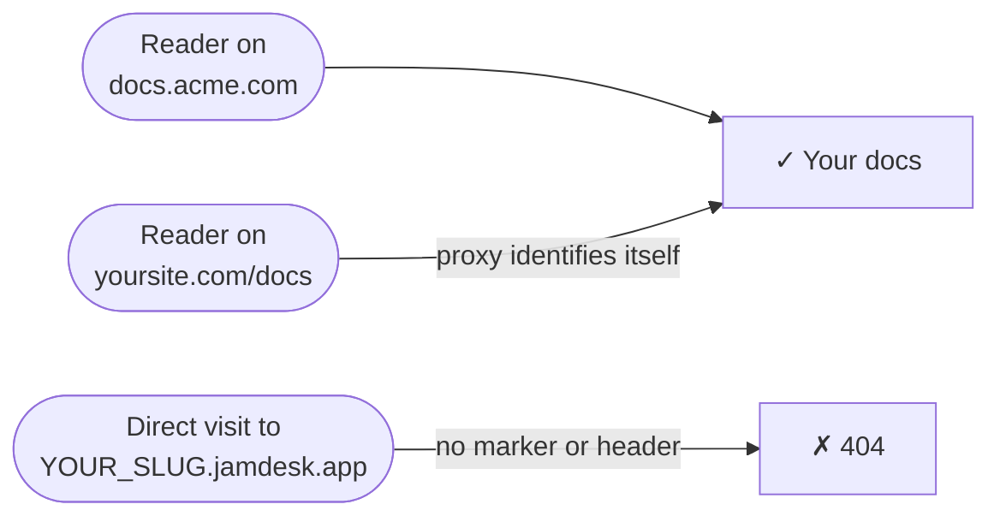

Your documentation is hosted at `YOUR_SLUG.jamdesk.app`. When you connect a custom domain, that subdomain keeps answering — but every page it serves includes a `<link rel="canonical">` tag pointing at your domain, so search engines index your domain, never the subdomain. For most projects that's all you need.

**Custom domain only** goes one step further: it turns the subdomain off for direct visitors. A plain hit on `YOUR_SLUG.jamdesk.app` returns a 404, and your docs are reachable only through your own domain.



<Warning>
This hides your subdomain — it is not a password. Anyone visiting through your domain still sees your docs. To control *who* can read them, use [password protection](/setup/password-protection); the two work together.
</Warning>

## Turning It On

<Steps>
  <Step title="Verify your custom domain">
    Add and verify your domain in the dashboard — see [Custom Domains](/deploy/custom-domains). The toggle requires a domain with status **Active**.
  </Step>
  <Step title="Check your proxy (reverse-proxy setups only)">
    If your domain is a plain CNAME pointed at Jamdesk (like `docs.acme.com`), skip this step — there's nothing to configure. If you serve docs at `yoursite.com/docs` through a proxy, the proxy must identify itself on every request it forwards — see [Proxy setups](#proxy-setups) below.
  </Step>
  <Step title="Flip the toggle">
    In the dashboard, open your project's **Settings**, expand the **Custom Domain** card, and turn on **Custom domain only**. Jamdesk checks your live domain first and won't enable the toggle until your setup passes — if the check fails, the message tells you exactly what to fix.

    <Frame>
      
    </Frame>
  </Step>
</Steps>

Changes reach every edge server within a minute.

## Proxy Setups

A request to `YOUR_SLUG.jamdesk.app` is only served if it identifies itself as coming through your proxy — with either the `X-Jamdesk-Forwarded-Host` header or the `?jd_proxy=1` query marker. Each setup guide already includes the right one:

- **[Vercel](/deploy/vercel)** — `vercel.json` rewrites carry `?jd_proxy=1`; Edge Middleware sets the header
- **[Cloudflare Workers](/deploy/cloudflare)** — the Worker sets the header
- **[AWS CloudFront](/deploy/aws)** — the origin custom header
- **[Reverse proxy](/deploy/reverse-proxy)** — nginx, Apache, Caddy, and HAProxy set the header

If you followed one of those guides, you're already set.

Using [MCP](/ai/mcp-server) or the [chat widget](/ai/chat) through a reverse proxy? Forward `/api/mcp/:path*` and `/api/chat/:path*` the same way as `/docs`. On Vercel:

```json vercel.json
{
  "rewrites": [
    { "source": "/api/mcp/:path*", "destination": "https://YOUR_SLUG.jamdesk.app/api/mcp/:path*?jd_proxy=1" },
    { "source": "/api/chat/:path*", "destination": "https://YOUR_SLUG.jamdesk.app/api/chat/:path*?jd_proxy=1" }
  ]
}
```

If your custom domain is CNAME'd to Jamdesk, MCP and chat on your domain keep working with no changes — point MCP clients at `https://docs.acme.com/_mcp` and you're done.

## Good to Know

- **Everything 404s on the bare subdomain** — pages, `sitemap.xml`, `robots.txt`, `llms.txt`, and Markdown exports. Browsers see a simple Jamdesk not-found page.
- **Images stay reachable.** Images, video, and social-preview (OG) images are exempt — the dashboard's site preview loads them directly from the subdomain.
- **You can't lock yourself out.** If your domain's DNS ever breaks, Jamdesk stops enforcing the block and the subdomain serves again until the domain recovers. If you break your own proxy config instead (say, by removing the marker from a rewrite), turn the toggle off while you fix it.
- **The [Search API](/jamdesk-api/docs-search-api) is unaffected** — it's authenticated by API key.

## What's Next?

<Columns cols={3}>
  <Card title="Vercel" icon="cloud-arrow-up" href="/deploy/vercel">
    Add the jd_proxy marker or Edge Middleware
  </Card>
  <Card title="Custom Domains" icon="globe" href="/deploy/custom-domains">
    Register and verify your domain
  </Card>
  <Card title="Password Protection" icon="lock" href="/setup/password-protection">
    Control who can read your docs
  </Card>
</Columns>
