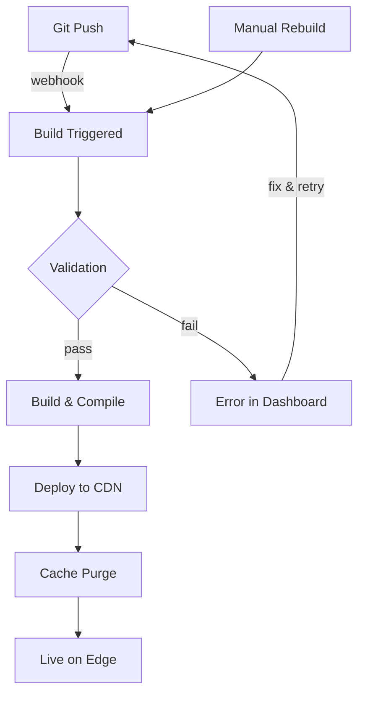

Jamdesk handles the full build and deploy lifecycle automatically. Push to GitHub and your docs go live within minutes.

## Build Lifecycle



## Build Triggers

| Trigger | How It Works | Use Case |
|---------|--------------|----------|
| **Git Push** | Webhook fires on push to connected branch | Normal development |
| **Dashboard** | Click "Rebuild" in project settings | Force refresh after config changes |

<Note>
Builds are debounced. Multiple commits within 10 seconds are batched into a single build.
</Note>

## What Happens During a Build

Jamdesk clones your repo, validates `docs.json` and MDX syntax, compiles to optimized HTML with search indexing, then deploys to Cloudflare R2. Most sites build in 30-90 seconds.

For the full pipeline breakdown with architecture diagram, see [How Jamdesk Works](/how-jamdesk-works).

## Deployment Status

Check build status in the dashboard:

| Status | Meaning |
|--------|---------|
| **Building** | Build in progress |
| **Deployed** | Live at your domain |
| **Failed** | Build error - check logs |
| **Queued** | Waiting for previous build |

The Build History section shows recent deployments with status and the ability to trigger manual rebuilds:

<SizedImage src="/images/dashboard/build-history.webp" alt="Build History showing recent deployments with Successful status badges, commit info, and Rebuild button" />

## Manual Rebuild

Trigger a rebuild without pushing changes:

1. Go to your project in the dashboard
2. Open **Settings**
3. Click **Rebuild**

Use this when:
- Updating environment variables
- Fixing a stuck build
- Refreshing after platform updates

## Environment Variables

Set build-time variables in **Settings** → **Environment**:

```bash
ANALYTICS_ID=G-XXXXXXXXXX
API_BASE_URL=https://api.example.com
```

Variables are available during the build process and can be referenced in your docs.json or MDX files.

## Build Logs

View detailed build logs for debugging:

1. Go to **Deployments** in your project
2. Click on a specific deployment
3. View the full build log

Common issues appear in logs:
- Invalid MDX syntax
- Missing images or assets
- Broken internal links
- Configuration errors

## Rollbacks

Revert to a previous version:

1. Go to **Deployments**
2. Find the deployment you want to restore
3. Click **Rollback**

The previous version goes live immediately while a new build starts.

## Branch Deployments

<Note>
Branch deployments are available on Pro plans.
</Note>

Preview changes before merging:

1. Push to a feature branch
2. Jamdesk creates a preview at `branch-name.your-project.jamdesk.app`
3. Review and merge when ready

## What's Next?

<Columns cols={2}>
  <Card title="Deployment Overview" icon="cloud-arrow-up" href="/deploy/overview">
    Choose between subdomain, custom domain, or subpath hosting
  </Card>
  <Card title="Subpath Hosting" icon="route" href="/deploy/subpath-hosting">
    Host docs at example.com/docs
  </Card>
</Columns>
