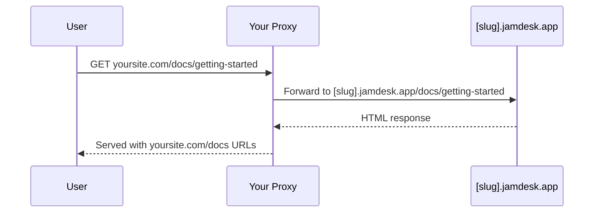

Host your documentation at a `/docs` subpath on your primary domain. This keeps your docs integrated with your main website while maintaining a consistent brand experience.

## Why Use a Subpath?

Hosting docs at `yoursite.com/docs` instead of a subdomain like `docs.yoursite.com` provides:

- **Better SEO** - Documentation pages contribute to your main domain's authority
- **Unified experience** - Users stay on your primary domain
- **Simpler navigation** - No context switching between domains

## How It Works

Your web server or CDN proxies requests from `/docs/*` to your Jamdesk site while preserving the original URL in the browser:

## Setup by Provider

Choose your hosting provider to get started:

<CardGroup cols={2}>
  <Card title="Cloudflare" icon="cloud" href="/deploy/cloudflare">
    Use Cloudflare Workers to proxy /docs traffic
  </Card>
  <Card title="AWS" icon="aws" href="/deploy/aws">
    Configure CloudFront with Route 53
  </Card>
  <Card title="Vercel" icon="triangle" href="/deploy/vercel">
    Add rewrites to vercel.json
  </Card>
  <Card title="Reverse Proxy" icon="server" href="/deploy/reverse-proxy">
    nginx, Apache, or other proxy servers
  </Card>
</CardGroup>

## Prerequisites

Before configuring your proxy:

1. **Enable subpath hosting** in your [Jamdesk dashboard](https://app.jamdesk.com) under Settings → Custom Domain
2. **Toggle "Host at /docs"** to on
3. **Add your domain** (e.g., `yoursite.com`)

Your Jamdesk subdomain (e.g., `acme.jamdesk.app`) will be displayed in the dashboard - you'll need this for your proxy configuration.

Once you've configured your proxy, test by visiting `https://yoursite.com/docs`. Your documentation should load with all assets and links working correctly.
