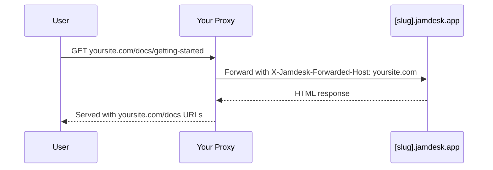

Host your docs at a subpath on your domain instead of a separate subdomain: `yoursite.com/docs` by default, or a custom segment like `yoursite.com/help`. For all deployment options, see [Deployment Overview](/deploy/overview).

## Why Use a Subpath?

Compared with a subdomain like `docs.yoursite.com`, a subpath keeps readers on your primary domain, and your documentation pages contribute to that domain's search authority instead of splitting ranking signals across two hosts.

## How It Works

Your web server or CDN proxies requests from `/docs/*` to your Jamdesk site while preserving the original URL in the browser:

The proxy passes the `X-Jamdesk-Forwarded-Host` header with your domain. Jamdesk uses this to:

1. **Verify your domain** is authorized to serve the content
2. **Apply your configuration** from the dashboard

This makes your proxy configuration a one-time setup: if you change settings in the dashboard, the proxy doesn't need to be updated.

## Setup by Provider

Choose your hosting provider to get started:

<Columns cols={2}>
  <Card title="Cloudflare" icon="cloud" href="/deploy/cloudflare">
    Use Cloudflare Workers to proxy /docs traffic
  </Card>
  <Card title="AWS" icon="aws" href="/deploy/aws">
    Configure CloudFront with Route 53
  </Card>
  <Card title="Vercel" icon="triangle" href="/deploy/vercel">
    Add rewrites to vercel.json
  </Card>
  <Card title="Reverse Proxy" icon="server" href="/deploy/reverse-proxy">
    nginx, Apache, or other proxy servers
  </Card>
</Columns>

## Prerequisites

Before configuring your proxy:

1. **Add your domain** in your [Jamdesk dashboard](https://dashboard.jamdesk.com) under Settings → Custom Domain
2. **Toggle "Host at a subpath"** on
3. **Choose your subpath** (optional; see [Choosing Your Subpath](#choosing-your-subpath) below) and click **Save**

Your Jamdesk subdomain (e.g., `acme.jamdesk.app`) will be displayed in the dashboard. You'll need it for your proxy configuration.

<Note>
Saving a change to subpath hosting (turning it on or off, or changing the subpath itself) triggers a full rebuild of your documentation. This is required because the URL structure changes (for example, between `/introduction` and `/docs/introduction`).
</Note>

## Choosing Your Subpath

By default, your docs are served at `/docs`. To use something else, like `/help` or `/support`, enter it in the subpath field next to the toggle. With the field blank the toggle reads `Host at a subpath (e.g. /docs)`; type a value and it updates live to the path you are about to enable (`Host at /help`, and so on).

<Frame>
  
</Frame>

The field accepts a single lowercase segment: letters, digits, and inner hyphens only, no leading or trailing hyphen, 63 characters maximum. A handful of segments are reserved and rejected outright, including `api`, `jd`, common admin paths like `wp-admin`, and any locale code your docs might use (`fr`, `es`, `de`, and similar). Reserving them means your subpath can never collide with a route Jamdesk already serves.

Leave the field blank to keep the default `/docs`.

## Renaming or Removing Your Subpath

Changing your subpath, or clearing it to go back to the default, is safe to do without breaking links that are already indexed or bookmarked:

- **`/docs` never stops serving.** Even after you switch to a custom subpath like `/help`, the original `/docs/*` paths keep responding on your `[slug].jamdesk.app` subdomain and through any proxy still pointed at them. Canonical links move to your new subpath immediately, so search engines re-index there. Nothing that already points at `/docs` breaks, which means you can update your own proxy configuration at your own pace rather than under time pressure.
- **Renaming a custom subpath forwards the old one, for one rename.** If you rename `/help` to `/guide`, requests to `/help/*` 308-redirect to the matching `/guide/*` path. This history is one level deep: rename again from `/guide` to `/support` and `/guide/*` now redirects to `/support/*`, but `/help/*` (the segment from two renames ago) is no longer tracked and 404s. Don't chain renames if you're relying on the redirect to carry old links forward; update external links to the current subpath instead.
- **Rolling back to `/docs`** works the same way: your previous custom subpath (one level of history) redirects to `/docs/*`.

<Warning>
This does **not** mean `/docs` redirects to whatever subpath you choose. It doesn't need to, because `/docs` keeps serving directly, permanently. The one-level redirect only applies to a *custom* subpath you're moving away from.
</Warning>

Once you've configured your proxy, test by visiting `https://yoursite.com/docs` (or your configured subpath). Your documentation should load with all assets and links working correctly.

## Do I need to hide the jamdesk.app subdomain?

No. Your `[slug].jamdesk.app` subdomain stays reachable (it's the upstream
origin your proxy forwards to), but it won't compete with your site in
search results:

- **With your domain registered**, every page served directly from the
  subdomain includes a canonical link pointing at the same page on your
  domain, so search engines consolidate all ranking signals there.
- **Before a domain is registered**, subpath-mode subdomain pages are marked
  `noindex`, so they never enter the index at all.

If you also want the content itself inaccessible on the subdomain (not just
unindexed), enable [Password Protection](/setup/password-protection): the
subdomain then serves an unlock screen instead of your docs.

## What's Next?

<Columns cols={2}>
  <Card title="Deployment Overview" icon="cloud-arrow-up" href="/deploy/overview">
    Compare subdomain, custom domain, and subpath hosting
  </Card>
  <Card title="Custom Domains" icon="globe" href="/deploy/custom-domains">
    Verify DNS and troubleshoot domain setup
  </Card>
</Columns>
