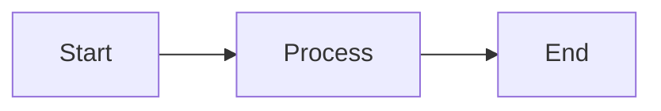
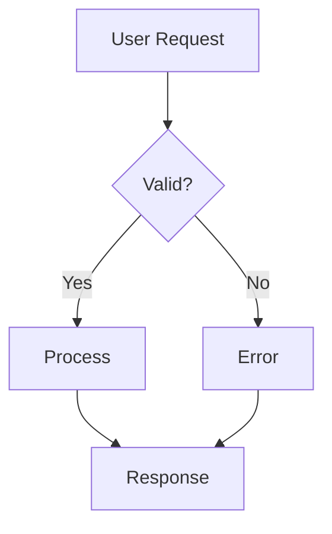
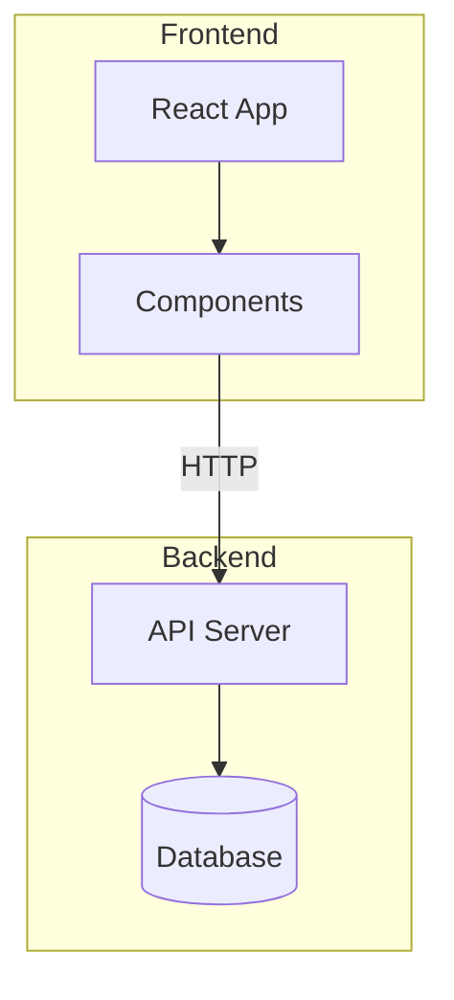
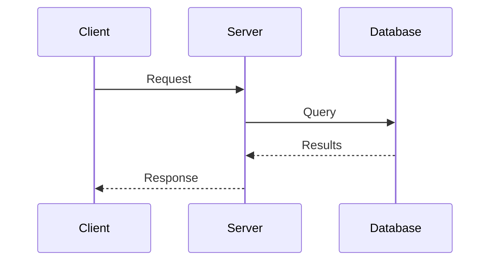
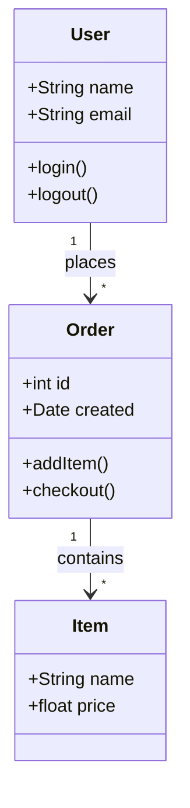
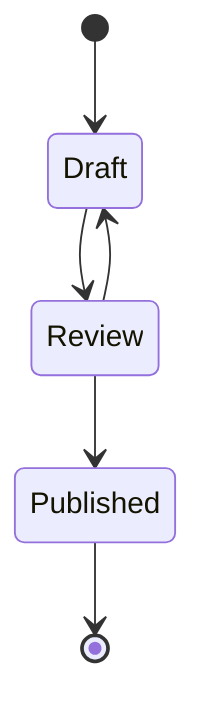
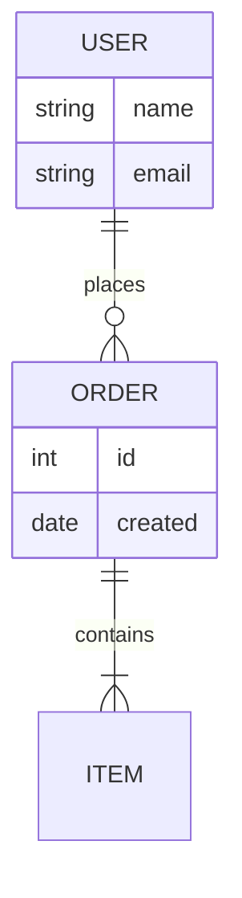
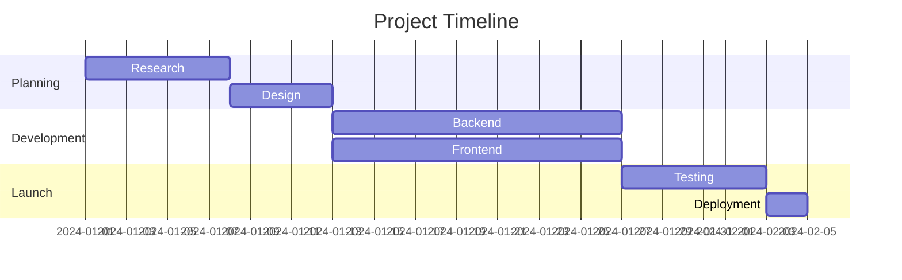
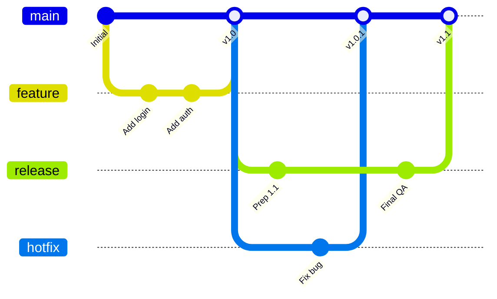
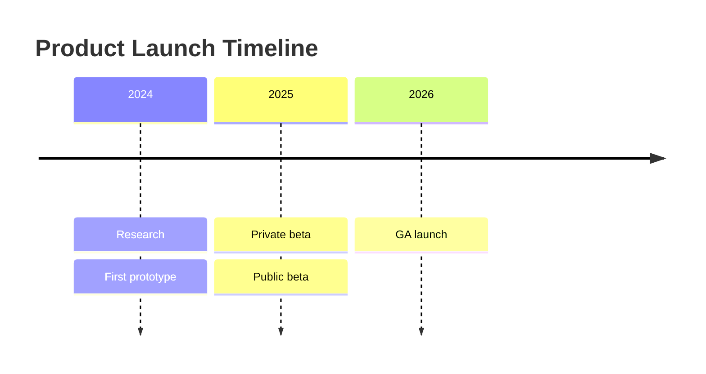

Escribe diagramas como texto en bloques de código delimitados. Jamdesk los renderiza como SVG en tiempo de build.

<Tip>
  Redacta y previsualiza tu diagrama en el [editor Mermaid de Jamdesk](https://jamdesk.com/utilities/mermaid-editor) —
  un editor y visualizador de código abierto que funciona en el navegador. Escribe sintaxis Mermaid, ve el resultado
  en tiempo real y luego pégalo en un bloque delimitado `mermaid`.
</Tip>

<Tip>
  Jamdesk también admite [diagramas D2](/es/components/d2) en bloques delimitados `d2`.
  Opta por D2 cuando un diagrama necesite contenedores anidados, un esquema SQL con
  claves primarias y foráneas, o cuando quieras cambiar de motor de diseño. Los ejemplos
  de Mermaid en esta página tienen equivalentes en D2 en la [página de D2](/es/components/d2).
</Tip>

## Uso básico

Usa un bloque de código delimitado con el identificador de lenguaje `mermaid`:

````mdx

````


## Tipos de diagramas

### Diagramas de flujo

La dirección puede ser de arriba hacia abajo (`TD`), de izquierda a derecha (`LR`), de abajo hacia arriba (`BT`) o de derecha a izquierda (`RL`).



````mdx

````

#### Subgráficos

Agrupa nodos relacionados usando subgráficos. Esto ayuda a organizar diagramas de flujo complejos en secciones lógicas como "Frontend" y "Backend" o diferentes etapas de un pipeline.



````mdx

````

### Diagramas de secuencia

Los diagramas de secuencia muestran cómo interactúan los componentes a lo largo del tiempo. Son ideales para documentar llamadas a API, flujos de autenticación o cualquier comunicación entre servicios. Los participantes aparecen como líneas de vida verticales, con mensajes que fluyen entre ellos.



````mdx

````

### Diagramas de clases

Los diagramas de clases representan la estructura de sistemas orientados a objetos. Úsalos para documentar modelos de datos, mostrar relaciones entre entidades o diseñar la arquitectura del sistema. Muestran clases con sus atributos, métodos y cómo se relacionan entre sí.



````mdx

````

### Diagramas de estado

Los diagramas de estado modelan el ciclo de vida de un objeto o proceso. Muestran todos los estados posibles y las transiciones entre ellos. Usa diagramas de estado para documentar estados de pedidos, flujos de trabajo de documentos o cualquier sistema con fases diferenciadas.



````mdx

````

### Diagramas de relación entre entidades

Los diagramas ER documentan esquemas de bases de datos y modelos de datos. Muestran entidades (tablas), sus atributos (columnas) y las relaciones entre ellos. Los símbolos indican cardinalidad: uno a uno, uno a muchos o muchos a muchos.



````mdx

````

### Diagramas de Gantt

Los diagramas de Gantt visualizan cronogramas y líneas de tiempo de proyectos. Las tareas se muestran como barras horizontales a lo largo de una línea de tiempo, indicando duración, dependencias y trabajo en paralelo. Úsalos para planificación de proyectos, documentación de sprints o hojas de ruta.



````mdx

````

### Gráficos de Git

Los gráficos de Git visualizan estrategias de ramificación y flujos de trabajo de control de versiones. Muestran commits, ramas, fusiones y el historial general de un repositorio. Cada rama tiene un color diferente para facilitar su identificación.



````mdx

````

### Diagramas de línea de tiempo

Las líneas de tiempo muestran eventos a lo largo de períodos. Comienza con la palabra clave `timeline`, un `title` opcional y luego una línea por período con eventos separados por dos puntos:



````mdx

````

### Gráficos circulares

Los gráficos circulares muestran datos proporcionales como sectores de un círculo. Úsalos para mostrar cuota de mercado, resultados de encuestas, asignación de recursos o cualquier dato donde las partes forman un todo. Limita los sectores a 6 o menos para mayor legibilidad.

```mermaid
pie title Browser Market Share
    "Chrome" : 65
    "Safari" : 19
    "Firefox" : 10
    "Edge" : 4
    "Other" : 2
```

````mdx
```mermaid
pie title Browser Market Share
    "Chrome" : 65
    "Safari" : 19
    "Firefox" : 10
    "Edge" : 4
    "Other" : 2
```
````

## Formas en diagramas de flujo

Las distintas formas transmiten diferentes significados en los diagramas de flujo:

| Sintaxis   | Forma               | Uso |
| ---------- | ------------------- | ------- |
| `[text]`   | Rectángulo          | Pasos de proceso, acciones |
| `(text)`   | Rectángulo redondeado | Puntos de inicio/fin |
| `{text}`   | Rombo               | Decisiones, condiciones |
| `([text])` | Estadio             | Eventos, disparadores |
| `[[text]]` | Subrutina           | Procesos predefinidos |
| `[(text)]` | Cilindro            | Bases de datos, almacenamiento |

## Tipos de flechas

Las flechas indican la dirección del flujo y los tipos de relación:

| Sintaxis    | Descripción      | Uso |
| ----------- | ---------------- | ------- |
| `-->`       | Flecha sólida    | Flujo normal |
| `---`       | Línea sólida     | Asociaciones |
| `-.->`      | Flecha punteada  | Flujo opcional o asíncrono |
| `==>`       | Flecha gruesa    | Rutas importantes |
| `--text-->` | Flecha con etiqueta | Describe la transición |

## Ajuste del tamaño de diagramas anchos

Para diagramas anchos como gráficos de Gantt o gráficos de Git complejos, puedes usar el componente `Mermaid` directamente con una prop `minWidth` para asegurarte de que el diagrama no quede comprimido:

```mdx
<Mermaid minWidth="700px">
gantt
    title Wide Project Timeline
    ...
</Mermaid>
```

## Consejos de estilo

<Tip>
  Los diagramas Mermaid se adaptan automáticamente a los modos claro y oscuro. Los colores están
  optimizados para legibilidad en ambos temas.
</Tip>

Para crear diagramas efectivos:

- Mantenlo simple: divide los flujos complejos en varios diagramas más pequeños.
- Etiqueta tus flechas para explicar las transiciones.
- Elige una sola dirección: `TD` (de arriba hacia abajo) para diagramas altos, `LR` (de izquierda a derecha) para los anchos.
- Limita cada diagrama a 10-15 nodos para mayor claridad.

## Más información

Para la referencia completa de sintaxis de Mermaid, incluyendo funcionalidades avanzadas como estilos, temas y tipos de diagramas adicionales, consulta la [documentación oficial de Mermaid](https://mermaid.js.org/intro/).

## ¿Qué sigue?

<Columns cols={2}>
  <Card title="Diagramas D2" icon="diagram-project" href="/es/components/d2">
    Arquitectura, contenedores y esquemas SQL con D2
  </Card>
  <Card title="Descripción general de componentes" icon="puzzle-piece" href="/es/components/overview">
    Explora todos los componentes disponibles
  </Card>
  <Card title="Conceptos básicos de MDX" icon="file-code" href="/es/content/mdx-basics">
    Aprende a usar componentes en MDX
  </Card>
</Columns>
