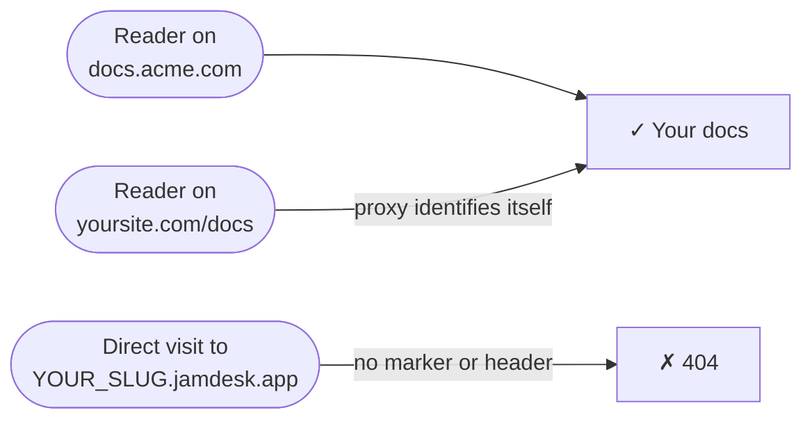

Tu documentación está alojada en `YOUR_SLUG.jamdesk.app`. Cuando conectas un dominio personalizado, ese subdominio sigue respondiendo, pero cada página que sirve incluye una etiqueta `<link rel="canonical">` que apunta a tu dominio, de modo que los motores de búsqueda indexan tu dominio y nunca el subdominio. Para la mayoría de los proyectos, esto es todo lo que necesitas.

Las capturas de pantalla muestran la interfaz en inglés.

**Solo dominio personalizado** va un paso más allá: desactiva el subdominio para las visitas directas. Un acceso directo a `YOUR_SLUG.jamdesk.app` devuelve un 404, y tu documentación solo es accesible a través de tu propio dominio.



<Warning>
Esto oculta tu subdominio — no es una contraseña. Cualquiera que visite a través de tu dominio sigue viendo tu documentación. Para controlar *quién* puede leerla, usa la [protección con contraseña](/es/setup/password-protection); las dos funciones trabajan juntas.
</Warning>

## Activarlo

<Steps>
  <Step title="Verifica tu dominio personalizado">
    Agrega y verifica tu dominio en el dashboard — consulta [Dominios personalizados](/es/deploy/custom-domains). El interruptor requiere un dominio con estado **Activo**.
  </Step>
  <Step title="Verifica tu proxy (solo para configuraciones con proxy inverso)">
    Si tu dominio es un simple CNAME que apunta a Jamdesk (como `docs.acme.com`), omite este paso — no hay nada que configurar. Si sirves la documentación en `yoursite.com/docs` mediante un proxy, el proxy debe identificarse en cada solicitud que reenvíe — consulta [Configuración de proxies](#configuración-de-proxies) más abajo.
  </Step>
  <Step title="Activa el interruptor">
    En el dashboard, abre la sección **Configuración** de tu proyecto, expande la tarjeta **Dominio personalizado** y activa **Solo dominio personalizado**. Jamdesk verifica primero tu dominio en producción y no habilitará el interruptor hasta que tu configuración pase la verificación — si la verificación falla, el mensaje te indica exactamente qué corregir.

    <Frame>
      
    </Frame>
  </Step>
</Steps>

Los cambios llegan a todos los servidores edge en menos de un minuto.

## Configuración de proxies

Una solicitud a `YOUR_SLUG.jamdesk.app` solo se atiende si se identifica como proveniente de tu proxy — ya sea con el encabezado `X-Jamdesk-Forwarded-Host` o con el marcador de consulta `?jd_proxy=1`. Cada guía de configuración ya incluye el que corresponde:

- **[Vercel](/es/deploy/vercel)** — los rewrites de `vercel.json` incluyen `?jd_proxy=1`; Edge Middleware configura el encabezado
- **[Cloudflare Workers](/es/deploy/cloudflare)** — el Worker configura el encabezado
- **[AWS CloudFront](/es/deploy/aws)** — el encabezado personalizado de origen
- **[Proxy inverso](/es/deploy/reverse-proxy)** — nginx, Apache, Caddy y HAProxy configuran el encabezado

Si seguiste alguna de estas guías, ya está todo listo.

¿Usas [MCP](/es/ai/mcp-server) o el [widget de chat](/es/ai/chat) a través de un proxy inverso? Reenvía `/api/mcp/:path*` y `/api/chat/:path*` de la misma manera que `/docs`. En Vercel:

```json vercel.json
{
  "rewrites": [
    { "source": "/api/mcp/:path*", "destination": "https://YOUR_SLUG.jamdesk.app/api/mcp/:path*?jd_proxy=1" },
    { "source": "/api/chat/:path*", "destination": "https://YOUR_SLUG.jamdesk.app/api/chat/:path*?jd_proxy=1" }
  ]
}
```

Si tu dominio personalizado tiene un CNAME hacia Jamdesk, MCP y el chat en tu dominio siguen funcionando sin cambios — apunta los clientes MCP a `https://docs.acme.com/_mcp` y listo.

## Lo que debes saber

- **Todo devuelve 404 en el subdominio simple** — páginas, `sitemap.xml`, `robots.txt`, `llms.txt` y las exportaciones en Markdown. Los navegadores ven una sencilla página de Jamdesk indicando que no se encontró la página.
- **Las imágenes siguen siendo accesibles.** Las imágenes, los videos y las imágenes de vista previa social (OG) están exentas — la vista previa del sitio en el dashboard las carga directamente desde el subdominio.
- **No puedes quedarte bloqueado.** Si el DNS de tu dominio falla alguna vez, Jamdesk deja de aplicar el bloqueo y el subdominio vuelve a responder hasta que el dominio se recupere. Si en cambio rompes tu propia configuración de proxy (por ejemplo, al eliminar el marcador de un rewrite), desactiva el interruptor mientras lo solucionas.
- **La [API de búsqueda](/es/jamdesk-api/docs-search-api) no se ve afectada** — se autentica mediante clave de API.

## Próximos pasos

<Columns cols={3}>
  <Card title="Vercel" icon="cloud-arrow-up" href="/es/deploy/vercel">
    Agrega el marcador jd_proxy o usa Edge Middleware
  </Card>
  <Card title="Dominios personalizados" icon="globe" href="/es/deploy/custom-domains">
    Registra y verifica tu dominio
  </Card>
  <Card title="Protección con contraseña" icon="lock" href="/es/setup/password-protection">
    Controla quién puede leer tu documentación
  </Card>
</Columns>
