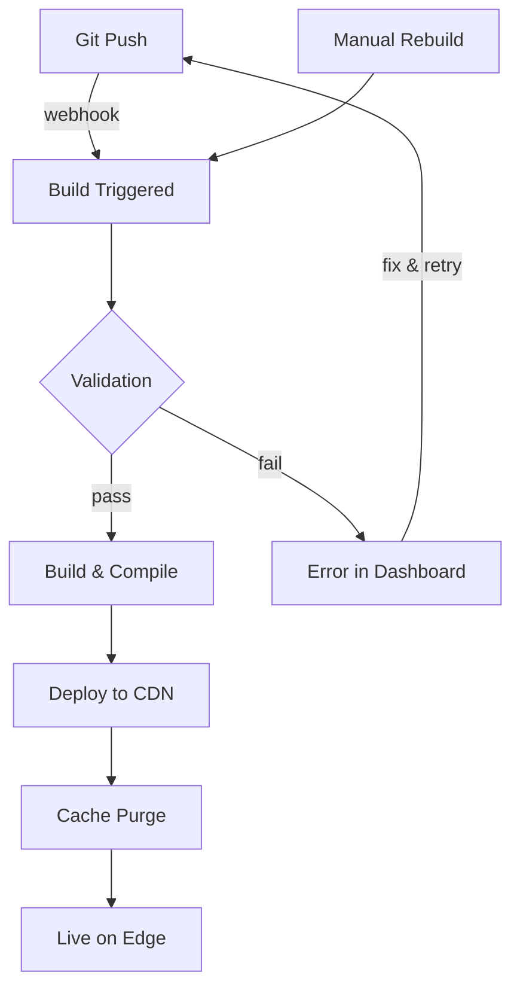

Jamdesk gestiona automáticamente el ciclo de vida completo de build y despliegue. Haz push a GitHub y Jamdesk se encarga de desplegar tu documentación en minutos.

Las capturas de pantalla muestran la interfaz en inglés.

*Nota: Las capturas de pantalla en esta página muestran la interfaz en inglés. La interfaz del dashboard está disponible únicamente en inglés por el momento.*

## Ciclo de vida del build



## Disparadores de build

| Disparador | Cómo funciona | Caso de uso |
|---------|--------------|----------|
| **Git Push** | El Webhook se activa al hacer push a la rama conectada | Desarrollo normal |
| **Dashboard** | Haz clic en "Rebuild" en la configuración del proyecto | Forzar actualización tras cambios de configuración |

<Note>
Los builds tienen debounce. Los commits múltiples dentro de 10 segundos se agrupan en un único build.
</Note>

## Qué ocurre durante un build

Jamdesk clona tu repositorio, valida `docs.json` y la sintaxis MDX, compila a HTML optimizado con indexación de búsqueda y luego despliega en Cloudflare R2. La mayoría de los sitios se construyen en 30-90 segundos.

Para el desglose completo del pipeline con diagrama de arquitectura, consulta [Cómo funciona Jamdesk](/es/how-jamdesk-works).

## Estado del despliegue

Consulta el estado del build en el dashboard:

| Estado | Significado |
|--------|---------|
| **Building** | Build en progreso |
| **Deployed** | En vivo en tu dominio |
| **Failed** | Error de build - revisa los logs |
| **Queued** | Esperando el build anterior |

La sección Build History muestra los despliegues recientes con su estado y la posibilidad de activar rebuilds manuales:


## Rebuild manual

Activa un rebuild sin hacer push de cambios:

1. Ve a tu proyecto en el dashboard
2. Abre **Settings**
3. Haz clic en **Rebuild**

Úsalo cuando:
- Actualices variables de entorno
- Necesites corregir un build atascado
- Quieras actualizar tras cambios en la plataforma

## Variables de entorno

Define variables en tiempo de build en **Settings** → **Environment**:

```
ANALYTICS_ID=G-XXXXXXXXXX
API_BASE_URL=https://api.example.com
```

Las variables están disponibles durante el proceso de build y pueden referenciarse en tus archivos docs.json o MDX.

## Logs de build

Consulta los logs detallados del build para depuración:

1. Ve a **Deployments** en tu proyecto
2. Haz clic en un despliegue específico
3. Visualiza el log completo del build

Los problemas comunes aparecen en los logs:
- Sintaxis MDX inválida
- Imágenes o assets faltantes
- Enlaces internos rotos
- Errores de configuración

## Rollbacks

Revierte a una versión anterior:

1. Ve a **Deployments**
2. Encuentra el despliegue que deseas restaurar
3. Haz clic en **Rollback**

La versión anterior queda en vivo de inmediato mientras comienza un nuevo build.

## Despliegues por rama

<Note>
Los despliegues por rama están disponibles en los planes Pro.
</Note>

Preview de cambios antes de fusionar:

1. Haz push a una rama de funcionalidad
2. Jamdesk crea una preview en `branch-name.your-project.jamdesk.app`
3. Revisa y fusiona cuando esté listo

## ¿Qué sigue?

<Columns cols={2}>
  <Card title="Descripción general del despliegue" icon="cloud-arrow-up" href="/es/deploy/overview">
    Elige entre subdominio, dominio personalizado o alojamiento en subruta
  </Card>
  <Card title="Alojamiento en subruta" icon="route" href="/es/deploy/subpath-hosting">
    Aloja la documentación en example.com/docs
  </Card>
</Columns>
