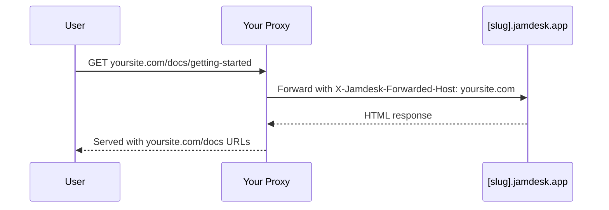

Aloja tu documentación en una subruta de tu dominio en lugar de un subdominio independiente: `yoursite.com/docs` de forma predeterminada, o un segmento personalizado como `yoursite.com/help`. Para ver todas las opciones de despliegue, consulta [Descripción general del despliegue](/es/deploy/overview).

Las capturas de pantalla muestran la interfaz en inglés.

## ¿Por qué usar una subruta?

En comparación con un subdominio como `docs.yoursite.com`, una subruta mantiene a los lectores en tu dominio principal, y tus páginas de documentación contribuyen a la autoridad de búsqueda de ese dominio en lugar de dividir las señales de posicionamiento entre dos hosts.

## Cómo funciona

Tu servidor web o CDN redirige las solicitudes de `/docs/*` a tu sitio de Jamdesk mientras conserva la URL original en el navegador:

El proxy envía el encabezado `X-Jamdesk-Forwarded-Host` con tu dominio. Jamdesk lo usa para:

1. **Verificar que tu dominio** esté autorizado a servir el contenido
2. **Aplicar tu configuración** desde el dashboard

Esto convierte la configuración de tu proxy en una tarea única: si cambias los ajustes en el dashboard, no es necesario actualizar el proxy.

## Configuración por proveedor

Elige tu proveedor de hospedaje para empezar:

<Columns cols={2}>
  <Card title="Cloudflare" icon="cloud" href="/es/deploy/cloudflare">
    Usa Cloudflare Workers para redirigir el tráfico de /docs
  </Card>
  <Card title="AWS" icon="aws" href="/es/deploy/aws">
    Configura CloudFront con Route 53
  </Card>
  <Card title="Vercel" icon="triangle" href="/es/deploy/vercel">
    Añade rewrites a vercel.json
  </Card>
  <Card title="Proxy inverso" icon="server" href="/es/deploy/reverse-proxy">
    nginx, Apache, u otros servidores proxy
  </Card>
</Columns>

## Requisitos previos

Antes de configurar tu proxy:

1. **Añade tu dominio** en tu [dashboard de Jamdesk](https://dashboard.jamdesk.com) en Settings → Custom Domain
2. **Activa «Host at a subpath»**
3. **Elige tu subruta** (opcional; consulta [Elegir tu subruta](#elegir-tu-subruta) más abajo) y haz clic en **Save**

Tu subdominio de Jamdesk (por ejemplo, `acme.jamdesk.app`) se mostrará en el dashboard. Lo necesitarás para la configuración de tu proxy.

<Note>
Guardar un cambio en el alojamiento por subruta (activarlo, desactivarlo o modificar la subruta en sí) desencadena una reconstrucción completa de tu documentación. Esto es necesario porque la estructura de la URL cambia (por ejemplo, entre `/introduction` y `/docs/introduction`).
</Note>

## Elegir tu subruta

De forma predeterminada, tu documentación se sirve en `/docs`. Para usar algo distinto, como `/help` o `/support`, introdúcelo en el campo de subruta junto al interruptor. Con el campo vacío, el interruptor muestra `Host at a subpath (e.g. /docs)`; al escribir un valor, se actualiza en vivo a la ruta que estás a punto de habilitar (`Host at /help`, y así sucesivamente).

<Frame>
  
</Frame>

El campo acepta un único segmento en minúsculas: solo letras, dígitos y guiones internos, sin guion inicial ni final, con un máximo de 63 caracteres. Varios segmentos están reservados y se rechazan directamente, incluidos `api`, `jd`, rutas de administración comunes como `wp-admin`, y cualquier código de idioma que tu documentación pueda usar (`fr`, `es`, `de`, y similares). Reservarlos garantiza que tu subruta nunca pueda entrar en conflicto con una ruta que Jamdesk ya utilice.

Deja el campo vacío para mantener el valor predeterminado `/docs`.

## Renombrar o eliminar tu subruta

Cambiar tu subruta, o vaciarla para volver al valor predeterminado, se puede hacer sin riesgo de romper enlaces ya indexados o guardados como favoritos:

- **`/docs` nunca deja de funcionar.** Incluso después de cambiar a una subruta personalizada como `/help`, las rutas originales `/docs/*` siguen respondiendo en tu subdominio `[slug].jamdesk.app` y a través de cualquier proxy que aún apunte a ellas. Los enlaces canónicos pasan a tu nueva subruta de inmediato, por lo que los motores de búsqueda la reindexan allí. Nada de lo que ya apunta a `/docs` se rompe, lo que significa que puedes actualizar la configuración de tu propio proxy a tu propio ritmo en lugar de bajo presión.
- **Renombrar una subruta personalizada redirige la anterior, durante un solo renombrado.** Si renombras `/help` a `/guide`, las solicitudes a `/help/*` se redirigen con un 308 a la ruta `/guide/*` correspondiente. Este historial tiene un solo nivel de profundidad: vuelve a renombrar de `/guide` a `/support` y `/guide/*` ahora redirige a `/support/*`, pero `/help/*` (el segmento de hace dos renombrados) ya no se rastrea, por lo que esos enlaces dejan de resolverse: acaban en una página de "no encontrado", a veces tras una redirección a una ruta combinada de aspecto extraño. No encadenes renombrados si dependes de la redirección para mantener los enlaces antiguos; en su lugar, actualiza los enlaces externos a la subruta actual.
- **Volver a `/docs`** funciona de la misma manera: tu subruta personalizada anterior (un nivel de historial) redirige a `/docs/*`.

<Warning>
Esto **no** significa que `/docs` redirija a la subruta que elijas. No es necesario, porque `/docs` sigue sirviendo directamente, de forma permanente. La redirección de un solo nivel solo se aplica a una subruta *personalizada* que estás dejando atrás.
</Warning>

Una vez configurado tu proxy, pruébalo visitando `https://yoursite.com/docs` (o tu subruta configurada). Tu documentación debería cargarse con todos los recursos y enlaces funcionando correctamente.

## ¿Necesito ocultar el subdominio jamdesk.app?

No. Tu subdominio `[slug].jamdesk.app` sigue siendo accesible (es el origen ascendente al que reenvía tu proxy), pero no competirá con tu sitio en los resultados de búsqueda:

- **Con tu dominio registrado**, cada página servida directamente desde el subdominio incluye un enlace canónico que apunta a la misma página en tu dominio, de modo que los motores de búsqueda consolidan allí todas las señales de posicionamiento.
- **Antes de registrar un dominio**, las páginas del subdominio en modo de subruta se marcan como `noindex`, por lo que nunca llegan a entrar en el índice.

Si además quieres que el contenido en sí sea inaccesible en el subdominio (no solo que no esté indexado), activa la [protección con contraseña](/es/setup/password-protection): el subdominio servirá entonces una pantalla de desbloqueo en lugar de tu documentación.

## ¿Qué sigue?

<Columns cols={2}>
  <Card title="Descripción general del despliegue" icon="cloud-arrow-up" href="/es/deploy/overview">
    Compara el alojamiento por subdominio, dominio personalizado y subruta
  </Card>
  <Card title="Dominios personalizados" icon="globe" href="/es/deploy/custom-domains">
    Verifica el DNS y soluciona problemas de configuración del dominio
  </Card>
</Columns>
