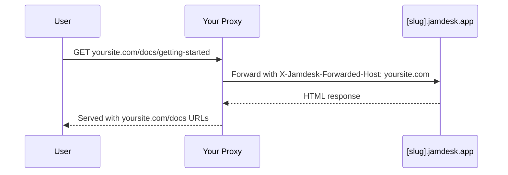

Aloja tus docs en `yoursite.com/docs` en lugar de un subdominio separado. Para conocer todas las opciones de despliegue, consulta [Resumen de despliegue](/es/deploy/overview).

## ¿Por qué usar una subruta?

Alojar los docs en `yoursite.com/docs` en lugar de un subdominio como `docs.yoursite.com` ofrece:

- **Mejor SEO** - Las páginas de documentación contribuyen a la autoridad de tu dominio principal
- **Experiencia unificada** - Los usuarios permanecen en tu dominio principal
- **Navegación más simple** - Sin cambios de contexto entre dominios

## Cómo funciona

Tu servidor web o CDN redirige las solicitudes de `/docs/*` a tu sitio Jamdesk mientras conserva la URL original en el navegador:

El proxy envía el header `X-Jamdesk-Forwarded-Host` con tu dominio. Jamdesk lo usa para:

1. **Verificar tu dominio** está autorizado a servir el contenido
2. **Aplicar tu configuración** desde el dashboard

Esto significa que la configuración de tu proxy es una **configuración única** - si cambias los ajustes en el dashboard, el proxy no necesita actualizarse.

## Configuración por proveedor

Elige tu proveedor de hosting para empezar:

<Columns cols={2}>
  <Card title="Cloudflare" icon="cloud" href="/es/deploy/cloudflare">
    Usa Cloudflare Workers para redirigir el tráfico de /docs
  </Card>
  <Card title="AWS" icon="aws" href="/es/deploy/aws">
    Configura CloudFront con Route 53
  </Card>
  <Card title="Vercel" icon="triangle" href="/es/deploy/vercel">
    Agrega rewrites a vercel.json
  </Card>
  <Card title="Proxy inverso" icon="server" href="/es/deploy/reverse-proxy">
    nginx, Apache u otros servidores proxy
  </Card>
</Columns>

## Requisitos previos

Antes de configurar tu proxy:

1. **Habilita el alojamiento en subruta** en tu [dashboard de Jamdesk](https://dashboard.jamdesk.com) en Settings → Custom Domain
2. **Activa "Host at /docs"**
3. **Agrega tu dominio** (por ejemplo, `yoursite.com`)

Tu subdominio de Jamdesk (por ejemplo, `acme.jamdesk.app`) se mostrará en el dashboard - lo necesitarás para la configuración de tu proxy.

<Note>
Activar o desactivar "Host at /docs" desencadena una reconstrucción automática de tu documentación. Esto es necesario porque la estructura de URL cambia entre `/introduction` y `/docs/introduction`.
</Note>

Una vez que hayas configurado tu proxy, pruébalo visitando `https://yoursite.com/docs`. Tu documentación debería cargar con todos los recursos y enlaces funcionando correctamente.

## ¿Necesito ocultar el subdominio jamdesk.app?

No. Tu subdominio `[slug].jamdesk.app` sigue siendo accesible (es el origen
al que tu proxy redirige las solicitudes), pero no competirá con tu sitio en
los resultados de búsqueda:

- **Con tu dominio registrado**, cada página servida directamente desde el
  subdominio incluye un enlace canónico que apunta a la misma página en tu
  dominio, de modo que los motores de búsqueda consolidan ahí todas las señales de ranking.
- **Antes de registrar un dominio**, las páginas del subdominio en modo subruta
  se marcan como `noindex`, por lo que nunca entran al índice.

Si también quieres que el contenido en sí sea inaccesible en el subdominio
(no solo no indexado), habilita [Protección con contraseña](/es/setup/password-protection): el
subdominio entonces mostrará una pantalla de desbloqueo en lugar de tus docs.

## ¿Qué sigue?

<Columns cols={2}>
  <Card title="Resumen del despliegue" icon="cloud-arrow-up" href="/es/deploy/overview">
    Compara el alojamiento por subdominio, dominio personalizado y subruta
  </Card>
  <Card title="Dominios personalizados" icon="globe" href="/es/deploy/custom-domains">
    Verifica el DNS y soluciona problemas de configuración de dominio
  </Card>
</Columns>
