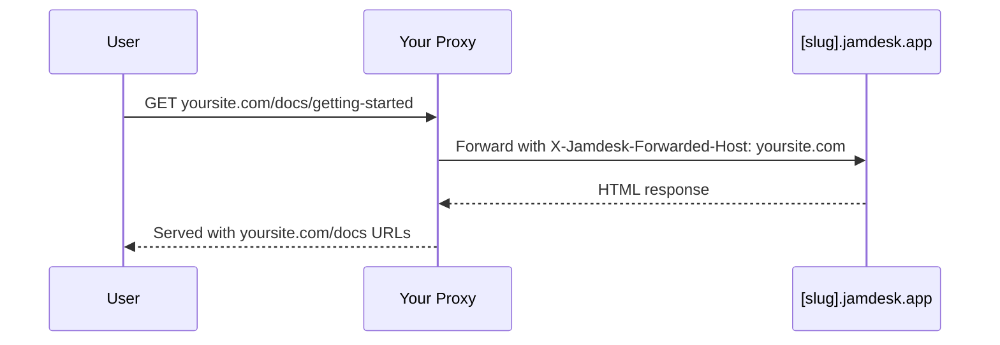

Aloja tu documentación en `yoursite.com/docs` en lugar de un subdominio separado. Para todas las opciones de despliegue, consulta [Descripción general del despliegue](/es/deploy/overview).

## ¿Por qué usar un subpath?

Alojar la documentación en `yoursite.com/docs` en lugar de un subdominio como `docs.yoursite.com` ofrece:

- **Mejor SEO** - Las páginas de documentación contribuyen a la autoridad de tu dominio principal
- **Experiencia unificada** - Los usuarios permanecen en tu dominio principal
- **Navegación más sencilla** - Sin cambio de contexto entre dominios

## Cómo funciona

Tu servidor web o CDN redirige las solicitudes de `/docs/*` a tu sitio de Jamdesk preservando la URL original en el navegador:

El proxy pasa el encabezado `X-Jamdesk-Forwarded-Host` con tu dominio. Jamdesk lo utiliza para:

1. **Verificar que tu dominio** está autorizado para servir el contenido
2. **Aplicar tu configuración** desde el dashboard

Esto significa que la configuración de tu proxy es una **configuración única** — si cambias ajustes en el dashboard, el proxy no necesita actualizarse.

## Configuración por proveedor

Elige tu proveedor de alojamiento para comenzar:

<Columns cols={2}>
  <Card title="Cloudflare" icon="cloud" href="/es/deploy/cloudflare">
    Usa Cloudflare Workers para redirigir el tráfico de /docs
  </Card>
  <Card title="AWS" icon="aws" href="/es/deploy/aws">
    Configura CloudFront con Route 53
  </Card>
  <Card title="Vercel" icon="triangle" href="/es/deploy/vercel">
    Añade rewrites a vercel.json
  </Card>
  <Card title="Reverse Proxy" icon="server" href="/es/deploy/reverse-proxy">
    nginx, Apache u otros servidores proxy
  </Card>
</Columns>

## Requisitos previos

Antes de configurar tu proxy:

1. **Activa el alojamiento en subpath** en tu [dashboard de Jamdesk](https://dashboard.jamdesk.com) en Ajustes → Dominio personalizado
2. **Activa "Host at /docs"**
3. **Añade tu dominio** (p. ej., `yoursite.com`)

Tu subdominio de Jamdesk (p. ej., `acme.jamdesk.app`) se mostrará en el dashboard — lo necesitarás para la configuración de tu proxy.

<Note>
Activar o desactivar "Host at /docs" activa una reconstrucción automática de tu documentación. Esto es necesario porque la estructura de URL cambia entre `/introduction` y `/docs/introduction`.
</Note>

Una vez que hayas configurado tu proxy, comprueba el resultado visitando `https://yoursite.com/docs`. Tu documentación debe cargarse correctamente con todos los recursos y enlaces funcionando.

## ¿Qué sigue?

<Columns cols={2}>
  <Card title="Descripción general del despliegue" icon="cloud-arrow-up" href="/es/deploy/overview">
    Compara el alojamiento por subdominio, dominio personalizado y subpath
  </Card>
  <Card title="Dominios personalizados" icon="globe" href="/es/deploy/custom-domains">
    Verifica DNS y soluciona problemas de configuración de dominio
  </Card>
</Columns>
