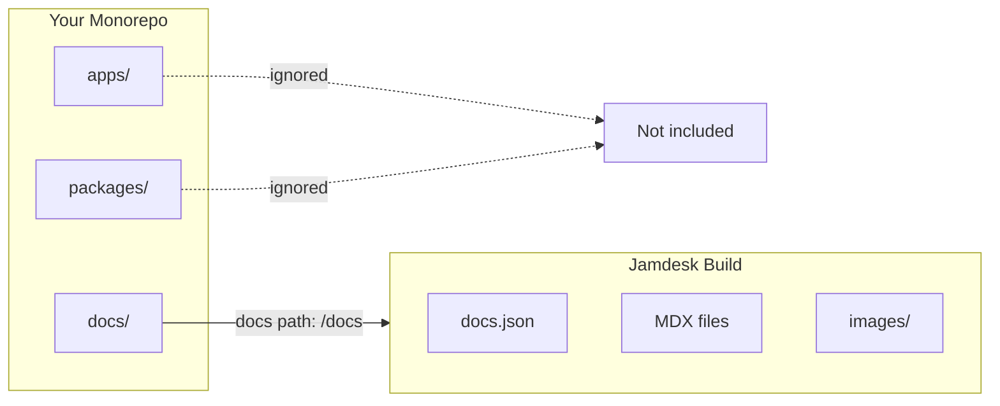

Si tu `docs.json` se encuentra en un subdirectorio -- `docs/`, `packages/docs/` o cualquier otro lugar -- activa el modo monorepo en la configuración del proyecto y especifica la ruta. Jamdesk limitará los builds a ese directorio e ignorará todo lo que esté fuera de él.

Las capturas de pantalla muestran la interfaz en inglés.

*Nota: las capturas de pantalla de esta página pueden mostrar la interfaz en inglés.*

<Note>
**Requisitos previos:** Necesitas un [proyecto de Jamdesk](/es/setup/creating-projects) conectado a un [repositorio de GitHub](/es/setup/connecting-github) antes de configurar el soporte para monorepo.
</Note>

## Cómo Jamdesk delimita tu build



## Configuración rápida

<Steps>
  <Step title="Abre la configuración del proyecto">
    Ve a tu proyecto en el [dashboard de Jamdesk](https://dashboard.jamdesk.com) y navega hasta **Settings**.
  </Step>

  <Step title="Activa el modo monorepo">
    En la sección **Git Repository**, activa la opción **Set up as monorepo**.

    <Frame>
      
    </Frame>
  </Step>

  <Step title="Introduce la ruta de tus docs">
    Especifica la ruta al directorio que contiene tu archivo `docs.json`.

    <Frame>
      
    </Frame>

    El preview muestra dónde buscará Jamdesk tu archivo de configuración.
  </Step>

  <Step title="Guarda y reconstruye">
    Haz clic en **Save Changes** para aplicar los cambios. El próximo build usará la nueva ruta.
  </Step>
</Steps>

## Comprender la ruta de docs

La ruta de docs indica a Jamdesk dónde encontrar tu archivo de configuración `docs.json` dentro del repositorio.

<Warning>
Introduce solo la ruta del directorio, no el nombre del archivo. Usa `docs`, no `docs/docs.json`.
</Warning>

### Ejemplos de rutas

| Estructura del repositorio | Valor de la ruta de docs |
|---------------------|-----------------|
| `my-repo/docs/docs.json` | `docs` |
| `my-repo/packages/docs/docs.json` | `packages/docs` |
| `my-repo/apps/website/docs/docs.json` | `apps/website/docs` |
| `my-repo/documentation/docs.json` | `documentation` |

### Qué se incluye

Cuando estableces una ruta de docs, Jamdesk solo procesa los archivos dentro de ese directorio:

- Los **archivos de contenido** (`.mdx`, `.md`) se compilan en páginas
- Los **recursos** en subdirectorios (como `images/`) se incluyen
- La **configuración** (`docs.json`) define tu sitio

Los archivos fuera de la ruta de docs se ignoran durante los builds.

## Patrones comunes en monorepos

Elige el patrón que se adapte a la estructura de tu proyecto:

<Tabs>
  <Tab title="Dedicated /docs">
    Documentación en un directorio de nivel superior.

    ```bash
    monorepo/
    ├── packages/
    ├── apps/
    └── docs/                    # Docs path: docs
        ├── docs.json
        ├── introduction.mdx
        └── guides/
    ```

    **Ruta de docs:** `docs`
  </Tab>

  <Tab title="Package in /packages">
    Documentación como paquete del workspace.

    ```bash
    monorepo/
    ├── packages/
    │   ├── core/
    │   ├── cli/
    │   └── docs/                # Docs path: packages/docs
    │       ├── docs.json
    │       └── pages/
    └── apps/
    ```

    **Ruta de docs:** `packages/docs`
  </Tab>

  <Tab title="Inside an App">
    Documentación anidada dentro de una aplicación.

    ```bash
    monorepo/
    ├── apps/
    │   └── website/
    │       ├── src/
    │       └── docs/            # Docs path: apps/website/docs
    │           ├── docs.json
    │           └── introduction.mdx
    └── packages/
    ```

    **Ruta de docs:** `apps/website/docs`
  </Tab>

  <Tab title="Custom Directory">
    Cualquier nombre de directorio personalizado.

    ```bash
    monorepo/
    ├── src/
    ├── tests/
    └── documentation/           # Docs path: documentation
        ├── docs.json
        └── getting-started.mdx
    ```

    **Ruta de docs:** `documentation`
  </Tab>
</Tabs>

## Trabajar con recursos

Las rutas de recursos en `docs.json` son siempre relativas a tu directorio de docs, no a la raíz del repositorio.

### Ejemplo

Si tus docs están en `packages/docs/`:

```json packages/docs/docs.json
{
  "logo": {
    "light": "/images/logo.svg"
  },
  "favicon": "/images/favicon.svg"
}
```

Estas rutas hacen referencia a:
- `packages/docs/images/logo.svg`
- `packages/docs/images/favicon.svg`

<Warning>
No uses rutas absolutas desde la raíz del repositorio. Esto no funcionará:

```json
"favicon": "/packages/docs/images/favicon.svg"
```
</Warning>

### En archivos MDX

La misma regla se aplica a las imágenes en tu contenido:

```mdx

```

Esto hace referencia a una imagen en `[docs-path]/images/tabs-preview.png`.

## Enlaces internos

Los enlaces internos funcionan igual independientemente de la estructura de tu repositorio. Usa rutas relativas a la raíz de tus docs:

```mdx
[See the quickstart guide](/quickstart)
[Installation steps](/quickstart#installation)
```

Estas rutas coinciden con tu estructura de navegación, no con tu sistema de archivos.

## Comportamiento del build

Jamdesk solo detecta cambios dentro de tu ruta de docs configurada:

- Los cambios en `packages/docs/**` desencadenan un build
- Los cambios en `packages/core/**` no desencadenan un build

Esto mantiene los builds rápidos y centrados en los cambios de documentación.

<Tip>
**¿Necesitas desencadenar un build cuando cambia otro código?**

Si generas documentación a partir del código fuente (como docs de API a partir de comentarios en el código), activa una reconstrucción manual desde el dashboard o configura un webhook en tu pipeline de CI.
</Tip>

## Compatibilidad con herramientas de workspace

Jamdesk funciona con todas las herramientas principales de monorepo. No se necesita ninguna configuración especial más allá de establecer la ruta de docs.

| Herramienta | Compatible |
|------|-----------|
| npm workspaces | Sí |
| Yarn workspaces | Sí |
| pnpm workspaces | Sí |
| Turborepo | Sí |
| Nx | Sí |
| Lerna | Sí |

## Solución de problemas

<AccordionGroup>
  <Accordion title="Error: docs.json no encontrado" icon="circle-exclamation">
    1. Verifica que la ruta exacta en tu repositorio coincide con lo que introdujiste
    2. Asegúrate de que `docs.json` existe en esa ubicación
    3. Comprueba si hay errores tipográficos: las rutas distinguen entre mayúsculas y minúsculas
    4. Recuerda: usa `docs`, no `docs/docs.json`

    **Verificación rápida:** En tu repositorio, el archivo debe existir en `[your-docs-path]/docs.json`
  </Accordion>

  <Accordion title="Los recursos no se cargan" icon="image">
    Las rutas de recursos deben ser relativas a tu directorio de docs.

    **Correcto** - relativo al directorio de docs:
    ```json
    "favicon": "/images/favicon.svg"
    ```

    **Incorrecto** - absoluto desde la raíz del repositorio:
    ```json
    "favicon": "/packages/docs/images/favicon.svg"
    ```

    Comprueba que tus imágenes existen en `[docs-path]/images/`.
  </Accordion>

  <Accordion title="Los cambios no desencadenan builds" icon="rotate">
    Solo los cambios dentro de tu ruta de docs configurada desencadenan builds automáticos.

    1. Verifica que estás modificando archivos dentro de la ruta de docs
    2. Comprueba que estás haciendo push a la rama correcta
    3. Consulta el estado de entrega del webhook en la configuración del repositorio de GitHub

    Si necesitas que los builds se desencadenen por cambios fuera de la ruta de docs, usa reconstrucciones manuales o webhooks de CI.
  </Accordion>
</AccordionGroup>

## ¿Qué sigue?

<Columns cols={2}>
  <Card title="Conectar GitHub" icon="github" href="/es/setup/connecting-github">
    Vincula tu repositorio para builds automáticos
  </Card>
  <Card title="Estructura de directorios" icon="folder-tree" href="/es/setup/directory-structure">
    Organiza tus docs para escalar
  </Card>
</Columns>
