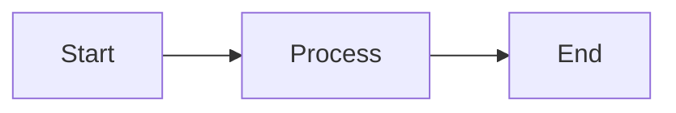
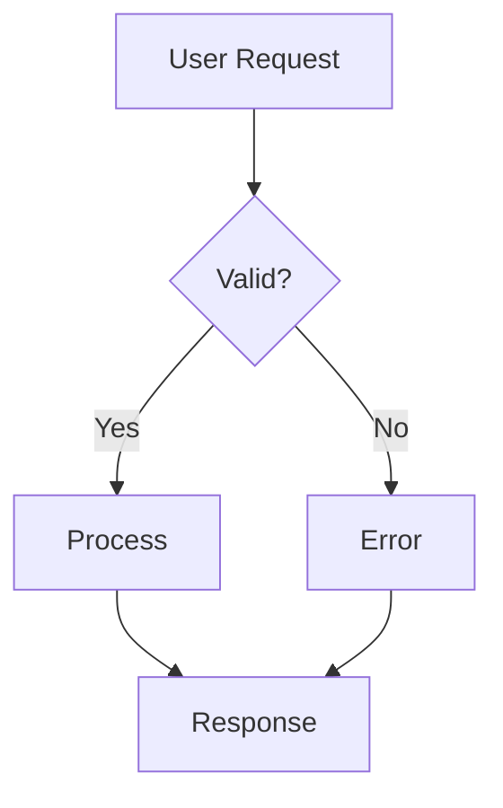
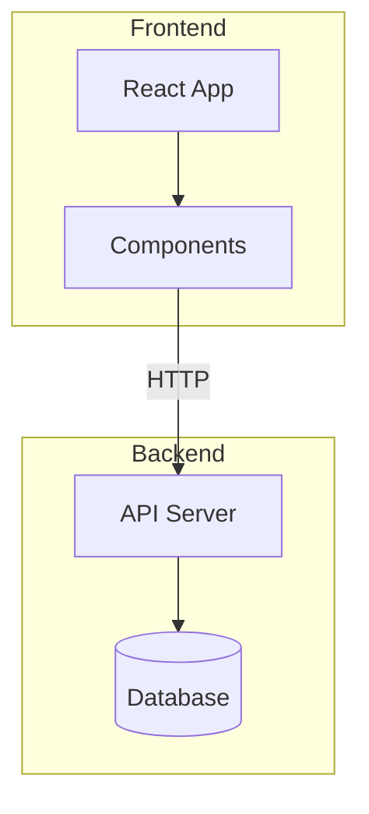
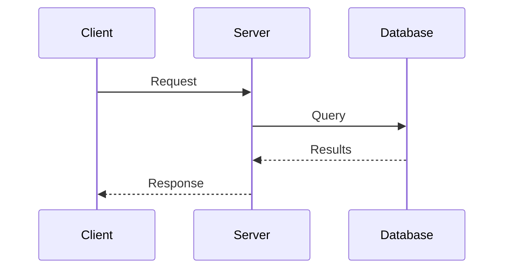
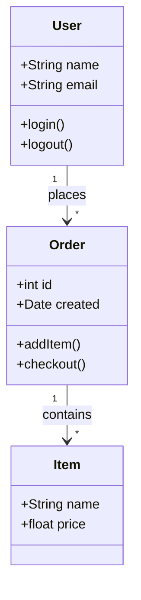
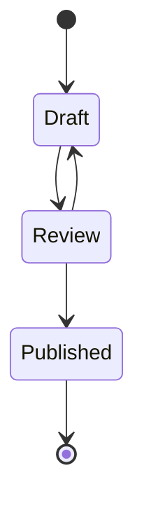
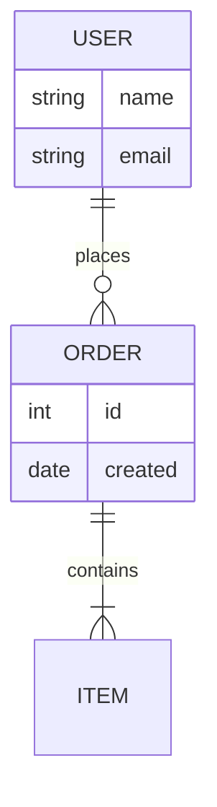
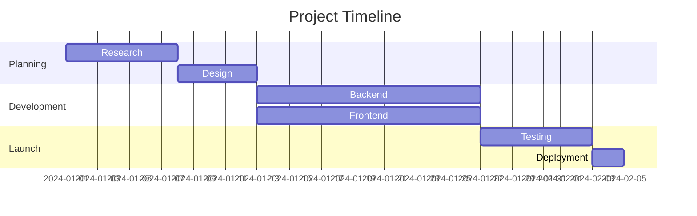
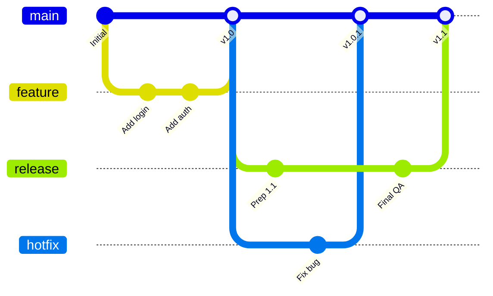
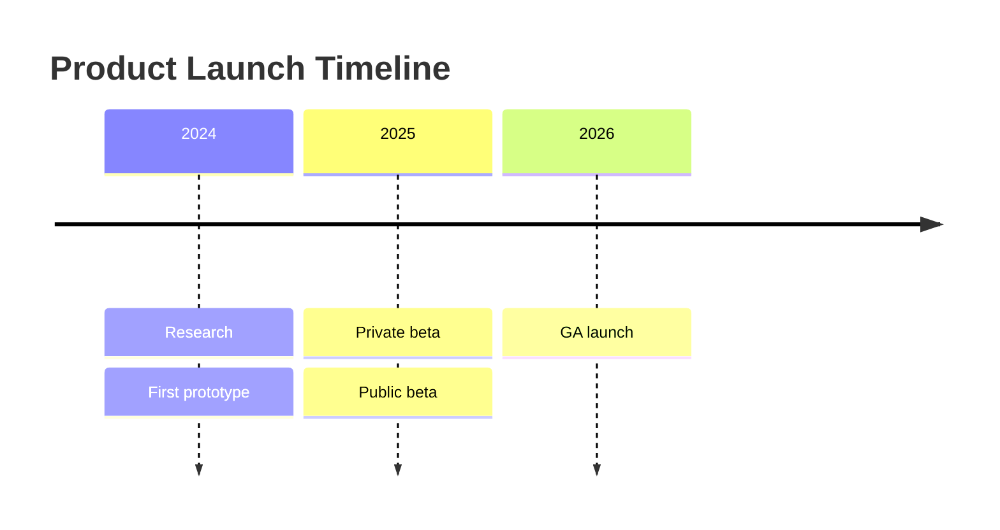

Écrivez des diagrammes sous forme de texte dans des blocs de code délimités. Jamdesk les affiche en SVG au moment du build.

<Tip>
  Jamdesk supporte également les [diagrammes D2](/fr/components/d2) dans des blocs délimités `d2`.
  Préférez D2 lorsqu'un diagramme nécessite des conteneurs imbriqués, un schéma SQL avec
  des clés primaires et étrangères, ou si vous souhaitez changer de moteur de mise en page. Les exemples
  Mermaid de cette page ont leurs équivalents D2 sur la [page D2](/fr/components/d2).
</Tip>

## Utilisation de base

Utilisez un bloc de code délimité avec l'identifiant de langage `mermaid` :

````mdx

````


## Types de diagrammes

### Flowcharts

La direction peut être de haut en bas (`TD`), de gauche à droite (`LR`), de bas en haut (`BT`), ou de droite à gauche (`RL`).



````mdx

````

#### Sous-graphes

Regroupez les nœuds associés à l'aide de sous-graphes. Cela permet d'organiser les flowcharts complexes en sections logiques telles que « Frontend » et « Backend », ou différentes étapes d'un pipeline.



````mdx

````

### Diagrammes de séquence

Les diagrammes de séquence montrent comment les composants interagissent dans le temps. Ils sont idéaux pour documenter les appels API, les flux d'authentification, ou toute communication entre services. Les participants apparaissent comme des lignes de vie verticales, avec des messages qui circulent entre eux.



````mdx

````

### Diagrammes de classes

Les diagrammes de classes représentent la structure des systèmes orientés objet. Utilisez-les pour documenter des modèles de données, montrer les relations entre entités, ou concevoir l'architecture d'un système. Ils affichent les classes avec leurs attributs, leurs méthodes et leurs relations mutuelles.



````mdx

````

### Diagrammes d'état

Les diagrammes d'état modélisent le cycle de vie d'un objet ou d'un processus. Ils montrent tous les états possibles et les transitions entre eux. Utilisez les diagrammes d'état pour documenter les statuts de commandes, les workflows documentaires, ou tout système comportant des phases distinctes.



````mdx

````

### Diagrammes entité-relation

Les diagrammes ER documentent les schémas de base de données et les modèles de données. Ils montrent les entités (tables), leurs attributs (colonnes) et les relations entre eux. Les symboles indiquent la cardinalité : un-à-un, un-à-plusieurs, ou plusieurs-à-plusieurs.



````mdx

````

### Diagrammes de Gantt

Les diagrammes de Gantt visualisent les plannings et les chronologies de projets. Les tâches sont représentées sous forme de barres horizontales sur une ligne de temps, indiquant la durée, les dépendances et les travaux parallèles. Utilisez-les pour la planification de projets, la documentation de sprints ou les feuilles de route.



````mdx

````

### Graphes Git

Les graphes Git visualisent les stratégies de branchement et les workflows de contrôle de version. Ils montrent les commits, les branches, les fusions et l'historique global d'un dépôt. Chaque branche est codée par couleur pour une identification facile.



````mdx

````

### Diagrammes de chronologie

Les chronologies affichent des événements sur des périodes. Commencez par le mot-clé `timeline`, un `title` optionnel, puis une ligne par période avec des événements séparés par des deux-points :



````mdx

````

### Camemberts

Les camemberts affichent des données proportionnelles sous forme de parts d'un cercle. Utilisez-les pour montrer des parts de marché, des résultats d'enquêtes, l'allocation de ressources, ou toute donnée dont les parties forment un tout. Limitez les parts à 6 ou moins pour la lisibilité.

```mermaid
pie title Browser Market Share
    "Chrome" : 65
    "Safari" : 19
    "Firefox" : 10
    "Edge" : 4
    "Other" : 2
```

````mdx
```mermaid
pie title Browser Market Share
    "Chrome" : 65
    "Safari" : 19
    "Firefox" : 10
    "Edge" : 4
    "Other" : 2
```
````

## Formes dans les flowcharts

Les différentes formes véhiculent des significations différentes dans les flowcharts :

| Syntaxe    | Forme               | Utilisation |
| ---------- | ------------------- | ------- |
| `[text]`   | Rectangle           | Étapes de traitement, actions |
| `(text)`   | Rectangle arrondi   | Points de départ/fin |
| `{text}`   | Losange             | Décisions, conditions |
| `([text])` | Stade               | Événements, déclencheurs |
| `[[text]]` | Sous-routine        | Processus prédéfinis |
| `[(text)]` | Cylindre            | Bases de données, stockage |

## Types de flèches

Les flèches indiquent la direction du flux et les types de relations :

| Syntaxe     | Description      | Utilisation |
| ----------- | ---------------- | ------- |
| `-->`       | Flèche pleine    | Flux normal |
| `---`       | Ligne pleine     | Associations |
| `-.->`      | Flèche pointillée | Flux optionnel ou asynchrone |
| `==>`       | Flèche épaisse   | Chemins importants |
| `--text-->` | Flèche avec étiquette | Décrire la transition |

## Dimensionner les diagrammes larges

Pour les diagrammes larges comme les Gantt ou les graphes Git complexes, vous pouvez utiliser le composant `Mermaid` directement avec une prop `minWidth` pour éviter que le diagramme ne soit compressé :

```mdx
<Mermaid minWidth="700px">
gantt
    title Wide Project Timeline
    ...
</Mermaid>
```

## Conseils de style

<Tip>
  Les diagrammes Mermaid s'adaptent automatiquement aux modes clair et sombre. Les couleurs sont
  optimisées pour la lisibilité dans les deux thèmes.
</Tip>

Pour des diagrammes efficaces :

- Restez simple : décomposez les flux complexes en plusieurs diagrammes plus petits.
- Étiquetez vos flèches pour expliquer les transitions.
- Choisissez une direction : `TD` (de haut en bas) pour les diagrammes hauts, `LR` (de gauche à droite) pour les diagrammes larges.
- Limitez chaque diagramme à 10-15 nœuds pour la clarté.

## En savoir plus

Pour la référence complète de la syntaxe Mermaid, y compris les fonctionnalités avancées comme le style, les thèmes et les types de diagrammes supplémentaires, consultez la [documentation officielle Mermaid](https://mermaid.js.org/intro/).

## Et ensuite ?

<Columns cols={2}>
  <Card title="Diagrammes D2" icon="diagram-project" href="/fr/components/d2">
    Architecture, conteneurs et schémas SQL avec D2
  </Card>
  <Card title="Vue d'ensemble des composants" icon="puzzle-piece" href="/fr/components/overview">
    Parcourir tous les composants disponibles
  </Card>
  <Card title="Bases MDX" icon="file-code" href="/fr/content/mdx-basics">
    Apprendre à utiliser les composants en MDX
  </Card>
</Columns>
