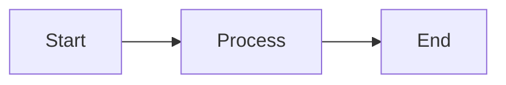
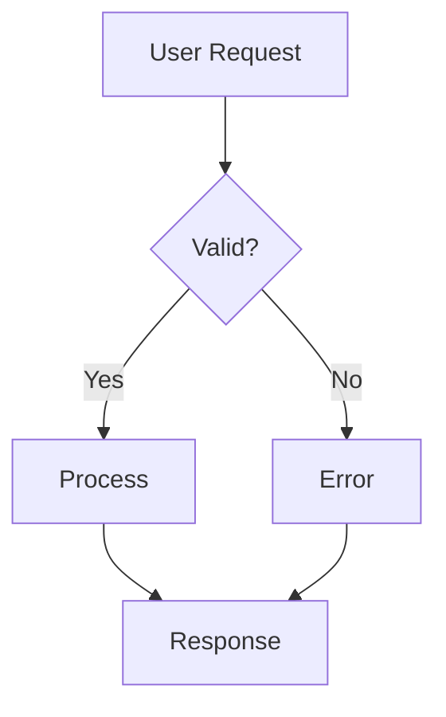
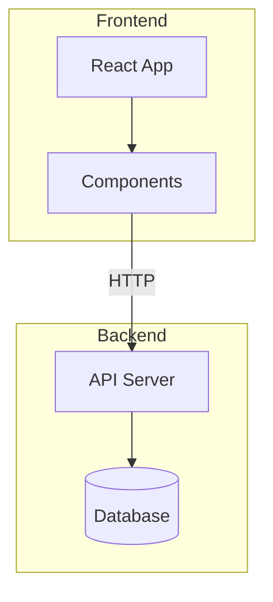
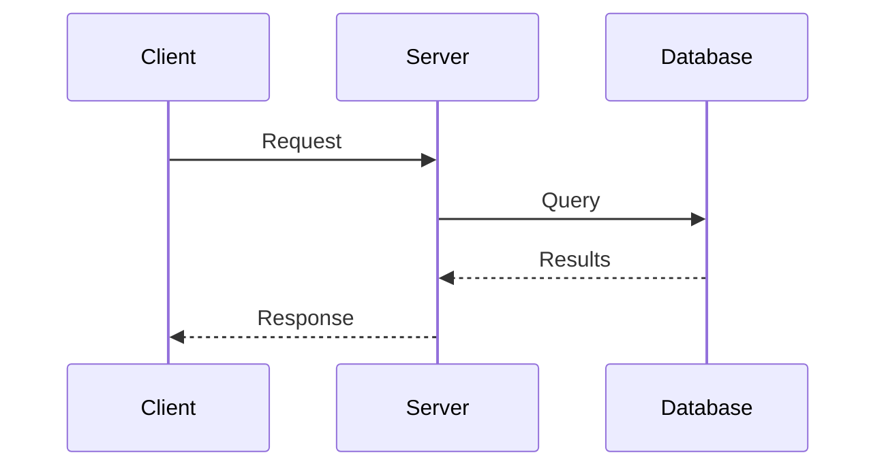
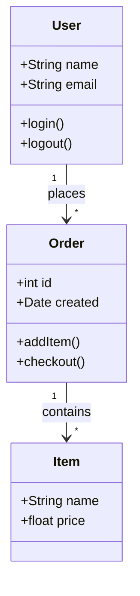
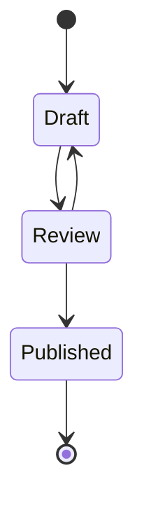
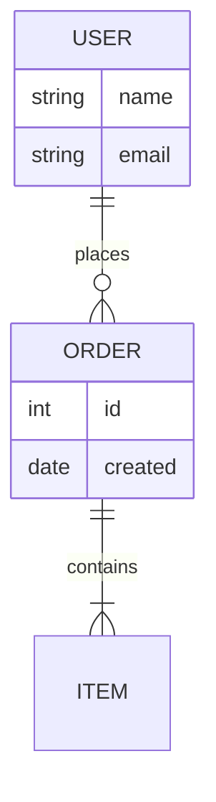
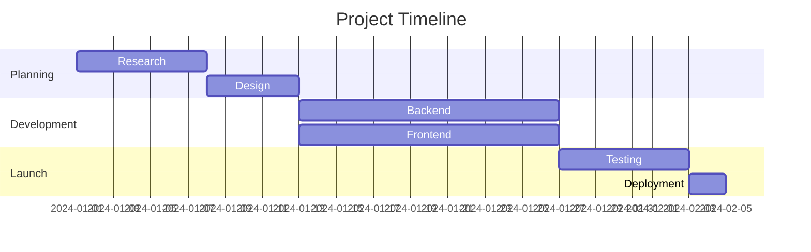
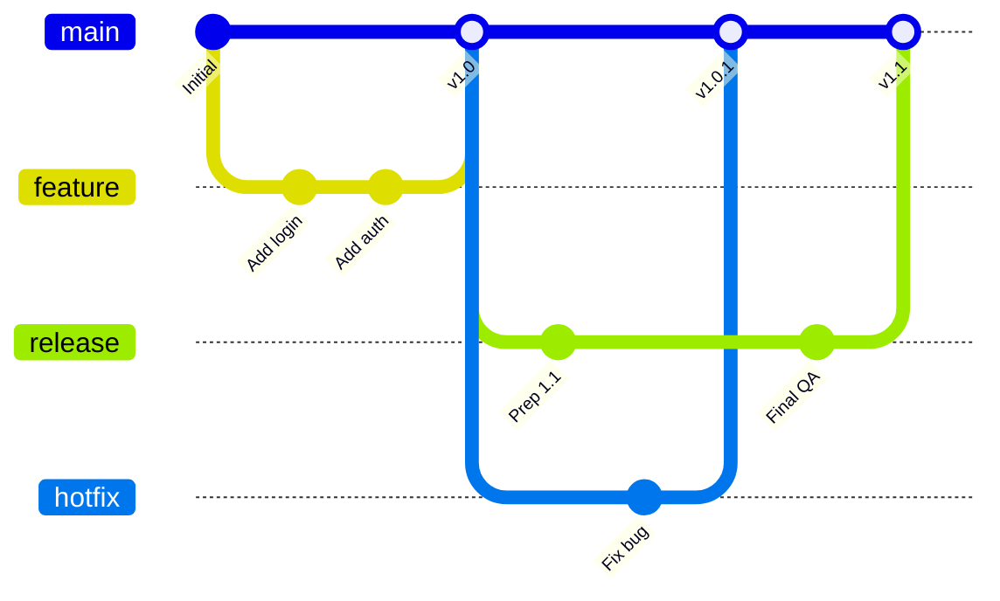
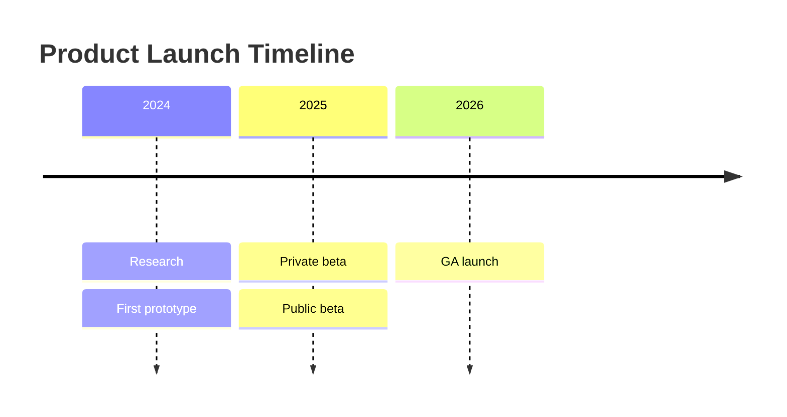

Écrivez les diagrammes sous forme de texte dans des blocs de code délimités. Jamdesk les affiche en SVG au moment du build.

<Tip>
  Rédigez et prévisualisez votre diagramme dans l'[éditeur Mermaid Jamdesk](https://jamdesk.com/utilities/mermaid-editor),
  un éditeur et visualiseur open source basé sur le navigateur. Écrivez la syntaxe Mermaid, voyez-la
  s'afficher en direct, puis collez-la dans un bloc `mermaid` ici.
</Tip>

<Tip>
  Jamdesk prend aussi en charge les [diagrammes D2](/fr/components/d2) dans des blocs `d2`.
  Optez pour D2 quand un diagramme nécessite des conteneurs imbriqués, un schéma SQL avec
  des clés primaires et étrangères, ou pour changer de moteur de mise en page. Les
  exemples Mermaid de cette page ont des équivalents D2 sur la [page D2](/fr/components/d2).
</Tip>

## Utilisation de base

Utilisez un bloc de code délimité avec l'identifiant de langage `mermaid` :

````mdx

````


## Types de diagrammes

### Flowcharts

La direction peut être de haut en bas (`TD`), de gauche à droite (`LR`), de bas en haut (`BT`), ou de droite à gauche (`RL`).



````mdx

````

#### Sous-graphes

Regroupez les nœuds liés à l'aide de sous-graphes. Cela aide à organiser des flowcharts complexes en sections logiques comme « Frontend » et « Backend » ou différentes étapes d'un pipeline.



````mdx

````

### Diagrammes de séquence

Les diagrammes de séquence montrent comment les composants interagissent dans le temps. Utilisez un diagramme de séquence pour les flux d'appels API et les échanges d'authentification. Les participants apparaissent comme des lignes de vie verticales, avec des messages circulant entre eux.



````mdx

````

### Diagrammes de classes

Les diagrammes de classes représentent la structure de systèmes orientés objet, comme un modèle de données ou les types principaux d'un service. Ils affichent les classes avec leurs attributs, méthodes, et leurs relations entre elles.



````mdx

````

### Diagrammes d'états

Les diagrammes d'états modélisent le cycle de vie d'un objet ou d'un processus. Ils montrent tous les états possibles et les transitions entre eux. Les statuts de commande et les workflows d'approbation de documents en sont des exemples typiques.



````mdx

````

### Diagrammes entité-relation

Les diagrammes ER documentent les schémas de base de données et modèles de données, en montrant les entités (tables), leurs attributs (colonnes), et les relations entre elles. Les symboles indiquent la cardinalité : un-à-un, un-à-plusieurs, ou plusieurs-à-plusieurs.



````mdx

````

### Diagrammes de Gantt

Les diagrammes de Gantt visualisent les plannings et calendriers de projet. Les tâches sont affichées sous forme de barres horizontales sur une timeline, montrant la durée, les dépendances, et le travail en parallèle. Un plan de projet ou une roadmap s'y prête naturellement.



````mdx

````

### Git Graphs

Les Git graphs visualisent les stratégies de branchement et les workflows de contrôle de version. Ils montrent les commits, branches, fusions, et l'historique global d'un dépôt. Chaque branche est colorée pour une identification facile.



````mdx

````

### Diagrammes de timeline

Les timelines montrent des événements sur des périodes. Commencez par le mot-clé `timeline`, un
`title` optionnel, puis une ligne par période avec les événements séparés par des deux-points :



````mdx

````

### Camemberts

Les camemberts affichent des données proportionnelles sous forme de parts d'un cercle. Utilisez-en un quand des parties composent un tout, comme une part de marché ou des résultats de sondage. Limitez-vous à 6 parts maximum pour la lisibilité.

```mermaid
pie title Browser Market Share
    "Chrome" : 65
    "Safari" : 19
    "Firefox" : 10
    "Edge" : 4
    "Other" : 2
```

````mdx
```mermaid
pie title Browser Market Share
    "Chrome" : 65
    "Safari" : 19
    "Firefox" : 10
    "Edge" : 4
    "Other" : 2
```
````

## Formes de flowchart

Différentes formes véhiculent différentes significations dans les flowcharts :

| Syntax     | Shape               | Use For |
| ---------- | ------------------- | ------- |
| `[text]`   | Rectangle           | Étapes de processus, actions |
| `(text)`   | Rectangle arrondi    | Points de début/fin |
| `{text}`   | Losange              | Décisions, conditions |
| `([text])` | Stade                | Événements, déclencheurs |
| `[[text]]` | Sous-routine         | Processus prédéfinis |
| `[(text)]` | Cylindre             | Bases de données, stockage |

## Types de flèches

Les flèches indiquent la direction du flux et les types de relations :

| Syntax      | Description      | Use For |
| ----------- | ---------------- | ------- |
| `-->`       | Flèche pleine     | Flux normal |
| `---`       | Ligne pleine      | Associations |
| `-.->`      | Flèche pointillée | Flux optionnel ou asynchrone |
| `==>`       | Flèche épaisse    | Chemins importants |
| `--text-->` | Flèche avec libellé | Décrire la transition |

## Dimensionner les diagrammes larges

Pour les diagrammes larges comme les diagrammes de Gantt ou les Git graphs complexes, vous pouvez utiliser le composant `Mermaid` directement avec une prop `minWidth` pour éviter que le diagramme soit compressé :

```mdx
<Mermaid minWidth="700px">
gantt
    title Wide Project Timeline
    ...
</Mermaid>
```

## Conseils de style

<Tip>
  Les diagrammes Mermaid s'adaptent automatiquement aux modes clair et sombre. Les couleurs
  sont optimisées pour la lisibilité dans les deux thèmes.
</Tip>

Pour des diagrammes efficaces :

- Restez simple : découpez les flux complexes en plusieurs diagrammes plus petits.
- Libellez vos flèches pour expliquer les transitions.
- Choisissez une direction : `TD` (haut-bas) pour les diagrammes hauts, `LR` (gauche-droite) pour les larges.
- Limitez chaque diagramme à 10-15 nœuds pour la clarté.

## Pour en savoir plus

Pour la référence complète de la syntaxe Mermaid, incluant les fonctionnalités avancées comme le style, les thèmes, et des types de diagrammes supplémentaires, consultez la [documentation officielle Mermaid](https://mermaid.js.org/intro/).

## Prochaines étapes

<Columns cols={2}>
  <Card title="Diagrammes D2" icon="diagram-project" href="/fr/components/d2">
    Architecture, conteneurs et schémas SQL avec D2
  </Card>
  <Card title="Vue d'ensemble des composants" icon="puzzle-piece" href="/fr/components/overview">
    Parcourez tous les composants disponibles
  </Card>
  <Card title="Bases de MDX" icon="file-code" href="/fr/content/mdx-basics">
    Découvrez comment utiliser les composants dans MDX
  </Card>
</Columns>
