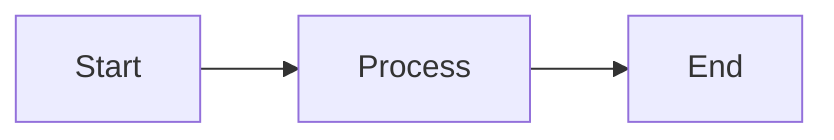
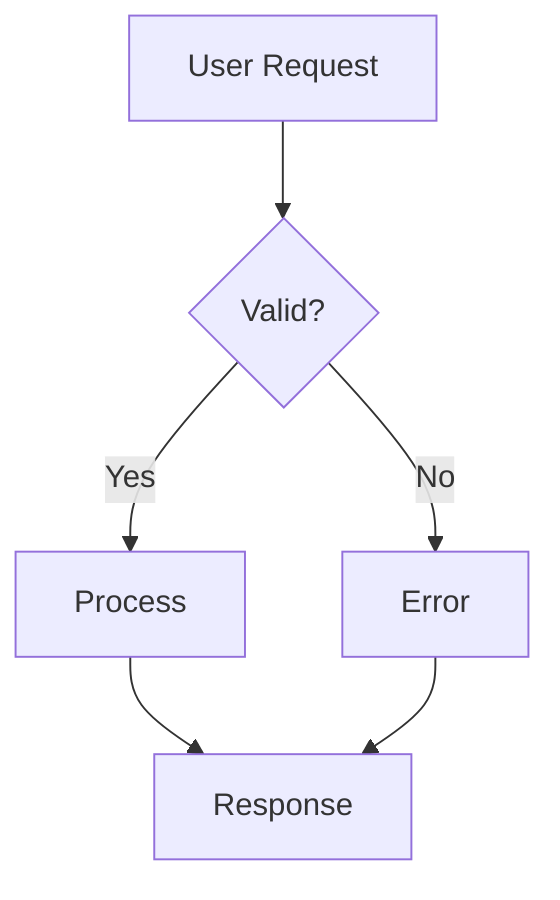
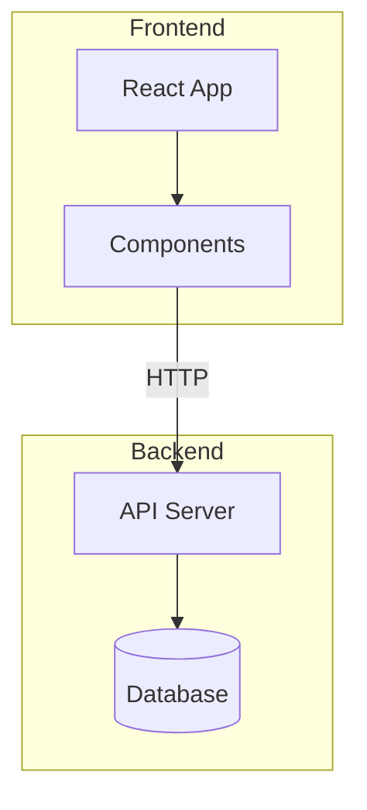
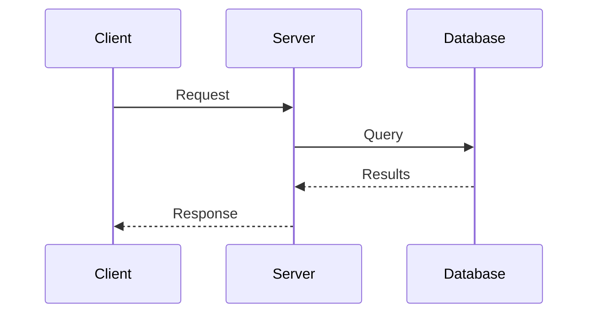
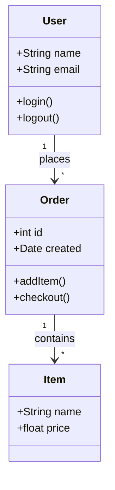
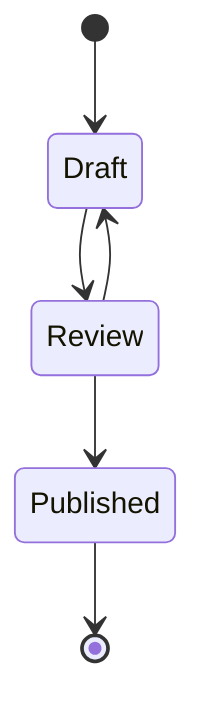
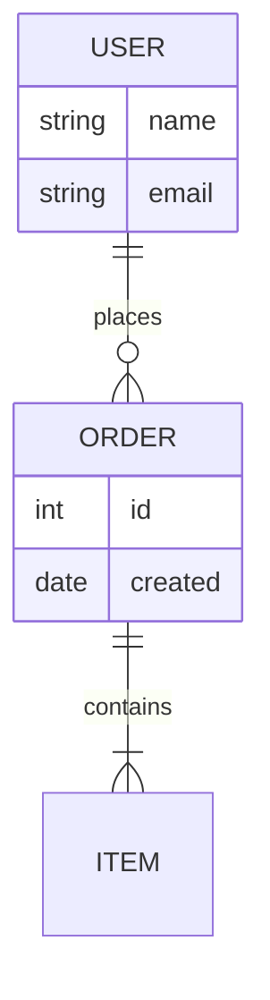
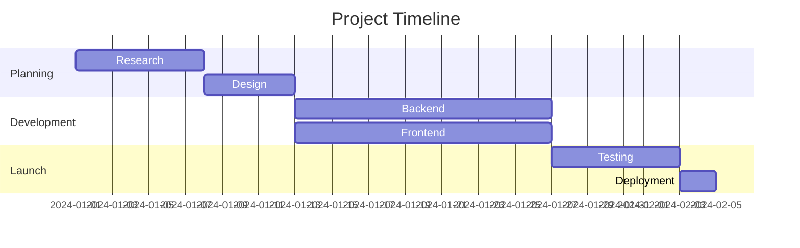
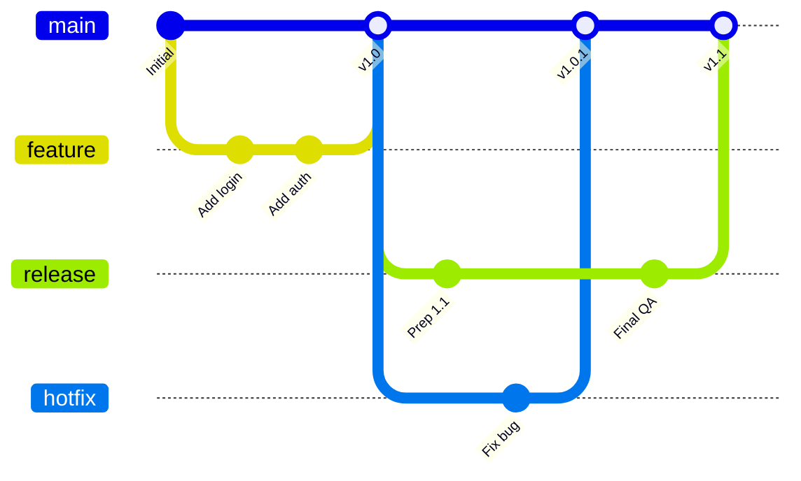
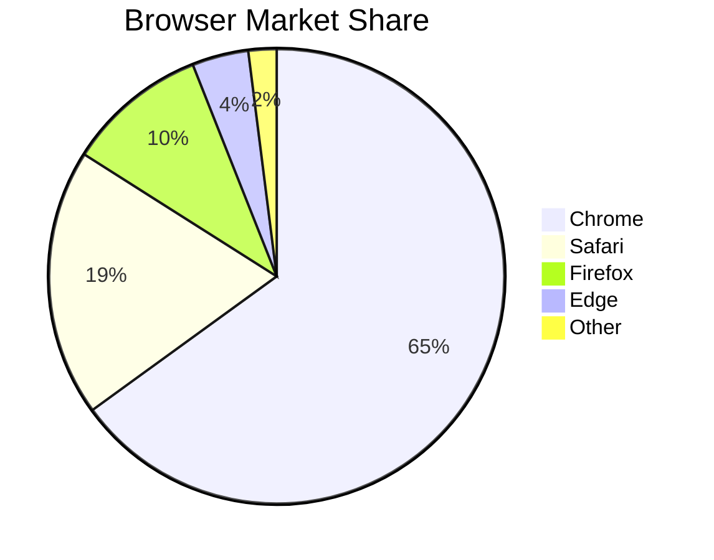

Rédigez des diagrammes sous forme de texte dans des blocs de code délimités. Jamdesk les génère en SVG au moment du build.

## Utilisation de base

Utilisez un bloc de code délimité avec l'identifiant de langage `mermaid` :

````mdx

````


## Types de diagrammes

### Organigrammes

La direction peut être de haut en bas (`TD`), de gauche à droite (`LR`), de bas en haut (`BT`) ou de droite à gauche (`RL`).



````mdx

````

#### Sous-graphes

Regroupez les nœuds connexes à l'aide de sous-graphes. Cela permet d'organiser des organigrammes complexes en sections logiques telles que « Frontend » et « Backend » ou différentes étapes d'un pipeline.



````mdx

````

### Diagrammes de séquence

Les diagrammes de séquence montrent comment les composants interagissent dans le temps. Ils sont idéaux pour documenter les appels API, les flux d'authentification ou toute communication entre services. Les participants apparaissent sous forme de lignes de vie verticales, avec des messages qui circulent entre eux.



````mdx

````

### Diagrammes de classes

Les diagrammes de classes représentent la structure des systèmes orientés objet. Utilisez-les pour documenter des modèles de données, montrer les relations entre entités ou concevoir l'architecture d'un système. Ils affichent les classes avec leurs attributs, leurs méthodes et leurs relations.



````mdx

````

### Diagrammes d'état

Les diagrammes d'état modélisent le cycle de vie d'un objet ou d'un processus. Ils montrent tous les états possibles et les transitions entre eux. Utilisez des diagrammes d'état pour documenter les statuts de commande, les flux de documents ou tout système avec des phases distinctes.



````mdx

````

### Diagrammes entité-relation

Les diagrammes ER documentent les schémas de base de données et les modèles de données. Ils montrent les entités (tables), leurs attributs (colonnes) et les relations entre eux. Les symboles indiquent la cardinalité : un-à-un, un-à-plusieurs ou plusieurs-à-plusieurs.



````mdx

````

### Diagrammes de Gantt

Les diagrammes de Gantt visualisent les plannings et les délais de projet. Les tâches sont affichées sous forme de barres horizontales sur une ligne temporelle, indiquant la durée, les dépendances et le travail en parallèle. Utilisez-les pour la planification de projet, la documentation de sprints ou les feuilles de route.



````mdx

````

### Graphes Git

Les graphes Git visualisent les stratégies de branchement et les flux de gestion de versions. Ils montrent les commits, les branches, les fusions et l'historique global d'un dépôt. Chaque branche est codée par couleur pour une identification facile.



````mdx

````

### Diagrammes circulaires

Les diagrammes circulaires affichent des données proportionnelles sous forme de portions d'un cercle. Utilisez-les pour montrer des parts de marché, des résultats de sondages, l'allocation des ressources ou toute donnée où les parties forment un tout. Limitez à 6 portions maximum pour la lisibilité.



````mdx

````

## Formes des organigrammes

Différentes formes véhiculent différentes significations dans les organigrammes :

| Syntaxe    | Forme               | Utilisation |
| ---------- | ------------------- | ------- |
| `[text]`   | Rectangle           | Étapes de processus, actions |
| `(text)`   | Rectangle arrondi   | Points de début/fin |
| `{text}`   | Losange             | Décisions, conditions |
| `([text])` | Stade               | Événements, déclencheurs |
| `[[text]]` | Sous-routine        | Processus prédéfinis |
| `[(text)]` | Cylindre            | Bases de données, stockage |

## Types de flèches

Les flèches indiquent la direction du flux et les types de relations :

| Syntaxe     | Description      | Utilisation |
| ----------- | ---------------- | ------- |
| `-->`       | Flèche pleine    | Flux normal |
| `---`       | Ligne pleine     | Associations |
| `-.->`      | Flèche pointillée | Flux optionnel ou asynchrone |
| `==>`       | Flèche épaisse   | Chemins importants |
| `--text-->` | Flèche avec étiquette | Décrire la transition |

## Dimensionner les diagrammes larges

Pour les diagrammes larges comme les diagrammes de Gantt ou les graphes Git complexes, vous pouvez utiliser le composant `Mermaid` directement avec une propriété `minWidth` pour vous assurer que le diagramme ne soit pas compressé :

```mdx
<Mermaid minWidth="700px">
gantt
    title Wide Project Timeline
    ...
</Mermaid>
```

## Conseils de mise en forme

<Tip>
  Les diagrammes Mermaid s'adaptent automatiquement aux modes clair et sombre. Les couleurs sont
  optimisées pour la lisibilité dans les deux thèmes.
</Tip>

Pour des diagrammes efficaces :

- Restez simple : décomposez les flux complexes en plusieurs diagrammes plus petits.
- Étiquetez vos flèches pour expliquer les transitions.
- Choisissez une direction : `TD` (de haut en bas) pour les diagrammes hauts, `LR` (de gauche à droite) pour les diagrammes larges.
- Limitez chaque diagramme à 10-15 nœuds pour plus de clarté.

## En savoir plus

Pour la référence complète de la syntaxe Mermaid, notamment les fonctionnalités avancées comme le style, les thèmes et les types de diagrammes supplémentaires, consultez la [documentation officielle Mermaid](https://mermaid.js.org/intro/).

## Prochaines étapes

<Columns cols={2}>
  <Card title="Vue d'ensemble des composants" icon="puzzle-piece" href="/fr/components/overview">
    Parcourir tous les composants disponibles
  </Card>
  <Card title="Les bases MDX" icon="file-code" href="/fr/content/mdx-basics">
    Apprendre à utiliser les composants en MDX
  </Card>
</Columns>
