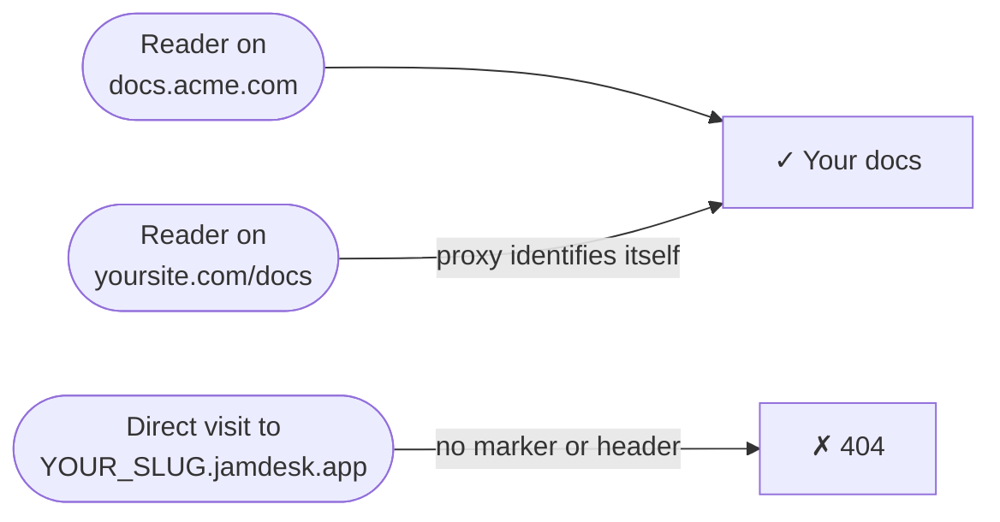

Votre documentation est hébergée à l'adresse `YOUR_SLUG.jamdesk.app`. Lorsque vous connectez un domaine personnalisé, ce sous-domaine continue de répondre — mais chaque page qu'il sert inclut une balise `<link rel="canonical">` pointant vers votre domaine, de sorte que les moteurs de recherche indexent votre domaine, jamais le sous-domaine. Pour la plupart des projets, c'est tout ce dont vous avez besoin.

Les captures d'écran montrent l'interface en anglais.

**Custom domain only** va plus loin : il désactive le sous-domaine pour les visiteurs directs. Une simple requête vers `YOUR_SLUG.jamdesk.app` renvoie une erreur 404, et votre documentation n'est accessible que via votre propre domaine.



<Warning>
Cela masque votre sous-domaine — ce n'est pas un mot de passe. Quiconque visite via votre domaine voit toujours votre documentation. Pour contrôler *qui* peut la lire, utilisez la [protection par mot de passe](/fr/setup/password-protection) ; les deux fonctionnalités fonctionnent ensemble.
</Warning>

## Activation

<Steps>
  <Step title="Vérifiez votre domaine personnalisé">
    Ajoutez et vérifiez votre domaine dans le dashboard — voir [Domaines personnalisés](/fr/deploy/custom-domains). L'interrupteur nécessite un domaine dont le statut est **Active**.
  </Step>
  <Step title="Vérifiez votre proxy (uniquement pour les configurations avec proxy inverse)">
    Si votre domaine est un simple enregistrement CNAME pointant vers Jamdesk (comme `docs.acme.com`), passez cette étape — il n'y a rien à configurer. Si vous servez votre documentation à l'adresse `yoursite.com/docs` via un proxy, celui-ci doit s'identifier à chaque requête qu'il transmet — voir [Configurations de proxy](#configurations-de-proxy) ci-dessous.
  </Step>
  <Step title="Activez l'interrupteur">
    Dans le dashboard, ouvrez l'onglet **Settings** de votre projet, développez la carte **Custom Domain**, puis activez **Custom domain only**. Jamdesk vérifie d'abord votre domaine en production, et n'active l'interrupteur que si votre configuration est valide — si la vérification échoue, le message vous indique précisément quoi corriger.

    <Frame>
      
    </Frame>
  </Step>
</Steps>

Les modifications atteignent tous les serveurs edge en moins d'une minute.

## Configurations de proxy

Une requête vers `YOUR_SLUG.jamdesk.app` n'est servie que si elle s'identifie comme provenant de votre proxy — via l'en-tête `X-Jamdesk-Forwarded-Host` ou le paramètre `?jd_proxy=1`. Chaque guide de configuration inclut déjà celui qui convient :

- **[Vercel](/fr/deploy/vercel)** — les rewrites de `vercel.json` transportent `?jd_proxy=1` ; Edge Middleware définit l'en-tête
- **[Cloudflare Workers](/fr/deploy/cloudflare)** — le Worker définit l'en-tête
- **[AWS CloudFront](/fr/deploy/aws)** — l'en-tête personnalisé de l'origine
- **[Proxy inverse](/fr/deploy/reverse-proxy)** — nginx, Apache, Caddy et HAProxy définissent l'en-tête

Si vous avez suivi l'un de ces guides, tout est déjà configuré.

Vous utilisez [MCP](/fr/ai/mcp-server) ou le [widget de chat](/fr/ai/chat) via un proxy inverse ? Transférez `/api/mcp/:path*` et `/api/chat/:path*` de la même façon que `/docs`. Sur Vercel :

```json vercel.json
{
  "rewrites": [
    { "source": "/api/mcp/:path*", "destination": "https://YOUR_SLUG.jamdesk.app/api/mcp/:path*?jd_proxy=1" },
    { "source": "/api/chat/:path*", "destination": "https://YOUR_SLUG.jamdesk.app/api/chat/:path*?jd_proxy=1" }
  ]
}
```

Si votre domaine personnalisé est en CNAME vers Jamdesk, MCP et le chat sur votre domaine continuent de fonctionner sans aucune modification — pointez vos clients MCP vers `https://docs.acme.com/_mcp` et c'est terminé.

## Bon à savoir

- **Tout renvoie une erreur 404 sur le sous-domaine nu** — les pages, `sitemap.xml`, `robots.txt`, `llms.txt`, et les exports Markdown. Les navigateurs voient une simple page « introuvable » de Jamdesk.
- **Les images restent accessibles.** Les images, vidéos et images de prévisualisation sociale (OG) sont exemptées — l'aperçu du site dans le dashboard les charge directement depuis le sous-domaine.
- **Vous ne pouvez pas vous verrouiller vous-même.** Si le DNS de votre domaine tombe en panne, Jamdesk cesse d'appliquer le blocage et le sous-domaine recommence à répondre jusqu'à ce que le domaine soit rétabli. Si c'est plutôt votre configuration de proxy qui se casse (par exemple en supprimant le marqueur d'une règle de rewrite), désactivez l'interrupteur le temps de corriger le problème.
- **L'[API de recherche](/fr/jamdesk-api/docs-search-api) n'est pas affectée** — elle est authentifiée par clé API.

## Et ensuite ?

<Columns cols={3}>
  <Card title="Vercel" icon="cloud-arrow-up" href="/fr/deploy/vercel">
    Ajoutez le marqueur jd_proxy ou Edge Middleware
  </Card>
  <Card title="Domaines personnalisés" icon="globe" href="/fr/deploy/custom-domains">
    Enregistrez et vérifiez votre domaine
  </Card>
  <Card title="Protection par mot de passe" icon="lock" href="/fr/setup/password-protection">
    Contrôlez qui peut lire votre documentation
  </Card>
</Columns>
