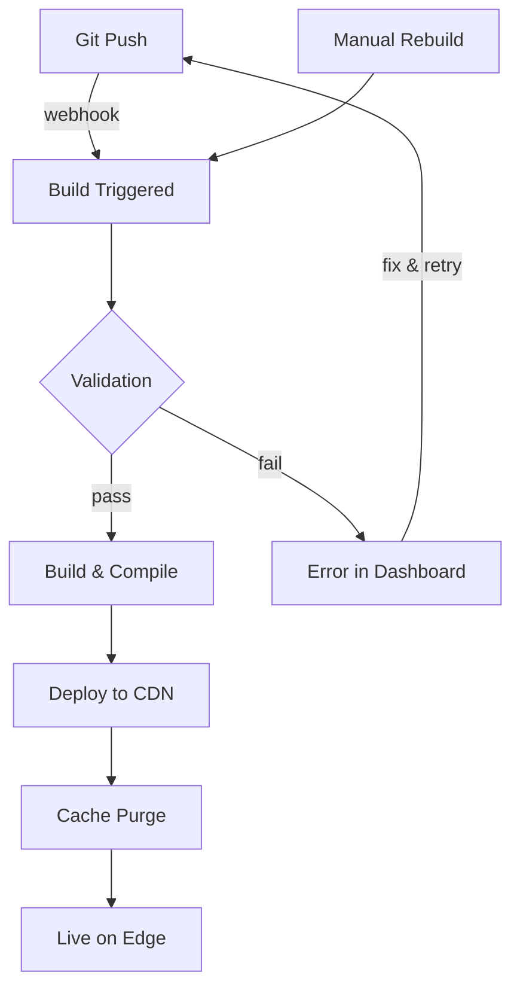

Jamdesk gère automatiquement l'intégralité du cycle de vie du build et du déploiement. Poussez vers GitHub et votre documentation est en ligne en quelques minutes.

Les captures d'écran montrent l'interface en anglais.

## Cycle de vie du build



## Déclencheurs de build

| Déclencheur | Fonctionnement | Cas d'usage |
|-------------|----------------|-------------|
| **Git Push** | Un Webhook se déclenche lors d'un push sur la branche connectée | Développement normal |
| **Dashboard** | Cliquez sur « Rebuild » dans les paramètres du projet | Forcer le rafraîchissement après des changements de configuration |

<Note>
Les builds sont soumis à un anti-rebond. Plusieurs commits effectués en moins de 10 secondes sont regroupés en un seul build.
</Note>

## Ce qui se passe durant un build

Jamdesk clone votre dépôt, valide `docs.json` et la syntaxe MDX, compile vers du HTML optimisé avec indexation de la recherche, puis se charge de déployer le tout vers Cloudflare R2. La plupart des sites se buildent en 30 à 90 secondes.

Pour une présentation complète du pipeline avec diagramme d'architecture, consultez [Comment fonctionne Jamdesk](/fr/how-jamdesk-works).

## Statut du déploiement

Consultez le statut du build dans le dashboard :

| Statut | Signification |
|--------|---------------|
| **Building** | Build en cours |
| **Deployed** | En ligne sur votre domaine |
| **Failed** | Erreur de build — vérifiez les logs |
| **Queued** | En attente du build précédent |

La section Build History affiche les déploiements récents avec leur statut et la possibilité de déclencher des rebuilds manuels :


## Rebuild manuel

Déclenchez un rebuild sans pousser de modifications :

1. Accédez à votre projet dans le dashboard
2. Ouvrez **Settings**
3. Cliquez sur **Rebuild**

Utilisez cette option lorsque :
- Vous mettez à jour des variables d'environnement
- Vous débloquez un build bloqué
- Vous actualisez après des mises à jour de la plateforme

## Variables d'environnement

Définissez les variables au moment du build dans **Settings** → **Environment** :

```bash
ANALYTICS_ID=G-XXXXXXXXXX
API_BASE_URL=https://api.example.com
```

Les variables sont disponibles pendant le processus de build et peuvent être référencées dans vos fichiers docs.json ou MDX.

## Logs de build

Consultez les logs de build détaillés pour le débogage :

1. Accédez à **Deployments** dans votre projet
2. Cliquez sur un déploiement spécifique
3. Consultez le log de build complet

Les problèmes courants apparaissent dans les logs :
- Syntaxe MDX invalide
- Images ou ressources manquantes
- Liens internes cassés
- Erreurs de configuration

## Rollbacks

Revenez à une version précédente :

1. Accédez à **Deployments**
2. Trouvez le déploiement que vous souhaitez restaurer
3. Cliquez sur **Rollback**

La version précédente est mise en ligne immédiatement pendant qu'un nouveau build démarre.

## Déploiements par branche

<Note>
Les déploiements par branche sont disponibles sur les plans Pro.
</Note>

Prévisualisez les modifications avant de les fusionner :

1. Poussez vers une branche de fonctionnalité
2. Jamdesk crée une preview à l'adresse `branch-name.your-project.jamdesk.app`
3. Vérifiez et fusionnez lorsque vous êtes prêt

## Et ensuite ?

<Columns cols={2}>
  <Card title="Vue d'ensemble du déploiement" icon="cloud-arrow-up" href="/fr/deploy/overview">
    Choisissez entre l'hébergement sur sous-domaine, domaine personnalisé ou sous-chemin
  </Card>
  <Card title="Hébergement sur sous-chemin" icon="route" href="/fr/deploy/subpath-hosting">
    Hébergez la documentation sur example.com/docs
  </Card>
</Columns>
