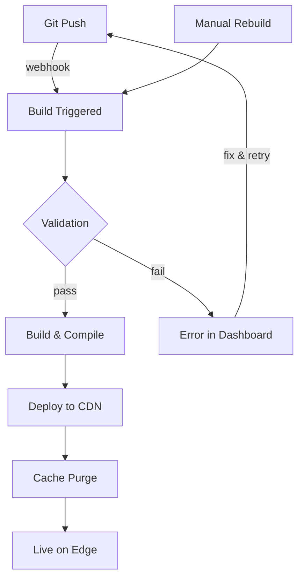

Jamdesk gère automatiquement l'ensemble du cycle de vie de build et de déploiement. Effectuez un push sur GitHub et votre documentation est en ligne en quelques minutes.

## Cycle de vie du build



## Déclencheurs de build

| Déclencheur | Fonctionnement | Cas d'usage |
|---------|--------------|----------|
| **Git Push** | Le Webhook se déclenche lors d'un push sur la branche connectée | Développement normal |
| **Dashboard** | Cliquez sur « Rebuild » dans les paramètres du projet | Forcer une actualisation après des changements de configuration |

<Note>
Les builds sont debounced. Plusieurs commits dans un intervalle de 10 secondes sont regroupés en un seul build.
</Note>

## Ce qui se passe pendant un build

Jamdesk clone votre repo, valide `docs.json` et la syntaxe MDX, compile en HTML optimisé avec indexation de recherche, puis déploie sur Cloudflare R2. La plupart des sites sont buildés en 30 à 90 secondes.

Pour le détail complet du pipeline avec le diagramme d'architecture, consultez [Comment fonctionne Jamdesk](/fr/how-jamdesk-works).

## Statut de déploiement

Vérifiez le statut du build dans le dashboard :

| Statut | Signification |
|--------|---------|
| **Building** | Build en cours |
| **Deployed** | En ligne sur votre domaine |
| **Failed** | Erreur de build - consultez les logs |
| **Queued** | En attente du build précédent |

La section Build History affiche les déploiements récents avec leur statut et permet de déclencher des rebuilds manuels :

<SizedImage src="/images/dashboard/build-history.webp" alt="Build History showing recent deployments with Successful status badges, commit info, and Rebuild button" />

## Rebuild manuel

Déclenchez un rebuild sans pousser de changements :

1. Accédez à votre projet dans le dashboard
2. Ouvrez **Settings**
3. Cliquez sur **Rebuild**

Utilisez cette option pour :
- Mettre à jour des variables d'environnement
- Résoudre un build bloqué
- Actualiser après des mises à jour de la plateforme

## Variables d'environnement

Définissez les variables au moment du build dans **Settings** → **Environment** :

```bash
ANALYTICS_ID=G-XXXXXXXXXX
API_BASE_URL=https://api.example.com
```

Les variables sont disponibles pendant le processus de build et peuvent être référencées dans votre docs.json ou vos fichiers MDX.

## Logs de build

Consultez les logs de build détaillés pour le débogage :

1. Accédez à **Deployments** dans votre projet
2. Cliquez sur un déploiement spécifique
3. Consultez le log de build complet

Les problèmes courants apparaissent dans les logs :
- Syntaxe MDX invalide
- Images ou assets manquants
- Liens internes cassés
- Erreurs de configuration

## Rollbacks

Revenez à une version précédente :

1. Accédez à **Deployments**
2. Trouvez le déploiement que vous souhaitez restaurer
3. Cliquez sur **Rollback**

La version précédente est déployée immédiatement pendant qu'un nouveau build démarre.

## Déploiements de branche

<Note>
Les déploiements de branche sont disponibles sur les plans Pro.
</Note>

Prévisualisez les changements avant de fusionner :

1. Effectuez un push sur une branche de fonctionnalité
2. Jamdesk crée une preview à `branch-name.your-project.jamdesk.app`
3. Consultez puis fusionnez lorsque vous êtes prêt

## Prochaines étapes

<Columns cols={2}>
  <Card title="Vue d'ensemble du déploiement" icon="cloud-arrow-up" href="/fr/deploy/overview">
    Choisissez entre un sous-domaine, un domaine personnalisé ou un hébergement en sous-chemin
  </Card>
  <Card title="Hébergement en sous-chemin" icon="route" href="/fr/deploy/subpath-hosting">
    Hébergez votre documentation sur example.com/docs
  </Card>
</Columns>
