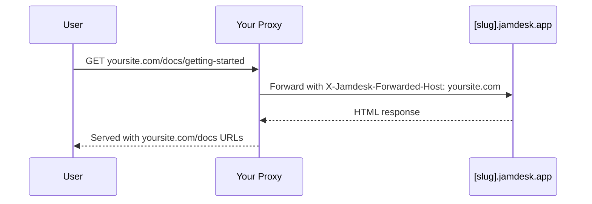

Hébergez votre documentation sur `yoursite.com/docs` au lieu d'un sous-domaine séparé. Pour toutes les options de déploiement, consultez [Vue d'ensemble du déploiement](/fr/deploy/overview).

## Pourquoi utiliser un sous-répertoire ?

Héberger la documentation sur `yoursite.com/docs` plutôt que sur un sous-domaine comme `docs.yoursite.com` offre :

- **Un meilleur SEO** - Les pages de documentation contribuent à l'autorité de votre domaine principal
- **Une expérience unifiée** - Les utilisateurs restent sur votre domaine principal
- **Une navigation plus simple** - Pas de changement de contexte entre domaines

## Fonctionnement

Votre serveur web ou CDN redirige les requêtes de `/docs/*` vers votre site Jamdesk tout en conservant l'URL d'origine dans le navigateur :

Le proxy transmet l'en-tête `X-Jamdesk-Forwarded-Host` avec votre domaine. Jamdesk l'utilise pour :

1. **Vérifier que votre domaine** est autorisé à servir le contenu
2. **Appliquer votre configuration** depuis le dashboard

Cela signifie que la configuration de votre proxy est une **configuration unique** - si vous modifiez des paramètres dans le dashboard, le proxy n'a pas besoin d'être mis à jour.

## Configuration par fournisseur

Choisissez votre fournisseur d'hébergement pour commencer :

<Columns cols={2}>
  <Card title="Cloudflare" icon="cloud" href="/fr/deploy/cloudflare">
    Utilisez Cloudflare Workers pour rediriger le trafic /docs
  </Card>
  <Card title="AWS" icon="aws" href="/fr/deploy/aws">
    Configurez CloudFront avec Route 53
  </Card>
  <Card title="Vercel" icon="triangle" href="/fr/deploy/vercel">
    Ajoutez des rewrites à vercel.json
  </Card>
  <Card title="Reverse Proxy" icon="server" href="/fr/deploy/reverse-proxy">
    nginx, Apache, ou autres serveurs proxy
  </Card>
</Columns>

## Prérequis

Avant de configurer votre proxy :

1. **Activez l'hébergement sur sous-répertoire** dans votre [dashboard Jamdesk](https://dashboard.jamdesk.com) sous Settings → Custom Domain
2. **Activez "Host at /docs"**
3. **Ajoutez votre domaine** (par exemple, `yoursite.com`)

Votre sous-domaine Jamdesk (par exemple, `acme.jamdesk.app`) s'affichera dans le dashboard - vous en aurez besoin pour configurer votre proxy.

<Note>
Activer ou désactiver "Host at /docs" déclenche une reconstruction automatique de votre documentation. Cela est nécessaire car la structure des URL change entre `/introduction` et `/docs/introduction`.
</Note>

Une fois votre proxy configuré, testez en visitant `https://yoursite.com/docs`. Votre documentation devrait se charger avec toutes les ressources et tous les liens fonctionnant correctement.

## Dois-je masquer le sous-domaine jamdesk.app ?

Non. Votre sous-domaine `[slug].jamdesk.app` reste accessible (c'est l'origine
en amont vers laquelle votre proxy redirige), mais il n'entrera pas en concurrence avec
votre site dans les résultats de recherche :

- **Une fois votre domaine enregistré**, chaque page servie directement depuis
  le sous-domaine inclut un lien canonique pointant vers la même page sur votre
  domaine, ce qui permet aux moteurs de recherche de consolider tous les signaux de classement à cet endroit.
- **Avant l'enregistrement d'un domaine**, les pages du sous-domaine en mode sous-répertoire sont marquées
  `noindex`, elles n'entrent donc jamais dans l'index.

Si vous souhaitez également rendre le contenu lui-même inaccessible sur le sous-domaine (pas
seulement non indexé), activez la [Protection par mot de passe](/fr/setup/password-protection) : le
sous-domaine affichera alors un écran de déverrouillage au lieu de votre documentation.

## Et ensuite ?

<Columns cols={2}>
  <Card title="Vue d'ensemble du déploiement" icon="cloud-arrow-up" href="/fr/deploy/overview">
    Comparez l'hébergement par sous-domaine, domaine personnalisé et sous-répertoire
  </Card>
  <Card title="Domaines personnalisés" icon="globe" href="/fr/deploy/custom-domains">
    Vérifiez le DNS et dépannez la configuration de domaine
  </Card>
</Columns>
