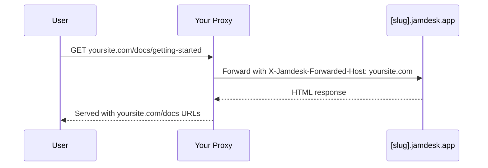

Hébergez votre documentation sur un sous-chemin de votre domaine plutôt que sur un sous-domaine distinct : `yoursite.com/docs` par défaut, ou un segment personnalisé comme `yoursite.com/help`. Pour toutes les options de déploiement, consultez [Aperçu du déploiement](/fr/deploy/overview).

Les captures d'écran montrent l'interface en anglais.

## Pourquoi utiliser un sous-chemin ?

Par rapport à un sous-domaine comme `docs.yoursite.com`, un sous-chemin garde les lecteurs sur votre domaine principal, et vos pages de documentation contribuent à l'autorité de recherche de ce domaine au lieu de répartir les signaux de classement entre deux hôtes.

## Comment ça fonctionne

Votre serveur web ou votre CDN redirige les requêtes de `/docs/*` vers votre site Jamdesk tout en conservant l'URL d'origine dans le navigateur :

Le proxy transmet l'en-tête `X-Jamdesk-Forwarded-Host` avec votre domaine. Jamdesk l'utilise pour :

1. **Vérifier que votre domaine** est autorisé à diffuser le contenu
2. **Appliquer votre configuration** depuis le dashboard

Cela fait de la configuration de votre proxy une opération unique : si vous modifiez les paramètres dans le dashboard, il n'est pas nécessaire de mettre à jour le proxy.

## Configuration par fournisseur

Choisissez votre fournisseur d'hébergement pour commencer :

<Columns cols={2}>
  <Card title="Cloudflare" icon="cloud" href="/fr/deploy/cloudflare">
    Utilisez Cloudflare Workers pour proxyfier le trafic /docs
  </Card>
  <Card title="AWS" icon="aws" href="/fr/deploy/aws">
    Configurez CloudFront avec Route 53
  </Card>
  <Card title="Vercel" icon="triangle" href="/fr/deploy/vercel">
    Ajoutez des rewrites à vercel.json
  </Card>
  <Card title="Proxy inverse" icon="server" href="/fr/deploy/reverse-proxy">
    nginx, Apache, ou autres serveurs proxy
  </Card>
</Columns>

## Prérequis

Avant de configurer votre proxy :

1. **Ajoutez votre domaine** dans votre [dashboard Jamdesk](https://dashboard.jamdesk.com) sous Settings → Custom Domain
2. **Activez « Host at a subpath »**
3. **Choisissez votre sous-chemin** (facultatif ; voir [Choisir votre sous-chemin](#choisir-votre-sous-chemin) ci-dessous) et cliquez sur **Save**

Votre sous-domaine Jamdesk (par exemple, `acme.jamdesk.app`) sera affiché dans le dashboard. Vous en aurez besoin pour la configuration de votre proxy.

<Note>
Enregistrer une modification de l'hébergement par sous-chemin (l'activer, le désactiver, ou modifier le sous-chemin lui-même) déclenche une reconstruction complète de votre documentation. Cela est nécessaire car la structure des URL change (par exemple, entre `/introduction` et `/docs/introduction`).
</Note>

## Choisir votre sous-chemin

Par défaut, votre documentation est servie à `/docs`. Pour utiliser autre chose, comme `/help` ou `/support`, saisissez-le dans le champ de sous-chemin à côté du bouton. Lorsque le champ est vide, le bouton affiche `Host at a subpath (e.g. /docs)` ; en saisissant une valeur, il se met à jour en direct vers le chemin que vous êtes sur le point d'activer (`Host at /help`, et ainsi de suite).

<Frame>
  
</Frame>

Le champ accepte un seul segment en minuscules : lettres, chiffres et traits d'union internes uniquement, sans trait d'union en début ou en fin, 63 caractères maximum. Un certain nombre de segments sont réservés et rejetés d'office, notamment `api`, `jd`, des chemins d'administration courants comme `wp-admin`, et tout code de locale que votre documentation pourrait utiliser (`fr`, `es`, `de`, et similaires). Les réserver garantit que votre sous-chemin ne pourra jamais entrer en conflit avec une route déjà utilisée par Jamdesk.

Laissez le champ vide pour conserver la valeur par défaut `/docs`.

## Renommer ou supprimer votre sous-chemin

Modifier votre sous-chemin, ou le vider pour revenir à la valeur par défaut, ne présente aucun risque de rompre les liens déjà indexés ou mis en favoris :

- **`/docs` ne cesse jamais de fonctionner.** Même après être passé à un sous-chemin personnalisé comme `/help`, les chemins `/docs/*` d'origine continuent de répondre sur votre sous-domaine `[slug].jamdesk.app` et via tout proxy encore pointé vers eux. Les liens canoniques basculent immédiatement vers votre nouveau sous-chemin, ce qui permet aux moteurs de recherche de les réindexer à cet endroit. Rien de ce qui pointe déjà vers `/docs` ne casse, ce qui signifie que vous pouvez mettre à jour la configuration de votre propre proxy à votre propre rythme plutôt que dans l'urgence.
- **Renommer un sous-chemin personnalisé redirige l'ancien, pour un seul renommage.** Si vous renommez `/help` en `/guide`, les requêtes vers `/help/*` sont redirigées en 308 vers le chemin `/guide/*` correspondant. Cet historique ne conserve qu'un seul niveau : renommez à nouveau `/guide` en `/support` et `/guide/*` redirige désormais vers `/support/*`, mais `/help/*` (le segment datant de deux renommages) n'est plus suivi, si bien que ces liens cessent de fonctionner — ils aboutissent à une page « introuvable », parfois après une redirection vers un chemin combiné à l'aspect étrange. Ne chaînez pas les renommages si vous comptez sur la redirection pour faire suivre les anciens liens ; mettez plutôt à jour les liens externes vers le sous-chemin actuel.
- **Revenir à `/docs`** fonctionne de la même manière : votre précédent sous-chemin personnalisé (un niveau d'historique) redirige vers `/docs/*`.

<Warning>
Cela ne signifie **pas** que `/docs` redirige vers le sous-chemin que vous choisissez. Ce n'est pas nécessaire, car `/docs` continue de servir directement, en permanence. La redirection à un seul niveau ne s'applique qu'à un sous-chemin *personnalisé* dont vous vous éloignez.
</Warning>

Une fois votre proxy configuré, testez-le en visitant `https://yoursite.com/docs` (ou votre sous-chemin configuré). Votre documentation devrait se charger avec tous les éléments et liens fonctionnant correctement.

## Dois-je masquer le sous-domaine jamdesk.app ?

Non. Votre sous-domaine `[slug].jamdesk.app` reste accessible (c'est l'origine en amont vers laquelle votre proxy redirige), mais il n'entrera pas en concurrence avec votre site dans les résultats de recherche :

- **Une fois votre domaine enregistré**, chaque page servie directement depuis le sous-domaine inclut un lien canonique pointant vers la même page sur votre domaine, ce qui permet aux moteurs de recherche d'y consolider tous les signaux de classement.
- **Avant l'enregistrement d'un domaine**, les pages du sous-domaine en mode sous-chemin sont marquées `noindex`, elles n'entrent donc jamais dans l'index.

Si vous souhaitez également rendre le contenu lui-même inaccessible sur le sous-domaine (pas seulement non indexé), activez la [protection par mot de passe](/fr/setup/password-protection) : le sous-domaine sert alors un écran de déverrouillage à la place de votre documentation.

## Et ensuite ?

<Columns cols={2}>
  <Card title="Aperçu du déploiement" icon="cloud-arrow-up" href="/fr/deploy/overview">
    Comparez l'hébergement par sous-domaine, domaine personnalisé et sous-chemin
  </Card>
  <Card title="Domaines personnalisés" icon="globe" href="/fr/deploy/custom-domains">
    Vérifiez le DNS et dépannez la configuration du domaine
  </Card>
</Columns>
