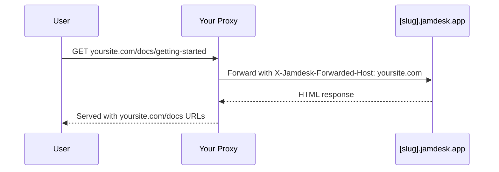

Hébergez votre documentation sur `yoursite.com/docs` plutôt que sur un sous-domaine séparé. Pour toutes les options de déploiement, consultez [Aperçu du déploiement](/fr/deploy/overview).

## Pourquoi utiliser un sous-chemin ?

Héberger la documentation sur `yoursite.com/docs` plutôt que sur un sous-domaine comme `docs.yoursite.com` offre :

- **Meilleur référencement** - Les pages de documentation contribuent à l'autorité de votre domaine principal
- **Expérience unifiée** - Les utilisateurs restent sur votre domaine principal
- **Navigation simplifiée** - Pas de changement de contexte entre les domaines

## Comment ça fonctionne

Votre serveur web ou CDN proxy les requêtes de `/docs/*` vers votre site Jamdesk tout en préservant l'URL d'origine dans le navigateur :

Le proxy transmet l'en-tête `X-Jamdesk-Forwarded-Host` avec votre domaine. Jamdesk l'utilise pour :

1. **Vérifier que votre domaine** est autorisé à servir le contenu
2. **Appliquer votre configuration** depuis le dashboard

Cela signifie que votre configuration de proxy est une **configuration unique** — si vous modifiez des paramètres dans le dashboard, le proxy n'a pas besoin d'être mis à jour.

## Configuration par fournisseur

Choisissez votre fournisseur d'hébergement pour commencer :

<Columns cols={2}>
  <Card title="Cloudflare" icon="cloud" href="/fr/deploy/cloudflare">
    Utiliser Cloudflare Workers pour proxy le trafic /docs
  </Card>
  <Card title="AWS" icon="aws" href="/fr/deploy/aws">
    Configurer CloudFront avec Route 53
  </Card>
  <Card title="Vercel" icon="triangle" href="/fr/deploy/vercel">
    Ajouter des réécritures à vercel.json
  </Card>
  <Card title="Reverse Proxy" icon="server" href="/fr/deploy/reverse-proxy">
    nginx, Apache ou autres serveurs proxy
  </Card>
</Columns>

## Prérequis

Avant de configurer votre proxy :

1. **Activez l'hébergement en sous-chemin** dans votre [dashboard Jamdesk](https://dashboard.jamdesk.com) sous Paramètres → Domaine personnalisé
2. **Activez "Host at /docs"**
3. **Ajoutez votre domaine** (par exemple, `yoursite.com`)

Votre sous-domaine Jamdesk (par exemple, `acme.jamdesk.app`) sera affiché dans le dashboard — vous en aurez besoin pour votre configuration de proxy.

<Note>
Activer ou désactiver "Host at /docs" déclenche une reconstruction automatique de votre documentation. Cela est nécessaire car la structure des URL change entre `/introduction` et `/docs/introduction`.
</Note>

Une fois votre proxy configuré, testez en visitant `https://yoursite.com/docs`. Votre documentation devrait se charger avec tous les assets et liens fonctionnant correctement.

## Étapes suivantes

<Columns cols={2}>
  <Card title="Aperçu du déploiement" icon="cloud-arrow-up" href="/fr/deploy/overview">
    Comparer l'hébergement par sous-domaine, domaine personnalisé et sous-chemin
  </Card>
  <Card title="Domaines personnalisés" icon="globe" href="/fr/deploy/custom-domains">
    Vérifier le DNS et résoudre les problèmes de configuration de domaine
  </Card>
</Columns>
