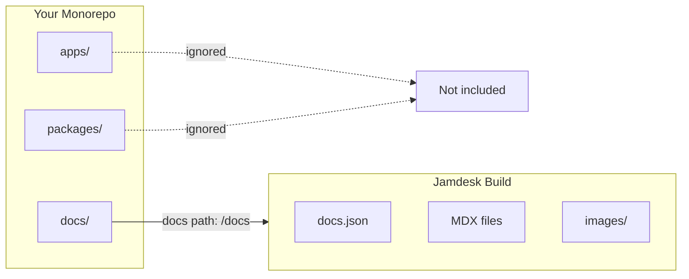

Si votre `docs.json` se trouve dans un sous-répertoire -- `docs/`, `packages/docs/`, ou ailleurs -- activez le mode monorepo dans les paramètres du projet et spécifiez le chemin. Jamdesk limitera les builds à ce répertoire et ignorera tout ce qui se trouve en dehors.

Les captures d'écran montrent l'interface en anglais.

<Note>
**Prérequis :** Vous devez avoir un [projet Jamdesk](/fr/setup/creating-projects) connecté à un [dépôt GitHub](/fr/setup/connecting-github) avant de configurer le support des monorepos.
</Note>

## Comment Jamdesk délimite votre build



## Configuration rapide

<Steps>
  <Step title="Ouvrir les paramètres du projet">
    Accédez à votre projet dans le [dashboard Jamdesk](https://dashboard.jamdesk.com) et naviguez vers **Settings**.
  </Step>

  <Step title="Activer le mode monorepo">
    Dans la section **Git Repository**, activez **Set up as monorepo**.

    <Frame>
      
    </Frame>
  </Step>

  <Step title="Saisir le chemin de vos docs">
    Spécifiez le chemin vers le répertoire contenant votre fichier `docs.json`.

    <Frame>
      
    </Frame>

    Le preview indique où Jamdesk cherchera votre fichier de configuration.
  </Step>

  <Step title="Enregistrer et reconstruire">
    Cliquez sur **Save Changes** pour appliquer. Votre prochain build utilisera le nouveau chemin.
  </Step>
</Steps>

## Comprendre le chemin des docs

Le chemin des docs indique à Jamdesk où trouver votre fichier de configuration `docs.json` dans le dépôt.

<Warning>
Saisissez uniquement le chemin du répertoire, pas le nom du fichier. Utilisez `docs` et non `docs/docs.json`.
</Warning>

### Exemples de chemins

| Structure du dépôt | Valeur du chemin des docs |
|---------------------|-----------------|
| `my-repo/docs/docs.json` | `docs` |
| `my-repo/packages/docs/docs.json` | `packages/docs` |
| `my-repo/apps/website/docs/docs.json` | `apps/website/docs` |
| `my-repo/documentation/docs.json` | `documentation` |

### Ce qui est inclus

Lorsque vous définissez un chemin de docs, Jamdesk ne traite que les fichiers dans ce répertoire :

- **Les fichiers de contenu** (`.mdx`, `.md`) sont compilés en pages
- **Les ressources** dans les sous-répertoires (comme `images/`) sont incluses
- **La configuration** (`docs.json`) définit votre site

Les fichiers en dehors du chemin des docs sont ignorés lors des builds.

## Structures courantes de monorepo

Choisissez la structure qui correspond à votre projet :

<Tabs>
  <Tab title="Dedicated /docs">
    Documentation dans un répertoire de premier niveau.

    ```bash
    monorepo/
    ├── packages/
    ├── apps/
    └── docs/                    # Docs path: docs
        ├── docs.json
        ├── introduction.mdx
        └── guides/
    ```

    **Chemin des docs :** `docs`
  </Tab>

  <Tab title="Package in /packages">
    Documentation en tant que package de workspace.

    ```bash
    monorepo/
    ├── packages/
    │   ├── core/
    │   ├── cli/
    │   └── docs/                # Docs path: packages/docs
    │       ├── docs.json
    │       └── pages/
    └── apps/
    ```

    **Chemin des docs :** `packages/docs`
  </Tab>

  <Tab title="Inside an App">
    Documentation imbriquée dans une application.

    ```bash
    monorepo/
    ├── apps/
    │   └── website/
    │       ├── src/
    │       └── docs/            # Docs path: apps/website/docs
    │           ├── docs.json
    │           └── introduction.mdx
    └── packages/
    ```

    **Chemin des docs :** `apps/website/docs`
  </Tab>

  <Tab title="Custom Directory">
    Tout nom de répertoire personnalisé.

    ```bash
    monorepo/
    ├── src/
    ├── tests/
    └── documentation/           # Docs path: documentation
        ├── docs.json
        └── getting-started.mdx
    ```

    **Chemin des docs :** `documentation`
  </Tab>
</Tabs>

## Travailler avec les ressources

Les chemins des ressources dans `docs.json` sont toujours relatifs à votre répertoire de docs, et non à la racine du dépôt.

### Exemple

Si vos docs se trouvent dans `packages/docs/` :

```json packages/docs/docs.json
{
  "logo": {
    "light": "/images/logo.svg"
  },
  "favicon": "/images/favicon.svg"
}
```

Ces chemins font référence à :
- `packages/docs/images/logo.svg`
- `packages/docs/images/favicon.svg`

<Warning>
N'utilisez pas de chemins absolus depuis la racine du dépôt. Ceci ne fonctionnera pas :

```json
"favicon": "/packages/docs/images/favicon.svg"
```
</Warning>

### Dans les fichiers MDX

La même règle s'applique aux images dans votre contenu :

```mdx

```

Ceci fait référence à une image à `[docs-path]/images/tabs-preview.png`.

## Liens internes

Les liens internes fonctionnent de la même façon quelle que soit la structure de votre dépôt. Utilisez des chemins relatifs à la racine de vos docs :

```mdx
[See the quickstart guide](/quickstart)
[Installation steps](/quickstart#installation)
```

Ces chemins correspondent à votre structure de navigation, pas à votre système de fichiers.

## Comportement des builds

Jamdesk ne surveille que les modifications dans votre chemin de docs configuré :

- Les modifications apportées à `packages/docs/**` déclenchent un build
- Les modifications apportées à `packages/core/**` ne déclenchent pas de build

Cela permet de maintenir des builds rapides et ciblés sur les modifications de la documentation.

<Tip>
**Besoin de reconstruire lorsque d'autre code change ?**

Si vous générez de la documentation à partir du code source (comme des docs API issues de commentaires de code), déclenchez une reconstruction manuelle depuis le dashboard ou configurez un webhook dans votre pipeline CI.
</Tip>

## Compatibilité avec les outils de workspace

Jamdesk fonctionne avec tous les principaux outils de monorepo. Aucune configuration spéciale n'est nécessaire au-delà de la définition du chemin des docs.

| Outil | Pris en charge |
|------|-----------|
| npm workspaces | Oui |
| Yarn workspaces | Oui |
| pnpm workspaces | Oui |
| Turborepo | Oui |
| Nx | Oui |
| Lerna | Oui |

## Dépannage

<AccordionGroup>
  <Accordion title="Erreur : docs.json introuvable" icon="circle-exclamation">
    1. Vérifiez que le chemin exact dans votre dépôt correspond à ce que vous avez saisi
    2. Assurez-vous que `docs.json` existe à cet emplacement
    3. Vérifiez les fautes de frappe — les chemins sont sensibles à la casse
    4. Rappel : utilisez `docs` et non `docs/docs.json`

    **Vérification rapide :** Dans votre dépôt, le fichier doit exister à `[your-docs-path]/docs.json`
  </Accordion>

  <Accordion title="Ressources non chargées" icon="image">
    Les chemins des ressources doivent être relatifs à votre répertoire de docs.

    **Correct** - relatif au répertoire de docs :
    ```json
    "favicon": "/images/favicon.svg"
    ```

    **Incorrect** - absolu depuis la racine du dépôt :
    ```json
    "favicon": "/packages/docs/images/favicon.svg"
    ```

    Vérifiez que vos images existent bien dans `[docs-path]/images/`.
  </Accordion>

  <Accordion title="Les modifications ne déclenchent pas de builds" icon="rotate">
    Seules les modifications dans votre chemin de docs configuré déclenchent des builds automatiques.

    1. Vérifiez que vous modifiez des fichiers à l'intérieur du chemin de docs
    2. Vérifiez que vous poussez vers la bonne branche
    3. Consultez l'état de livraison des webhooks dans les paramètres du dépôt GitHub

    Si vous avez besoin que des builds soient déclenchés par des modifications en dehors du chemin de docs, utilisez des reconstructions manuelles ou des webhooks CI.
  </Accordion>
</AccordionGroup>

## Et ensuite ?

<Columns cols={2}>
  <Card title="Connecter GitHub" icon="github" href="/fr/setup/connecting-github">
    Liez votre dépôt pour des builds automatiques
  </Card>
  <Card title="Structure des répertoires" icon="folder-tree" href="/fr/setup/directory-structure">
    Organisez vos docs pour passer à l'échelle
  </Card>
</Columns>
