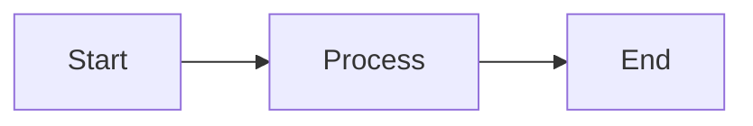
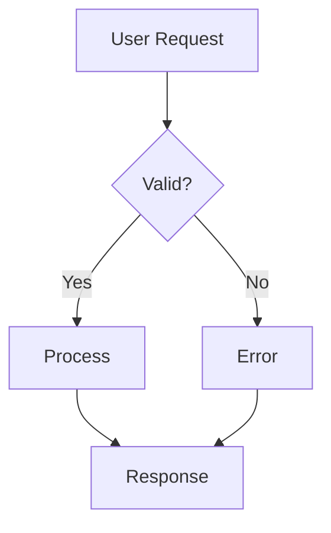
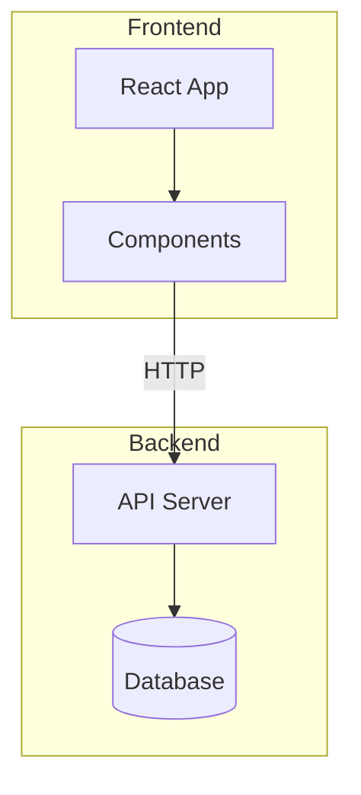
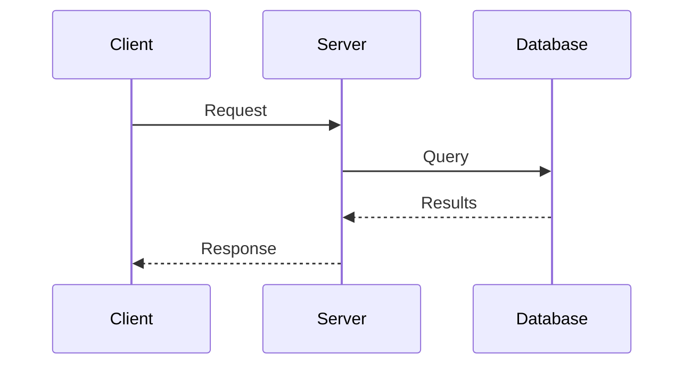
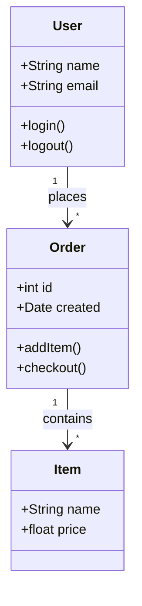
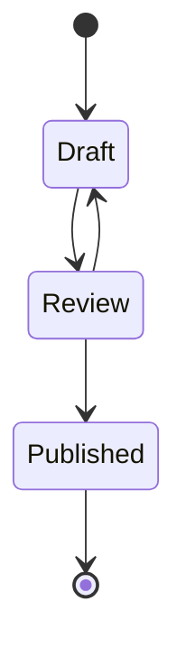
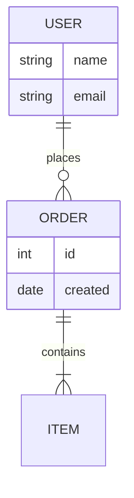
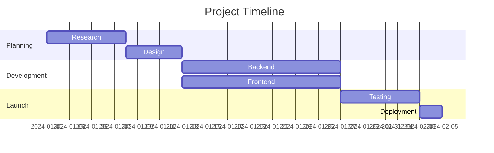
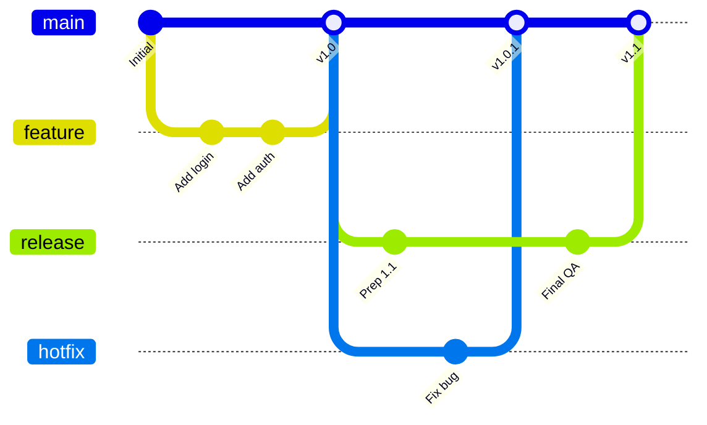
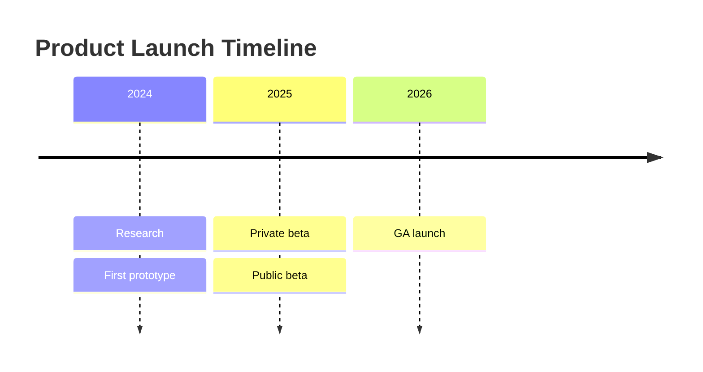

Scrivi i diagrammi come testo in blocchi di codice delimitati. Jamdesk li converte in SVG al momento del build.

<Tip>
  Crea una bozza e visualizza l'anteprima del diagramma nell'[editor Mermaid di Jamdesk](https://jamdesk.com/utilities/mermaid-editor),
  un editor e visualizzatore open source basato su browser. Scrivi la sintassi Mermaid, visualizza
  il rendering in tempo reale, quindi incollala qui in un blocco delimitato `mermaid`.
</Tip>

<Tip>
  Jamdesk supporta anche i [diagrammi D2](/it/components/d2) nei blocchi delimitati `d2`.
  Usa D2 quando un diagramma richiede contenitori annidati, uno schema SQL con chiavi primarie ed esterne
  oppure quando vuoi cambiare motore di layout. Gli esempi Mermaid di questa pagina hanno equivalenti D2 nella [pagina D2](/it/components/d2).
</Tip>

## Utilizzo di base

Usa un blocco di codice delimitato con l'identificatore di linguaggio `mermaid`:

````mdx

````


## Tipi di diagramma

### Diagrammi di flusso

La direzione può essere dall'alto verso il basso (`TD`), da sinistra a destra (`LR`), dal basso verso l'alto (`BT`) o da destra a sinistra (`RL`).



````mdx

````

#### Sottografi

Raggruppa i nodi correlati usando i sottografi. Questo aiuta a organizzare diagrammi di flusso complessi in sezioni logiche come "Frontend" e "Backend" o in diverse fasi di una pipeline.



````mdx

````

### Diagrammi di sequenza

I diagrammi di sequenza mostrano come i componenti interagiscono nel tempo. Usa un diagramma di sequenza per i flussi delle chiamate API e gli handshake di autenticazione. I partecipanti vengono visualizzati come linee di vita verticali, con messaggi che fluiscono tra loro.



````mdx

````

### Diagrammi delle classi

I diagrammi delle classi rappresentano la struttura dei sistemi orientati agli oggetti, come un modello di dati o i tipi principali di un servizio. Mostrano le classi con i relativi attributi e metodi, oltre al modo in cui sono correlate.



````mdx

````

### Diagrammi di stato

I diagrammi di stato modellano il ciclo di vita di un oggetto o di un processo. Mostrano tutti gli stati possibili e le transizioni tra di essi. Gli stati degli ordini e i flussi di approvazione dei documenti sono esempi tipici.



````mdx

````

### Diagrammi entità-relazione

I diagrammi ER documentano gli schemi dei database e i modelli di dati, mostrando le entità (tabelle), i relativi attributi (colonne) e le relazioni tra loro. I simboli indicano la cardinalità: uno a uno, uno a molti o molti a molti.



````mdx

````

### Diagrammi di Gantt

I diagrammi di Gantt visualizzano le pianificazioni e le timeline dei progetti. Le attività vengono visualizzate come barre orizzontali lungo una timeline, mostrando durata, dipendenze e lavoro parallelo. Un piano di progetto o una roadmap sono casi d'uso naturali.



````mdx

````

### Grafici Git

I grafici Git visualizzano le strategie di branching e i flussi di lavoro del controllo versione. Mostrano commit, branch, merge e la cronologia generale di un repository. Ogni branch è codificato con un colore per facilitarne l'identificazione.



````mdx

````

### Diagrammi timeline

Le timeline mostrano gli eventi distribuiti nel tempo. Inizia con la parola chiave `timeline`, un
`title` facoltativo, quindi una riga per ogni periodo con gli eventi separati da due punti:



````mdx

````

### Grafici a torta

I grafici a torta mostrano dati proporzionali come sezioni di un cerchio. Usane uno quando le parti costituiscono un insieme, ad esempio per la quota di mercato o i risultati di un sondaggio. Per una migliore leggibilità, limita le sezioni a 6 o meno.

```mermaid
pie title Browser Market Share
    "Chrome" : 65
    "Safari" : 19
    "Firefox" : 10
    "Edge" : 4
    "Other" : 2
```

````mdx
```mermaid
pie title Browser Market Share
    "Chrome" : 65
    "Safari" : 19
    "Firefox" : 10
    "Edge" : 4
    "Other" : 2
```
````

## Forme dei diagrammi di flusso

Forme diverse trasmettono significati diversi nei diagrammi di flusso:

| Sintassi   | Forma                 | Utilizzo |
| ---------- | --------------------- | -------- |
| `[text]`   | Rettangolo            | Fasi del processo, azioni |
| `(text)`   | Rettangolo arrotondato | Punti di inizio/fine |
| `{text}`   | Rombo                 | Decisioni, condizioni |
| `([text])` | Stadio                | Eventi, trigger |
| `[[text]]` | Sottoprogramma         | Processi predefiniti |
| `[(text)]` | Cilindro              | Database, archiviazione |

## Tipi di freccia

Le frecce indicano la direzione del flusso e i tipi di relazione:

| Sintassi     | Descrizione       | Utilizzo |
| ------------ | ----------------- | -------- |
| `-->`        | Freccia continua  | Flusso normale |
| `---`        | Linea continua    | Associazioni |
| `-.->`       | Freccia tratteggiata | Flusso facoltativo o asincrono |
| `==>`        | Freccia spessa    | Percorsi importanti |
| `--text-->`  | Freccia con etichetta | Descrive la transizione |

## Ridimensionare i diagrammi larghi

Per diagrammi larghi come i grafici di Gantt o grafici Git complessi, puoi usare direttamente il componente `Mermaid` con una proprietà `minWidth` per assicurarti che il diagramma non venga compresso:

```mdx
<Mermaid minWidth="700px">
gantt
    title Wide Project Timeline
    ...
</Mermaid>
```

## Suggerimenti per lo stile

<Tip>
  I diagrammi Mermaid si adattano automaticamente alle modalità chiara e scura. I colori sono
  ottimizzati per garantire la leggibilità in entrambi i temi.
</Tip>

Per creare diagrammi efficaci:

- Mantienili semplici: suddividi i flussi complessi in più diagrammi di dimensioni ridotte.
- Etichetta le frecce per spiegare le transizioni.
- Scegli una direzione: `TD` (dall'alto verso il basso) per diagrammi alti, `LR` (da sinistra a destra) per quelli larghi.
- Limita ogni diagramma a 10-15 nodi per facilitarne la comprensione.

## Per saperne di più

Per il riferimento completo alla sintassi Mermaid, incluse funzionalità avanzate come stile, temi e altri tipi di diagramma, consulta la [documentazione ufficiale di Mermaid](https://mermaid.js.org/intro/).

## Cosa fare dopo

<Columns cols={2}>
  <Card title="Diagrammi D2" icon="diagram-project" href="/it/components/d2">
    Architetture, contenitori e schemi SQL con D2
  </Card>
  <Card title="Panoramica dei componenti" icon="puzzle-piece" href="/it/components/overview">
    Esplora tutti i componenti disponibili
  </Card>
  <Card title="Basi di MDX" icon="file-code" href="/it/content/mdx-basics">
    Scopri come usare i componenti in MDX
  </Card>
</Columns>