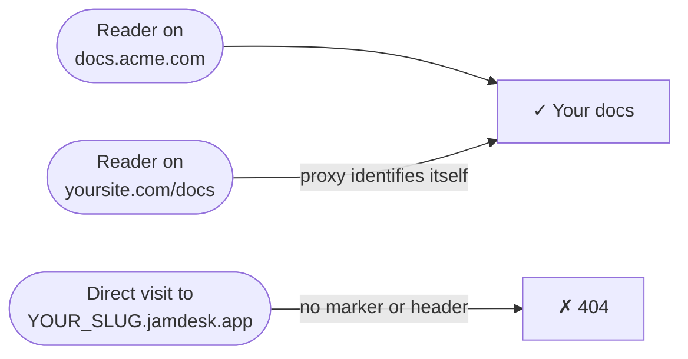

La documentazione è ospitata su `YOUR_SLUG.jamdesk.app`. Quando colleghi un dominio personalizzato, il sottodominio continua a rispondere, ma ogni pagina che pubblica include un tag `<link rel="canonical">` che punta al tuo dominio, così i motori di ricerca indicizzano il tuo dominio, mai il sottodominio. Per la maggior parte dei progetti è tutto ciò che serve.

Gli screenshot mostrano l'interfaccia in inglese.

**Custom domain only** fa un ulteriore passo avanti: disattiva il sottodominio per i visitatori diretti. Una semplice richiesta a `YOUR_SLUG.jamdesk.app` restituisce un 404 e la documentazione è raggiungibile solo dal tuo dominio.



<Warning>
Questa opzione nasconde il sottodominio, ma non è una password. Chiunque acceda dal tuo dominio continuerà a vedere la documentazione. Per controllare *chi* può leggerla, usa la [protezione con password](/it/setup/password-protection); le due opzioni funzionano insieme.
</Warning>

## Attivazione

<Steps>
  <Step title="Verifica il dominio personalizzato">
    Aggiungi e verifica il dominio nel dashboard — consulta [Custom Domains](/it/deploy/custom-domains). Il toggle richiede un dominio con stato **Active**.
  </Step>
  <Step title="Controlla il proxy (solo configurazioni reverse proxy)">
    Se il dominio è un semplice CNAME puntato a Jamdesk (ad esempio `docs.acme.com`), salta questo passaggio: non c'è nulla da configurare. Se pubblichi la documentazione su `yoursite.com/docs` tramite un proxy, il proxy deve identificarsi in ogni richiesta che inoltra — consulta [Configurazioni proxy](#configurazioni-proxy) qui sotto.
  </Step>
  <Step title="Attiva il toggle">
    Nel dashboard, apri le **Settings** del progetto, espandi la scheda **Custom Domain** e attiva **Custom domain only**. Jamdesk controlla prima il dominio online e non abilita il toggle finché la configurazione non supera il controllo; se il controllo fallisce, il messaggio indica esattamente cosa correggere.

    <Frame>
      
    </Frame>
  </Step>
</Steps>

Le modifiche raggiungono tutti i server edge entro un minuto.

## Configurazioni proxy

Una richiesta a `YOUR_SLUG.jamdesk.app` viene pubblicata solo se si identifica come proveniente dal tuo proxy, tramite l'header `X-Jamdesk-Forwarded-Host` oppure il parametro di query `?jd_proxy=1`. Ogni guida alla configurazione include già l'opzione corretta:

- **[Vercel](/it/deploy/vercel)** — le riscritture di `vercel.json` includono `?jd_proxy=1`; Edge Middleware imposta l'header
- **[Cloudflare Workers](/it/deploy/cloudflare)** — il Worker imposta l'header
- **[AWS CloudFront](/it/deploy/aws)** — l'header personalizzato dell'origine
- **[Reverse proxy](/it/deploy/reverse-proxy)** — nginx, Apache, Caddy e HAProxy impostano l'header

Se hai seguito una di queste guide, la configurazione è già pronta.

Utilizzi [MCP](/it/ai/mcp-server) o il [widget di chat](/it/ai/chat) tramite un reverse proxy? Inoltra `/api/mcp/:path*` e `/api/chat/:path*` nello stesso modo di `/docs`. Su Vercel:

```json vercel.json
{
  "rewrites": [
    { "source": "/api/mcp/:path*", "destination": "https://YOUR_SLUG.jamdesk.app/api/mcp/:path*?jd_proxy=1" },
    { "source": "/api/chat/:path*", "destination": "https://YOUR_SLUG.jamdesk.app/api/chat/:path*?jd_proxy=1" }
  ]
}
```

Se il dominio personalizzato ha un CNAME verso Jamdesk, MCP e la chat sul tuo dominio continueranno a funzionare senza modifiche: indirizza i client MCP a `https://docs.acme.com/_mcp` e il gioco è fatto.

## Da sapere

- **Sul sottodominio senza percorso tutto restituisce 404**: pagine, `sitemap.xml`, `robots.txt`, `llms.txt` ed esportazioni Markdown. I browser visualizzano una semplice pagina Jamdesk di contenuto non trovato.
- **Le immagini restano raggiungibili.** Immagini, video e immagini di anteprima social (OG) sono escluse: l'anteprima del sito nel dashboard le carica direttamente dal sottodominio.
- **Non puoi bloccarti fuori dal sito.** Se il DNS del dominio dovesse smettere di funzionare, Jamdesk interrompe l'applicazione del blocco e il sottodominio torna a essere pubblicato finché il dominio non viene ripristinato. Se invece modifichi in modo errato la configurazione del proxy (ad esempio rimuovendo il parametro da una riscrittura), disattiva il toggle mentre risolvi il problema.
- **La [Search API](/it/jamdesk-api/docs-search-api) non è interessata**: l'autenticazione avviene tramite chiave API.

## E adesso?

<Columns cols={3}>
  <Card title="Vercel" icon="cloud-arrow-up" href="/it/deploy/vercel">
    Aggiungi il parametro jd_proxy o Edge Middleware
  </Card>
  <Card title="Custom Domains" icon="globe" href="/it/deploy/custom-domains">
    Registra e verifica il dominio
  </Card>
  <Card title="Password Protection" icon="lock" href="/it/setup/password-protection">
    Controlla chi può leggere la documentazione
  </Card>
</Columns>