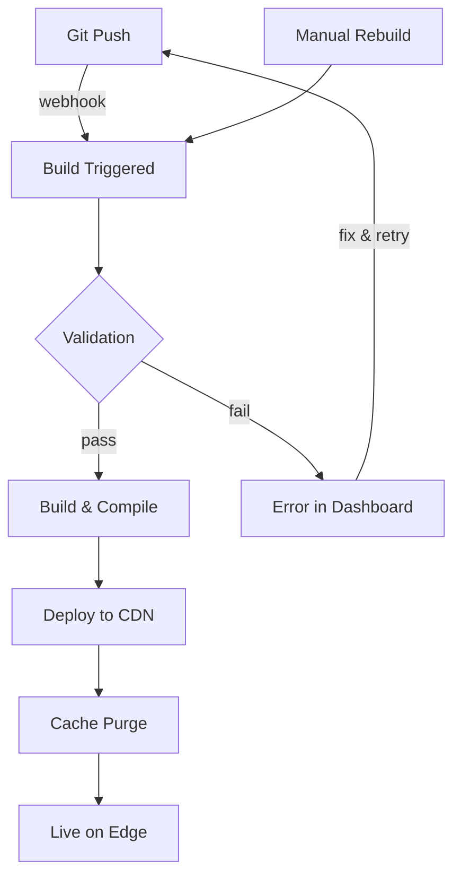

Jamdesk gestisce automaticamente l'intero ciclo di build e deploy. Esegui il push su GitHub e la documentazione sarà online entro pochi minuti.

Gli screenshot mostrano l'interfaccia in inglese.

## Ciclo di build



## Trigger di build

| Trigger | Come funziona | Caso d'uso |
|---------|---------------|------------|
| **Git Push** | Il Webhook si attiva quando viene eseguito il push sul branch collegato | Sviluppo ordinario |
| **Dashboard** | Fai clic su "Rebuild" nelle impostazioni del progetto | Aggiornamento forzato dopo modifiche alla configurazione |

<Note>
Le build vengono ritardate per evitare duplicazioni. Più commit entro 10 secondi vengono raggruppati in un'unica build.
</Note>

## Cosa succede durante una build

Jamdesk clona il repository, convalida `docs.json` e la sintassi MDX, compila il tutto in HTML ottimizzato con indicizzazione per la ricerca, quindi esegue il deploy su Cloudflare R2. La maggior parte dei siti viene compilata in 30-90 secondi.

Per una descrizione completa della pipeline con diagramma dell'architettura, consulta [Come funziona Jamdesk](/it/how-jamdesk-works).

## Stato del deploy

Controlla lo stato della build nel dashboard:

| Stato | Significato |
|-------|-------------|
| **Building** | Build in corso |
| **Deployed** | Online sul tuo dominio |
| **Failed** | Errore di build: controlla i log |
| **Queued** | In attesa della build precedente |

La sezione Build History mostra i deploy recenti con il relativo stato e consente di avviare build manuali:

<SizedImage src="/images/dashboard/build-history.webp" alt="Build History con i deploy recenti, badge di stato Successful, informazioni sul commit e pulsante Rebuild" />

## Ricompilazione manuale

Avvia una nuova build senza eseguire il push di modifiche:

1. Vai al tuo progetto nel dashboard
2. Apri **Settings**
3. Fai clic su **Rebuild**

Usa questa opzione per:
- Aggiornare le variabili d'ambiente
- Correggere una build bloccata
- Aggiornare il sito dopo gli aggiornamenti della piattaforma

## Variabili d'ambiente

Imposta le variabili disponibili durante la build in **Settings** → **Environment**:

```bash
ANALYTICS_ID=G-XXXXXXXXXX
API_BASE_URL=https://api.example.com
```

Le variabili sono disponibili durante il processo di build e possono essere utilizzate nei file docs.json o MDX.

## Log delle build

Visualizza i log dettagliati delle build per il debug:

1. Vai a **Deployments** nel tuo progetto
2. Fai clic su un deploy specifico
3. Visualizza il log completo della build

Nei log possono comparire problemi comuni:
- Sintassi MDX non valida
- Immagini o asset mancanti
- Link interni non funzionanti
- Errori di configurazione

## Rollback

Ripristina una versione precedente:

1. Vai a **Deployments**
2. Individua il deploy da ripristinare
3. Fai clic su **Rollback**

La versione precedente diventa immediatamente disponibile mentre viene avviata una nuova build.

## Deploy dei branch

<Note>
I deploy dei branch sono disponibili nei piani Pro.
</Note>

Visualizza in anteprima le modifiche prima del merge:

1. Esegui il push su un branch di funzionalità
2. Jamdesk crea un'anteprima all'indirizzo `branch-name.your-project.jamdesk.app`
3. Esamina le modifiche ed esegui il merge quando sono pronte

## Qual è il prossimo passo?

<Columns cols={2}>
  <Card title="Panoramica del deploy" icon="cloud-arrow-up" href="/it/deploy/overview">
    Scegli tra hosting su sottodominio, dominio personalizzato o sottopercorso
  </Card>
  <Card title="Hosting su sottopercorso" icon="route" href="/it/deploy/subpath-hosting">
    Ospita la documentazione su example.com/docs
  </Card>
</Columns>