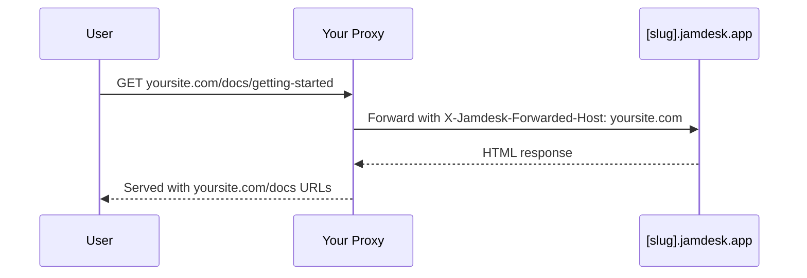

Ospita la documentazione su un sottopercorso del tuo dominio invece che su un sottodominio separato: per impostazione predefinita `yoursite.com/docs`, oppure un segmento personalizzato come `yoursite.com/help`. Per tutte le opzioni di deploy, consulta [Panoramica del deploy](/it/deploy/overview).

Gli screenshot mostrano l'interfaccia in inglese.

## Perché usare un sottopercorso?

Rispetto a un sottodominio come `docs.yoursite.com`, un sottopercorso mantiene i lettori sul tuo dominio principale e consente alle pagine della documentazione di contribuire all'autorevolezza del dominio nei motori di ricerca, invece di dividere i segnali di ranking tra due host.

## Come funziona

Il tuo server web o CDN inoltra le richieste da `/docs/*` al tuo sito Jamdesk, mantenendo l'URL originale nel browser:

Il proxy trasmette l'header `X-Jamdesk-Forwarded-Host` con il tuo dominio. Jamdesk lo utilizza per:

1. **Verificare che il tuo dominio** sia autorizzato a fornire i contenuti
2. **Applicare la tua configurazione** dal dashboard

In questo modo la configurazione del proxy richiede una sola impostazione: se modifichi le impostazioni nel dashboard, non è necessario aggiornare il proxy.

## Configurazione per provider

Scegli il tuo provider di hosting per iniziare:

<Columns cols={2}>
  <Card title="Cloudflare" icon="cloud" href="/it/deploy/cloudflare">
    Usa Cloudflare Workers per inoltrare il traffico /docs
  </Card>
  <Card title="AWS" icon="aws" href="/it/deploy/aws">
    Configura CloudFront con Route 53
  </Card>
  <Card title="Vercel" icon="triangle" href="/it/deploy/vercel">
    Aggiungi i rewrite a vercel.json
  </Card>
  <Card title="Reverse Proxy" icon="server" href="/it/deploy/reverse-proxy">
    nginx, Apache o altri server proxy
  </Card>
</Columns>

## Prerequisiti

Prima di configurare il proxy:

1. **Aggiungi il tuo dominio** nel [dashboard Jamdesk](https://dashboard.jamdesk.com), in Settings → Custom Domain
2. **Attiva "Host at a subpath"**
3. **Scegli il sottopercorso** (facoltativo; consulta [Scegliere il sottopercorso](#scegliere-il-sottopercorso) di seguito) e fai clic su **Save**

Il tuo sottodominio Jamdesk (ad esempio `acme.jamdesk.app`) verrà visualizzato nel dashboard. Ti servirà per configurare il proxy.

<Note>
Il salvataggio di una modifica all'hosting su sottopercorso (attivazione o disattivazione, oppure modifica del sottopercorso) avvia una ricostruzione completa della documentazione. È necessario perché la struttura degli URL cambia, ad esempio tra `/introduction` e `/docs/introduction`.
</Note>

## Scegliere il sottopercorso

Per impostazione predefinita, la documentazione viene fornita su `/docs`. Per usare un percorso diverso, come `/help` o `/support`, inseriscilo nel campo del sottopercorso accanto all'interruttore. Se il campo è vuoto, l'interruttore mostra `Host at a subpath (e.g. /docs)`; quando inserisci un valore, si aggiorna in tempo reale mostrando il percorso che stai per attivare (`Host at /help` e così via).

<Frame>
  
</Frame>

Il campo accetta un singolo segmento in minuscolo: solo lettere, cifre e trattini interni, senza trattini iniziali o finali, per un massimo di 63 caratteri. Alcuni segmenti sono riservati e vengono rifiutati, tra cui `api`, `jd`, percorsi amministrativi comuni come `wp-admin` e qualsiasi codice locale che la documentazione potrebbe usare (`fr`, `es`, `de` e simili). In questo modo il sottopercorso non può mai entrare in conflitto con un percorso già gestito da Jamdesk.

Lascia vuoto il campo per mantenere il valore predefinito `/docs`.

## Rinominare o rimuovere il sottopercorso

Modificare il sottopercorso o cancellarlo per tornare al valore predefinito non comporta rischi per i link già indicizzati o salvati nei segnalibri:

- **`/docs` continua sempre a funzionare.** Anche dopo aver scelto un sottopercorso personalizzato come `/help`, i percorsi originali `/docs/*` continuano a rispondere sul tuo sottodominio `[slug].jamdesk.app` e tramite qualsiasi proxy ancora indirizzato a tali percorsi. I link canonici passano immediatamente al nuovo sottopercorso, permettendo ai motori di ricerca di indicizzarlo nuovamente. Nulla di ciò che punta già a `/docs` si interrompe: puoi quindi aggiornare la configurazione del proxy quando preferisci, senza pressione.
- **La rinomina di un sottopercorso personalizzato inoltra quello precedente una sola volta.** Se rinomini `/help` in `/guide`, le richieste a `/help/*` vengono reindirizzate con un redirect 308 al percorso `/guide/*` corrispondente. Questa cronologia ha un solo livello: se rinomini nuovamente `/guide` in `/support`, `/guide/*` ora reindirizza a `/support/*`, ma `/help/*` (il segmento di due rinomine precedenti) non viene più tracciato. Di conseguenza, quei link smettono di risolversi e portano a una pagina "not found", talvolta dopo un redirect verso un percorso combinato dall'aspetto insolito. Non concatenare le rinomine se fai affidamento sul redirect per mantenere i vecchi link: aggiorna invece i link esterni al sottopercorso attuale.
- **Il ritorno a `/docs`** funziona allo stesso modo: il sottopercorso personalizzato precedente (un solo livello di cronologia) reindirizza a `/docs/*`.

<Warning>
Questo **non** significa che `/docs` reindirizzi a qualsiasi sottopercorso tu scelga. Non è necessario, perché `/docs` continua a essere fornito direttamente e in modo permanente. Il redirect a un solo livello si applica esclusivamente al *sottopercorso personalizzato* che stai abbandonando.
</Warning>

Dopo aver configurato il proxy, esegui un test visitando `https://yoursite.com/docs` (o il sottopercorso configurato). La documentazione dovrebbe caricarsi con tutte le risorse e i link correttamente funzionanti.

## Devo nascondere il sottodominio jamdesk.app?

No. Il tuo sottodominio `[slug].jamdesk.app` resta raggiungibile (è l'origine upstream a cui inoltra il proxy), ma non entrerà in competizione con il tuo sito nei risultati di ricerca:

- **Con il dominio registrato**, ogni pagina fornita direttamente dal sottodominio include un link canonico che punta alla stessa pagina sul tuo dominio, consentendo ai motori di ricerca di consolidare tutti i segnali di ranking su quest'ultimo.
- **Prima della registrazione di un dominio**, le pagine del sottodominio in modalità sottopercorso vengono contrassegnate con `noindex`, quindi non entrano mai nell'indice.

Se vuoi anche impedire l'accesso ai contenuti dal sottodominio (non solo impedirne l'indicizzazione), attiva la [Protezione tramite password](/it/setup/password-protection): il sottodominio mostrerà una schermata di sblocco invece della documentazione.

## Qual è il prossimo passo?

<Columns cols={2}>
  <Card title="Deployment Overview" icon="cloud-arrow-up" href="/it/deploy/overview">
    Confronta hosting su sottodominio, dominio personalizzato e sottopercorso
  </Card>
  <Card title="Custom Domains" icon="globe" href="/it/deploy/custom-domains">
    Verifica il DNS e risolvi i problemi di configurazione del dominio
  </Card>
</Columns>