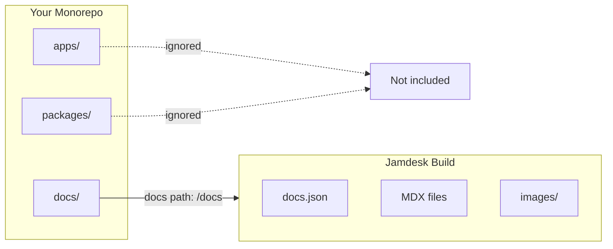

Se il tuo `docs.json` si trova in una sottodirectory — `docs/`, `packages/docs/` o in qualsiasi altra posizione — attiva la modalità monorepo nelle impostazioni del progetto e specifica il percorso. Jamdesk limiterà le build a quella directory e ignorerà tutto ciò che si trova al di fuori.

Gli screenshot mostrano l'interfaccia in inglese.

<Note>
**Prerequisiti:** prima di configurare il supporto monorepo, devi avere un [progetto Jamdesk](/it/setup/creating-projects) collegato a un [repository GitHub](/it/setup/connecting-github).
</Note>

## Come Jamdesk limita la build



## Configurazione rapida

<Steps>
  <Step title="Apri le impostazioni del progetto">
    Vai al tuo progetto nel [dashboard di Jamdesk](https://dashboard.jamdesk.com) e apri **Settings**.
  </Step>

  <Step title="Attiva la modalità monorepo">
    Nella sezione **Git Repository**, attiva **Set up as monorepo**.

    <Frame>
      
    </Frame>
  </Step>

  <Step title="Inserisci il percorso della documentazione">
    Specifica il percorso della directory che contiene il file `docs.json`.

    <Frame>
      
    </Frame>

    L'anteprima mostra dove Jamdesk cercherà il file di configurazione.
  </Step>

  <Step title="Salva e ricrea la build">
    Fai clic su **Save Changes** per applicare le modifiche. La build successiva utilizzerà il nuovo percorso.
  </Step>
</Steps>

## Comprendere il percorso della documentazione

Il percorso della documentazione indica a Jamdesk dove trovare il file di configurazione `docs.json` all'interno del repository.

<Warning>
Inserisci solo il percorso della directory, non il nome del file. Usa `docs`, non `docs/docs.json`.
</Warning>

### Esempi di percorsi

| Struttura del repository | Valore del percorso della documentazione |
|-------------------------|------------------------------------------|
| `my-repo/docs/docs.json` | `docs` |
| `my-repo/packages/docs/docs.json` | `packages/docs` |
| `my-repo/apps/website/docs/docs.json` | `apps/website/docs` |
| `my-repo/documentation/docs.json` | `documentation` |

### Cosa viene incluso

Quando imposti un percorso per la documentazione, Jamdesk elabora solo i file all'interno di quella directory:

- **File di contenuto** (`.mdx`, `.md`) vengono compilati nelle pagine
- **Risorse** nelle sottodirectory, come `images/`, vengono incluse
- **Configurazione** (`docs.json`) definisce il sito

I file al di fuori del percorso della documentazione vengono ignorati durante le build.

## Strutture monorepo comuni

Scegli il modello che corrisponde alla struttura del tuo progetto:

<Tabs>
  <Tab title="Dedicated /docs">
    Documentazione in una directory di primo livello.

    ```bash
    monorepo/
    ├── packages/
    ├── apps/
    └── docs/                    # Docs path: docs
        ├── docs.json
        ├── introduction.mdx
        └── guides/
    ```

    **Docs path:** `docs`
  </Tab>

  <Tab title="Package in /packages">
    Documentazione come pacchetto dell'area di lavoro.

    ```bash
    monorepo/
    ├── packages/
    │   ├── core/
    │   ├── cli/
    │   └── docs/                # Docs path: packages/docs
    │       ├── docs.json
    │       └── pages/
    └── apps/
    ```

    **Docs path:** `packages/docs`
  </Tab>

  <Tab title="Inside an App">
    Documentazione annidata all'interno di un'applicazione.

    ```bash
    monorepo/
    ├── apps/
    │   └── website/
    │       ├── src/
    │       └── docs/            # Docs path: apps/website/docs
    │           ├── docs.json
    │           └── introduction.mdx
    └── packages/
    ```

    **Docs path:** `apps/website/docs`
  </Tab>

  <Tab title="Custom Directory">
    Qualsiasi nome di directory personalizzato.

    ```bash
    monorepo/
    ├── src/
    ├── tests/
    └── documentation/           # Docs path: documentation
        ├── docs.json
        └── getting-started.mdx
    ```

    **Docs path:** `documentation`
  </Tab>
</Tabs>

## Lavorare con le risorse

I percorsi delle risorse in `docs.json` sono sempre relativi alla directory della documentazione, non alla root del repository.

### Esempio

Se la documentazione si trova in `packages/docs/`:

```json packages/docs/docs.json
{
  "logo": {
    "light": "/images/logo.svg"
  },
  "favicon": "/images/favicon.svg"
}
```

Questi percorsi fanno riferimento a:
- `packages/docs/images/logo.svg`
- `packages/docs/images/favicon.svg`

<Warning>
Non usare percorsi assoluti dalla root del repository. Questo non funzionerà:

```json
"favicon": "/packages/docs/images/favicon.svg"
```
</Warning>

### Nei file MDX

La stessa regola si applica alle immagini nei contenuti:

```mdx

```

Questo fa riferimento a un'immagine in `[docs-path]/images/tabs-preview.png`.

## Link interni

I link interni funzionano allo stesso modo indipendentemente dalla struttura del repository. Usa percorsi relativi alla root della documentazione:

```mdx
[See the quickstart guide](/quickstart)
[Installation steps](/quickstart#installation)
```

Questi percorsi corrispondono alla struttura della navigazione, non al file system.

## Comportamento delle build

Jamdesk monitora le modifiche solo all'interno del percorso della documentazione configurato:

- Le modifiche a `packages/docs/**` attivano una build
- Le modifiche a `packages/core/**` non attivano una build

In questo modo le build sono rapide e si concentrano sulle modifiche alla documentazione.

<Tip>
**Devi ricreare la build quando cambia altro codice?**

Se generi la documentazione dal codice sorgente, ad esempio la documentazione API dai commenti del codice, avvia una ricreazione manuale della build dal dashboard oppure configura un webhook nella pipeline CI.
</Tip>

## Compatibilità con gli strumenti per workspace

Jamdesk funziona con tutti i principali strumenti per monorepo. Non è necessaria alcuna configurazione speciale oltre all'impostazione del percorso della documentazione.

| Strumento | Supportato |
|------|-----------|
| npm workspaces | Sì |
| Yarn workspaces | Sì |
| pnpm workspaces | Sì |
| Turborepo | Sì |
| Nx | Sì |
| Lerna | Sì |

## Risoluzione dei problemi

<AccordionGroup>
  <Accordion title="Errore docs.json non trovato" icon="circle-exclamation">
    1. Verifica che il percorso esatto nel repository corrisponda a quello inserito
    2. Assicurati che `docs.json` esista in quella posizione
    3. Controlla che non ci siano errori di battitura: i percorsi distinguono tra maiuscole e minuscole
    4. Ricorda: usa `docs`, non `docs/docs.json`

    **Controllo rapido:** nel repository, il file dovrebbe trovarsi in `[your-docs-path]/docs.json`
  </Accordion>

  <Accordion title="Le risorse non vengono caricate" icon="image">
    I percorsi delle risorse devono essere relativi alla directory della documentazione.

    **Corretto** — relativo alla directory della documentazione:
    ```json
    "favicon": "/images/favicon.svg"
    ```

    **Errato** — assoluto dalla root del repository:
    ```json
    "favicon": "/packages/docs/images/favicon.svg"
    ```

    Verifica che le immagini si trovino effettivamente in `[docs-path]/images/`.
  </Accordion>

  <Accordion title="Le modifiche non attivano le build" icon="rotate">
    Solo le modifiche all'interno del percorso della documentazione configurato attivano le build automatiche.

    1. Verifica di modificare file all'interno del percorso della documentazione
    2. Controlla di eseguire il push sul branch corretto
    3. Visualizza lo stato della consegna del webhook nelle impostazioni del repository GitHub

    Se devi attivare build in seguito a modifiche al di fuori del percorso della documentazione, usa le ricreazioni manuali o i webhook CI.
  </Accordion>
</AccordionGroup>

## E adesso?

<Columns cols={2}>
  <Card title="Collega GitHub" icon="github" href="/it/setup/connecting-github">
    Collega il tuo repository per le build automatiche
  </Card>
  <Card title="Struttura delle directory" icon="folder-tree" href="/it/setup/directory-structure">
    Organizza la documentazione per progetti di grandi dimensioni
  </Card>
</Columns>