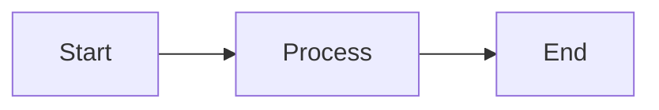
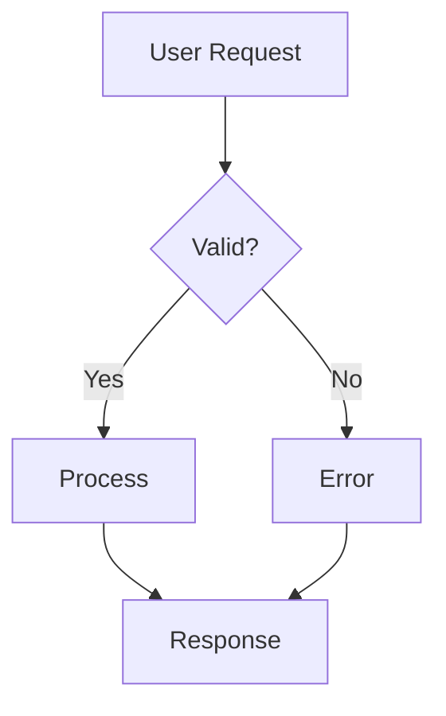
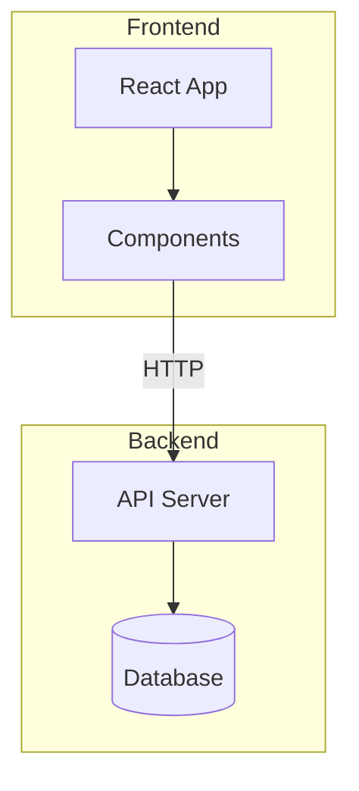
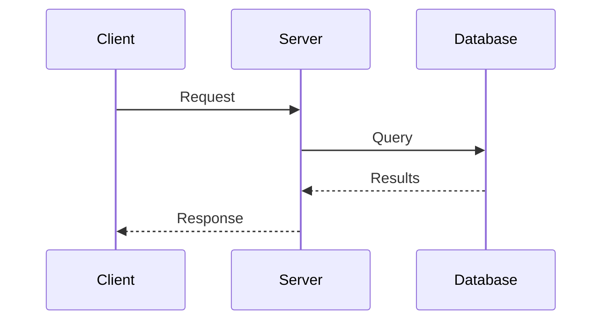
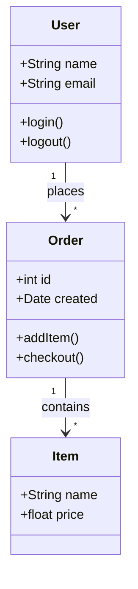
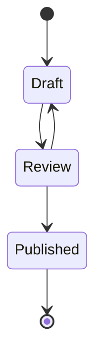
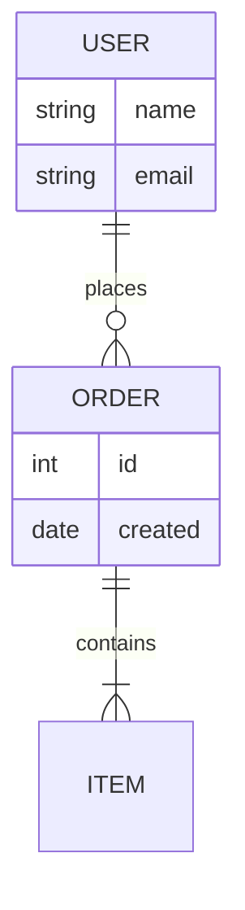
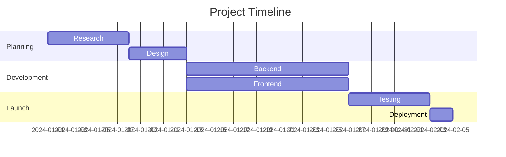
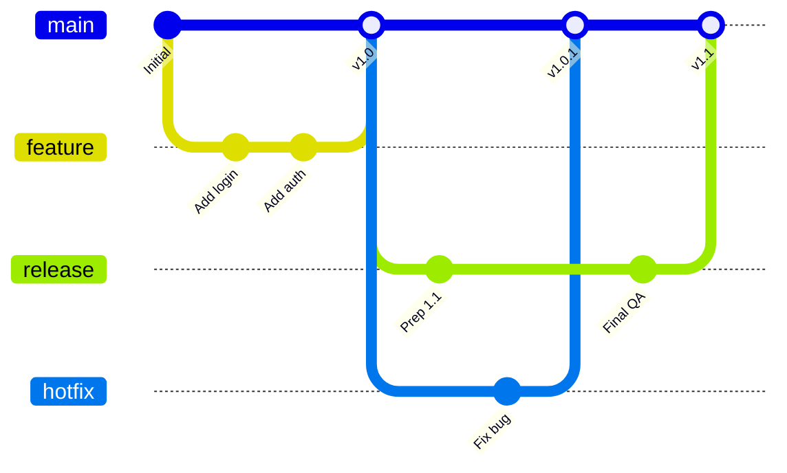
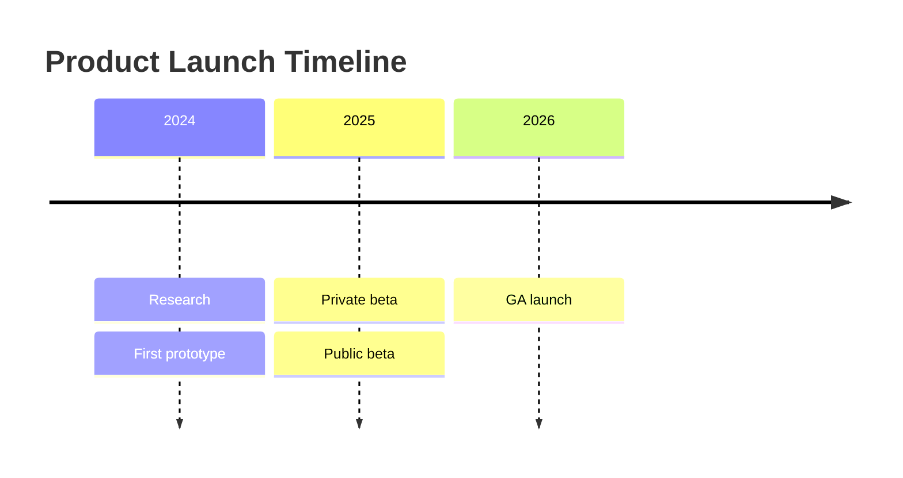

Escreva diagramas como texto em blocos de código cercados. O Jamdesk os renderiza como SVG durante o build.

<Tip>
  Crie um rascunho e visualize seu diagrama no [editor Mermaid do Jamdesk](https://jamdesk.com/utilities/mermaid-editor),
  um editor e visualizador de código aberto baseado em navegador. Escreva a sintaxe Mermaid, veja a
  renderização ao vivo e cole-a em um bloco cercado `mermaid` aqui.
</Tip>

<Tip>
  O Jamdesk também oferece suporte a [diagramas D2](/pt/components/d2) em blocos cercados `d2`.
  Use D2 quando um diagrama precisar de contêineres aninhados, um esquema SQL com chaves
  primárias e estrangeiras ou quando você quiser trocar os mecanismos de layout. Os exemplos de Mermaid
  nesta página têm equivalentes em D2 na [página do D2](/pt/components/d2).
</Tip>

## Uso básico

Use um bloco de código cercado com o identificador de linguagem `mermaid`:

````mdx

````


## Tipos de diagramas

### Fluxogramas

A direção pode ser de cima para baixo (`TD`), da esquerda para a direita (`LR`), de baixo para cima (`BT`) ou da direita para a esquerda (`RL`).



````mdx

````

#### Subgrafos

Agrupe nós relacionados usando subgrafos. Isso ajuda a organizar fluxogramas complexos em seções lógicas, como "Frontend" e "Backend", ou diferentes etapas de um pipeline.



````mdx

````

### Diagramas de sequência

Os diagramas de sequência mostram como os componentes interagem ao longo do tempo. Use um diagrama de sequência para fluxos de chamadas de API e processos de autenticação. Os participantes aparecem como linhas de vida verticais, com mensagens fluindo entre eles.



````mdx

````

### Diagramas de classes

Os diagramas de classes representam a estrutura de sistemas orientados a objetos, como um modelo de dados ou os tipos principais de um serviço. Eles exibem classes com seus atributos, métodos e relações entre si.



````mdx

````

### Diagramas de estado

Os diagramas de estado modelam o ciclo de vida de um objeto ou processo. Eles mostram todos os estados possíveis e as transições entre eles. Status de pedidos e fluxos de aprovação de documentos são exemplos comuns.



````mdx

````

### Diagramas de entidade e relacionamento

Os diagramas ER documentam esquemas de banco de dados e modelos de dados, mostrando entidades (tabelas), seus atributos (colunas) e as relações entre elas. Os símbolos indicam cardinalidade: um para um, um para muitos ou muitos para muitos.



````mdx

````

### Gráficos de Gantt

Os gráficos de Gantt visualizam cronogramas e linhas do tempo de projetos. As tarefas são exibidas como barras horizontais ao longo de uma linha do tempo, mostrando duração, dependências e trabalho paralelo. Um plano de projeto ou roadmap é um uso natural.



````mdx

````

### Gráficos do Git

Os gráficos do Git visualizam estratégias de ramificação e fluxos de trabalho de controle de versão. Eles mostram commits, branches, merges e o histórico geral de um repositório. Cada branch é codificada por cores para facilitar a identificação.



````mdx

````

### Diagramas de linha do tempo

As linhas do tempo mostram eventos ao longo de períodos. Comece com a palavra-chave `timeline`, um `title` opcional e, em seguida, uma linha por período, com eventos separados por dois-pontos:



````mdx

````

### Gráficos de pizza

Os gráficos de pizza exibem dados proporcionais como fatias de um círculo. Use um quando as partes formarem um todo, como em participação de mercado ou resultados de pesquisas. Para facilitar a leitura, mantenha no máximo 6 fatias.

```mermaid
pie title Browser Market Share
    "Chrome" : 65
    "Safari" : 19
    "Firefox" : 10
    "Edge" : 4
    "Other" : 2
```

````mdx
```mermaid
pie title Browser Market Share
    "Chrome" : 65
    "Safari" : 19
    "Firefox" : 10
    "Edge" : 4
    "Other" : 2
```
````

## Formas de fluxograma

Diferentes formas transmitem diferentes significados nos fluxogramas:

| Sintaxe    | Forma               | Usar para |
| ---------- | ------------------- | --------- |
| `[text]`   | Retângulo           | Etapas de processo, ações |
| `(text)`   | Retângulo arredondado | Pontos inicial e final |
| `{text}`   | Losango             | Decisões, condições |
| `([text])` | Estádio              | Eventos, gatilhos |
| `[[text]]` | Sub-rotina           | Processos predefinidos |
| `[(text)]` | Cilindro             | Bancos de dados, armazenamento |

## Tipos de setas

As setas indicam a direção do fluxo e os tipos de relação:

| Sintaxe     | Descrição              | Usar para |
| ----------- | ---------------------- | --------- |
| `-->`       | Seta sólida            | Fluxo normal |
| `---`       | Linha sólida            | Associações |
| `-.->`      | Seta pontilhada         | Fluxo opcional ou assíncrono |
| `==>`       | Seta espessa            | Caminhos importantes |
| `--text-->` | Seta com rótulo         | Descrever a transição |

## Dimensionar diagramas largos

Para diagramas largos, como gráficos de Gantt ou gráficos complexos do Git, você pode usar o componente `Mermaid` diretamente com uma propriedade `minWidth` para garantir que o diagrama não seja comprimido:

```mdx
<Mermaid minWidth="700px">
gantt
    title Wide Project Timeline
    ...
</Mermaid>
```

## Dicas de estilo

<Tip>
  Os diagramas Mermaid se adaptam automaticamente aos modos claro e escuro. As cores são
  otimizadas para facilitar a leitura em ambos os temas.
</Tip>

Para criar diagramas eficazes:

- Mantenha a simplicidade: divida fluxos complexos em vários diagramas menores.
- Rotule suas setas para explicar as transições.
- Escolha uma direção: `TD` (de cima para baixo) para diagramas altos, `LR` (da esquerda para a direita) para diagramas largos.
- Limite cada diagrama a 10–15 nós para facilitar a compreensão.

## Saiba mais

Para consultar a referência completa da sintaxe Mermaid, incluindo recursos avançados como estilização, temas e tipos adicionais de diagramas, consulte a [documentação oficial do Mermaid](https://mermaid.js.org/intro/).

## O que vem a seguir?

<Columns cols={2}>
  <Card title="Diagramas D2" icon="diagram-project" href="/pt/components/d2">
    Arquitetura, contêineres e esquemas SQL com D2
  </Card>
  <Card title="Visão geral dos componentes" icon="puzzle-piece" href="/pt/components/overview">
    Navegue por todos os componentes disponíveis
  </Card>
  <Card title="Noções básicas de MDX" icon="file-code" href="/pt/content/mdx-basics">
    Aprenda a usar componentes em MDX
  </Card>
</Columns>