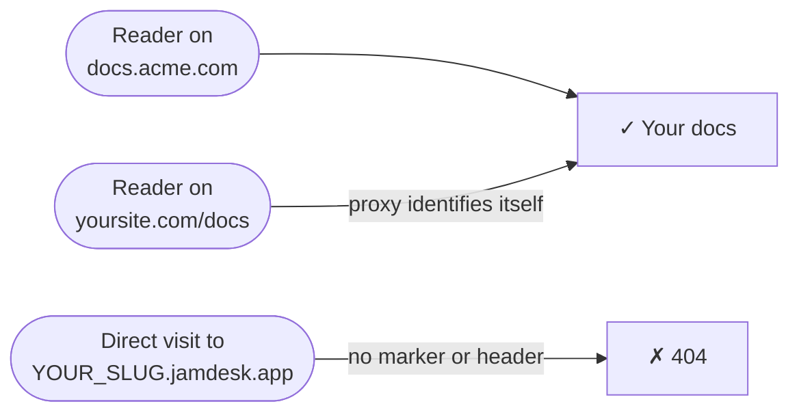

Sua documentação está hospedada em `YOUR_SLUG.jamdesk.app`. Quando você conecta um domínio personalizado, esse subdomínio continua respondendo — mas todas as páginas que ele disponibiliza incluem uma tag `<link rel="canonical">` apontando para o seu domínio. Assim, os mecanismos de pesquisa indexam o seu domínio, nunca o subdomínio. Para a maioria dos projetos, isso é suficiente.

As capturas de tela mostram a interface em inglês.

**Custom domain only** vai um passo além: desativa o subdomínio para visitantes diretos. Um acesso simples a `YOUR_SLUG.jamdesk.app` retorna 404, e sua documentação fica acessível somente pelo seu próprio domínio.



<Warning>
Isso oculta seu subdomínio — não é uma senha. Qualquer pessoa que acesse pelo seu domínio continuará vendo sua documentação. Para controlar *quem* pode lê-la, use a [proteção por senha](/pt/setup/password-protection); os dois recursos funcionam em conjunto.
</Warning>

## Ativação

<Steps>
  <Step title="Verifique seu domínio personalizado">
    Adicione e verifique seu domínio no dashboard — consulte [Custom Domains](/pt/deploy/custom-domains). O botão de alternância exige um domínio com status **Active**.
  </Step>
  <Step title="Verifique seu proxy (somente configurações com proxy reverso)">
    Se o seu domínio for um CNAME simples apontado para o Jamdesk (como `docs.acme.com`), ignore esta etapa — não há nada para configurar. Se você disponibiliza a documentação em `yoursite.com/docs` por meio de um proxy, o proxy precisa se identificar em todas as solicitações que encaminhar — consulte [Configurações de proxy](#configurações-de-proxy) abaixo.
  </Step>
  <Step title="Ative o botão de alternância">
    No dashboard, abra as **Settings** do seu projeto, expanda o cartão **Custom Domain** e ative **Custom domain only**. O Jamdesk verifica primeiro seu domínio ativo e não habilita o botão até que sua configuração seja aprovada — se a verificação falhar, a mensagem informa exatamente o que você precisa corrigir.

    <Frame>
      
    </Frame>
  </Step>
</Steps>

As alterações chegam a todos os servidores de edge em até um minuto.

## Configurações de proxy

Uma solicitação para `YOUR_SLUG.jamdesk.app` só é disponibilizada se identificar que vem pelo seu proxy — usando o cabeçalho `X-Jamdesk-Forwarded-Host` ou o marcador de consulta `?jd_proxy=1`. Cada guia de configuração já inclui a opção correta:

- **[Vercel](/pt/deploy/vercel)** — as reescritas de `vercel.json` incluem `?jd_proxy=1`; o Edge Middleware define o cabeçalho
- **[Cloudflare Workers](/pt/deploy/cloudflare)** — o Worker define o cabeçalho
- **[AWS CloudFront](/pt/deploy/aws)** — o cabeçalho personalizado da origem
- **[Proxy reverso](/pt/deploy/reverse-proxy)** — nginx, Apache, Caddy e HAProxy definem o cabeçalho

Se você seguiu uma dessas guias, já está tudo configurado.

Está usando o [MCP](/pt/ai/mcp-server) ou o [widget de chat](/pt/ai/chat) por meio de um proxy reverso? Encaminhe `/api/mcp/:path*` e `/api/chat/:path*` da mesma forma que `/docs`. Na Vercel:

```json vercel.json
{
  "rewrites": [
    { "source": "/api/mcp/:path*", "destination": "https://YOUR_SLUG.jamdesk.app/api/mcp/:path*?jd_proxy=1" },
    { "source": "/api/chat/:path*", "destination": "https://YOUR_SLUG.jamdesk.app/api/chat/:path*?jd_proxy=1" }
  ]
}
```

Se o seu domínio personalizado tiver um CNAME apontando para o Jamdesk, o MCP e o chat no seu domínio continuarão funcionando sem alterações — aponte os clientes MCP para `https://docs.acme.com/_mcp` e pronto.

## Informações importantes

- **Tudo retorna 404 no subdomínio sem caminho** — páginas, `sitemap.xml`, `robots.txt`, `llms.txt` e exportações em Markdown. Os navegadores exibem uma página simples de não encontrado do Jamdesk.
- **As imagens continuam acessíveis.** Imagens, vídeos e imagens de pré-visualização para redes sociais (OG) são exceções — a pré-visualização do site no dashboard as carrega diretamente do subdomínio.
- **Você não pode perder o acesso.** Se o DNS do seu domínio falhar, o Jamdesk deixará de aplicar o bloqueio, e o subdomínio voltará a ser disponibilizado até que o domínio se recupere. Se você alterar a configuração do próprio proxy (por exemplo, removendo o marcador de uma reescrita), desative o botão enquanto corrige o problema.
- A [Search API](/pt/jamdesk-api/docs-search-api) não é afetada — ela usa uma chave de API para autenticação.

## O que vem a seguir?

<Columns cols={3}>
  <Card title="Vercel" icon="cloud-arrow-up" href="/pt/deploy/vercel">
    Adicione o marcador jd_proxy ou o Edge Middleware
  </Card>
  <Card title="Custom Domains" icon="globe" href="/pt/deploy/custom-domains">
    Registre e verifique seu domínio
  </Card>
  <Card title="Password Protection" icon="lock" href="/pt/setup/password-protection">
    Controle quem pode ler sua documentação
  </Card>
</Columns>