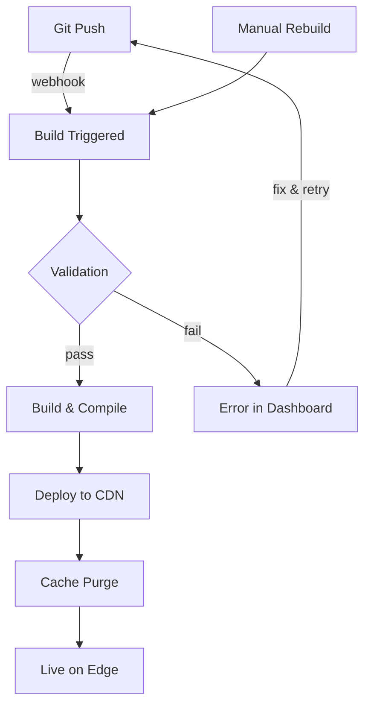

O Jamdesk gerencia automaticamente todo o ciclo de build e deploy. Faça push para o GitHub e sua documentação ficará online em poucos minutos.

As capturas de tela mostram a interface em inglês.

## Ciclo de Build



## Gatilhos de Build

| Gatilho | Como funciona | Caso de uso |
|---------|----------------|-------------|
| **Git Push** | O Webhook é acionado quando há um push para a branch conectada | Desenvolvimento normal |
| **Dashboard** | Clique em "Rebuild" nas configurações do projeto | Forçar atualização após alterações de configuração |

<Note>
Os builds são agrupados. Vários commits feitos em até 10 segundos são combinados em um único build.
</Note>

## O que acontece durante um Build

O Jamdesk clona seu repositório, valida a sintaxe de `docs.json` e MDX, compila tudo para HTML otimizado com indexação de pesquisa e, em seguida, faz o deploy no Cloudflare R2. A maioria dos sites é compilada em 30–90 segundos.

Para ver a descrição completa do pipeline com um diagrama de arquitetura, consulte [Como o Jamdesk funciona](/pt/how-jamdesk-works).

## Status do Deploy

Verifique o status do build no dashboard:

| Status | Significado |
|--------|-------------|
| **Building** | Build em andamento |
| **Deployed** | Disponível no seu domínio |
| **Failed** | Erro no build — verifique os logs |
| **Queued** | Aguardando o build anterior |

A seção Build History mostra os deploys recentes, com o status e a opção de acionar builds manuais:

<SizedImage src="/images/dashboard/build-history.webp" alt="Build History mostrando deploys recentes com badges de status Successful, informações do commit e o botão Rebuild" />

## Rebuild manual

Acione um rebuild sem fazer push de alterações:

1. Acesse seu projeto no dashboard
2. Abra **Settings**
3. Clique em **Rebuild**

Use esta opção quando:
- Atualizar variáveis de ambiente
- Corrigir um build travado
- Atualizar após alterações na plataforma

## Variáveis de ambiente

Defina as variáveis usadas durante o build em **Settings** → **Environment**:

```bash
ANALYTICS_ID=G-XXXXXXXXXX
API_BASE_URL=https://api.example.com
```

As variáveis ficam disponíveis durante o processo de build e podem ser referenciadas nos arquivos `docs.json` ou MDX.

## Logs de Build

Consulte logs detalhados do build para depuração:

1. Acesse **Deployments** no seu projeto
2. Clique em um deploy específico
3. Consulte o log completo do build

Problemas comuns aparecem nos logs:
- Sintaxe MDX inválida
- Imagens ou assets ausentes
- Links internos quebrados
- Erros de configuração

## Rollbacks

Reverta para uma versão anterior:

1. Acesse **Deployments**
2. Encontre o deploy que deseja restaurar
3. Clique em **Rollback**

A versão anterior ficará online imediatamente enquanto um novo build é iniciado.

## Deploys de Branch

<Note>
Os deploys de branch estão disponíveis nos planos Pro.
</Note>

Visualize as alterações antes de fazer o merge:

1. Faça push para uma branch de recurso
2. O Jamdesk cria uma prévia em `branch-name.your-project.jamdesk.app`
3. Revise e faça o merge quando estiver tudo pronto

## O que vem a seguir?

<Columns cols={2}>
  <Card title="Visão geral do Deploy" icon="cloud-arrow-up" href="/pt/deploy/overview">
    Escolha entre hospedagem em subdomínio, domínio personalizado ou subcaminho
  </Card>
  <Card title="Hospedagem em Subcaminho" icon="route" href="/pt/deploy/subpath-hosting">
    Hospede a documentação em example.com/docs
  </Card>
</Columns>