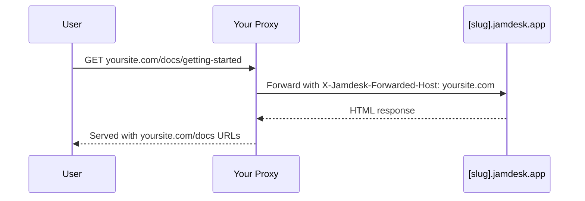

Hospede sua documentação em um subcaminho do seu domínio em vez de usar um subdomínio separado: `yoursite.com/docs` por padrão ou um segmento personalizado, como `yoursite.com/help`. Para ver todas as opções de implantação, consulte [Visão geral da implantação](/pt/deploy/overview).

As capturas de tela mostram a interface em inglês.

## Por que usar um subcaminho?

Em comparação com um subdomínio, como `docs.yoursite.com`, um subcaminho mantém os leitores no seu domínio principal, e suas páginas de documentação contribuem para a autoridade de busca desse domínio, em vez de dividir os sinais de classificação entre dois hosts.

## Como funciona

Seu servidor Web ou CDN faz proxy das solicitações de `/docs/*` para seu site Jamdesk, preservando o URL original no navegador:

O proxy envia o cabeçalho `X-Jamdesk-Forwarded-Host` com seu domínio. O Jamdesk usa esse cabeçalho para:

1. **Verificar se seu domínio** está autorizado a servir o conteúdo
2. **Aplicar sua configuração** do dashboard

Isso torna a configuração do proxy uma operação única: se você alterar as configurações no dashboard, não será necessário atualizar o proxy.

## Configuração por provedor

Escolha seu provedor de hospedagem para começar:

<Columns cols={2}>
  <Card title="Cloudflare" icon="cloud" href="/pt/deploy/cloudflare">
    Use o Cloudflare Workers para fazer proxy do tráfego de /docs
  </Card>
  <Card title="AWS" icon="aws" href="/pt/deploy/aws">
    Configure o CloudFront com o Route 53
  </Card>
  <Card title="Vercel" icon="triangle" href="/pt/deploy/vercel">
    Adicione rewrites ao vercel.json
  </Card>
  <Card title="Proxy reverso" icon="server" href="/pt/deploy/reverse-proxy">
    nginx, Apache ou outros servidores proxy
  </Card>
</Columns>

## Pré-requisitos

Antes de configurar seu proxy:

1. **Adicione seu domínio** no [dashboard do Jamdesk](https://dashboard.jamdesk.com), em Settings → Custom Domain
2. **Ative "Host at a subpath"**
3. **Escolha seu subcaminho** (opcional; consulte [Escolhendo seu subcaminho](#escolhendo-seu-subcaminho) abaixo) e clique em **Save**

Seu subdomínio do Jamdesk (por exemplo, `acme.jamdesk.app`) será exibido no dashboard. Você precisará dele para configurar o proxy.

<Note>
Salvar uma alteração na hospedagem em subcaminho (ativá-la ou desativá-la, ou alterar o próprio subcaminho) inicia uma reconstrução completa da sua documentação. Isso é necessário porque a estrutura de URL é alterada (por exemplo, entre `/introduction` e `/docs/introduction`).
</Note>

## Escolhendo seu subcaminho

Por padrão, sua documentação é servida em `/docs`. Para usar outro caminho, como `/help` ou `/support`, insira-o no campo de subcaminho ao lado do toggle. Com o campo vazio, o toggle exibe `Host at a subpath (e.g. /docs)`; quando você insere um valor, ele é atualizado imediatamente para o caminho que será ativado (`Host at /help` e assim por diante).

<Frame>
  
</Frame>

O campo aceita um único segmento em minúsculas: letras, dígitos e hifens internos, sem hífen no início ou no fim, com no máximo 63 caracteres. Alguns segmentos são reservados e rejeitados imediatamente, incluindo `api`, `jd`, caminhos administrativos comuns, como `wp-admin`, e qualquer código de localidade que sua documentação possa usar (`fr`, `es`, `de` e similares). Essa reserva impede que seu subcaminho entre em conflito com uma rota que o Jamdesk já serve.

Deixe o campo vazio para manter o padrão `/docs`.

## Renomear ou remover seu subcaminho

Alterar seu subcaminho ou limpá-lo para voltar ao padrão é seguro e não quebra links que já foram indexados ou adicionados aos favoritos:

- **`/docs` nunca deixa de ser servido.** Mesmo depois que você muda para um subcaminho personalizado, como `/help`, os caminhos originais `/docs/*` continuam respondendo no seu subdomínio `[slug].jamdesk.app` e por qualquer proxy que ainda aponte para eles. Os links canônicos são transferidos imediatamente para seu novo subcaminho, para que os mecanismos de busca façam uma nova indexação nele. Nada que já aponte para `/docs` deixa de funcionar, o que significa que você pode atualizar a configuração do seu próprio proxy no seu ritmo, sem pressão.
- **Renomear um subcaminho personalizado encaminha o anterior uma vez.** Se você renomear `/help` para `/guide`, as solicitações para `/help/*` receberão um redirecionamento 308 para o caminho correspondente em `/guide/*`. Esse histórico tem apenas um nível: se você renomear novamente `/guide` para `/support`, `/guide/*` passará a redirecionar para `/support/*`, mas `/help/*` (o segmento de duas renomeações atrás) não será mais rastreado. Assim, esses links deixarão de ser resolvidos e levarão a uma página de "not found", às vezes após um redirecionamento para um caminho combinado de aparência estranha. Não encadeie renomeações se depender do redirecionamento para preservar links antigos; atualize os links externos para apontarem para o subcaminho atual.
- **Voltar para `/docs`** funciona da mesma forma: seu subcaminho personalizado anterior (um nível do histórico) redireciona para `/docs/*`.

<Warning>
Isso **não** significa que `/docs` redireciona para qualquer subcaminho escolhido. Isso não é necessário, pois `/docs` continua sendo servido diretamente e permanentemente. O redirecionamento de um nível só se aplica a um subcaminho *personalizado* do qual você está saindo.
</Warning>

Depois de configurar o proxy, faça um teste acessando `https://yoursite.com/docs` (ou seu subcaminho configurado). Sua documentação deve carregar com todos os assets e links funcionando corretamente.

## Preciso ocultar o subdomínio jamdesk.app?

Não. Seu subdomínio `[slug].jamdesk.app` continua acessível (é a origem upstream para a qual seu proxy encaminha as solicitações), mas não competirá com seu site nos resultados de busca:

- **Com seu domínio registrado**, todas as páginas servidas diretamente pelo subdomínio incluem um link canônico apontando para a mesma página no seu domínio, para que os mecanismos de busca consolidem todos os sinais de classificação nele.
- **Antes de um domínio ser registrado**, as páginas do subdomínio no modo de subcaminho são marcadas como `noindex`, portanto nunca entram no índice.

Se você também quiser impedir o acesso ao conteúdo no subdomínio (e não apenas evitar sua indexação), ative a [Proteção por senha](/pt/setup/password-protection): o subdomínio passará a exibir uma tela de desbloqueio em vez da sua documentação.

## O que vem a seguir?

<Columns cols={2}>
  <Card title="Visão geral da implantação" icon="cloud-arrow-up" href="/pt/deploy/overview">
    Compare hospedagem em subdomínio, domínio personalizado e subcaminho
  </Card>
  <Card title="Domínios personalizados" icon="globe" href="/pt/deploy/custom-domains">
    Verifique o DNS e solucione problemas na configuração do domínio
  </Card>
</Columns>