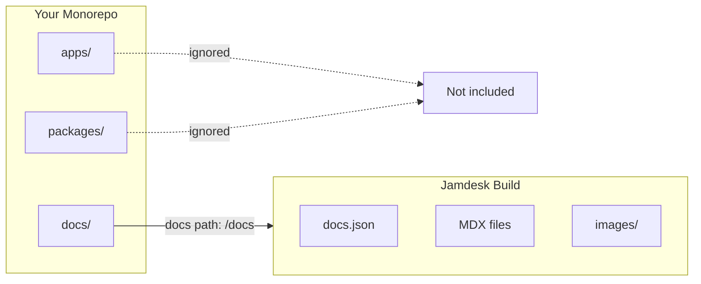

Se o seu `docs.json` estiver em um subdiretório — `docs/`, `packages/docs/` ou qualquer outro local — ative o modo monorepo nas configurações do projeto e especifique o caminho. O Jamdesk limitará os builds a esse diretório e ignorará tudo o que estiver fora dele.

As capturas de tela mostram a interface em inglês.

<Note>
**Pré-requisitos:** você precisa ter um [projeto do Jamdesk](/pt/setup/creating-projects) conectado a um [repositório do GitHub](/pt/setup/connecting-github) antes de configurar o suporte a monorepo.
</Note>

## Como o Jamdesk limita seu build



## Configuração rápida

<Steps>
  <Step title="Abra as configurações do projeto">
    Acesse seu projeto no [dashboard do Jamdesk](https://dashboard.jamdesk.com) e navegue até **Settings**.
  </Step>

  <Step title="Ative o modo monorepo">
    Na seção **Git Repository**, ative **Set up as monorepo**.

    <Frame>
      
    </Frame>
  </Step>

  <Step title="Insira o caminho da documentação">
    Especifique o caminho para o diretório que contém seu arquivo `docs.json`.

    <Frame>
      
    </Frame>

    A prévia mostra onde o Jamdesk procurará seu arquivo de configuração.
  </Step>

  <Step title="Salve e faça um novo build">
    Clique em **Save Changes** para aplicar. Seu próximo build usará o novo caminho.
  </Step>
</Steps>

## Entenda o caminho da documentação

O caminho da documentação informa ao Jamdesk onde encontrar seu arquivo de configuração `docs.json` dentro do repositório.

<Warning>
Insira apenas o caminho do diretório, não o nome do arquivo. Use `docs`, não `docs/docs.json`.
</Warning>

### Exemplos de caminhos

| Estrutura do repositório | Valor do caminho da documentação |
|---------------------|-----------------|
| `my-repo/docs/docs.json` | `docs` |
| `my-repo/packages/docs/docs.json` | `packages/docs` |
| `my-repo/apps/website/docs/docs.json` | `apps/website/docs` |
| `my-repo/documentation/docs.json` | `documentation` |

### O que é incluído

Quando você define um caminho para a documentação, o Jamdesk processa apenas os arquivos dentro desse diretório:

- **Arquivos de conteúdo** (`.mdx`, `.md`) são compilados em páginas
- **Assets** em subdiretórios (como `images/`) são incluídos
- **Configuração** (`docs.json`) define seu site

Os arquivos fora do caminho da documentação são ignorados durante os builds.

## Padrões comuns de monorepo

Escolha o padrão que corresponde à estrutura do seu projeto:

<Tabs>
  <Tab title="Diretório /docs dedicado">
    Documentação em um diretório de nível superior.

    ```bash
    monorepo/
    ├── packages/
    ├── apps/
    └── docs/                    # Docs path: docs
        ├── docs.json
        ├── introduction.mdx
        └── guides/
    ```

    **Caminho da documentação:** `docs`
  </Tab>

  <Tab title="Pacote em /packages">
    Documentação como um pacote do workspace.

    ```bash
    monorepo/
    ├── packages/
    │   ├── core/
    │   ├── cli/
    │   └── docs/                # Docs path: packages/docs
    │       ├── docs.json
    │       └── pages/
    └── apps/
    ```

    **Caminho da documentação:** `packages/docs`
  </Tab>

  <Tab title="Dentro de um app">
    Documentação aninhada em um aplicativo.

    ```bash
    monorepo/
    ├── apps/
    │   └── website/
    │       ├── src/
    │       └── docs/            # Docs path: apps/website/docs
    │           ├── docs.json
    │           └── introduction.mdx
    └── packages/
    ```

    **Caminho da documentação:** `apps/website/docs`
  </Tab>

  <Tab title="Diretório personalizado">
    Qualquer nome de diretório personalizado.

    ```bash
    monorepo/
    ├── src/
    ├── tests/
    └── documentation/           # Docs path: documentation
        ├── docs.json
        └── getting-started.mdx
    ```

    **Caminho da documentação:** `documentation`
  </Tab>
</Tabs>

## Trabalhando com assets

Os caminhos dos assets em `docs.json` são sempre relativos ao diretório da documentação, não à raiz do repositório.

### Exemplo

Se sua documentação estiver em `packages/docs/`:

```json packages/docs/docs.json
{
  "logo": {
    "light": "/images/logo.svg"
  },
  "favicon": "/images/favicon.svg"
}
```

Esses caminhos fazem referência a:
- `packages/docs/images/logo.svg`
- `packages/docs/images/favicon.svg`

<Warning>
Não use caminhos absolutos a partir da raiz do repositório. Isto não funcionará:

```json
"favicon": "/packages/docs/images/favicon.svg"
```
</Warning>

### Em arquivos MDX

A mesma regra se aplica às imagens do seu conteúdo:

```mdx

```

Isso faz referência a uma imagem em `[docs-path]/images/tabs-preview.png`.

## Links internos

Os links internos funcionam da mesma forma, independentemente da estrutura do repositório. Use caminhos relativos à raiz da documentação:

```mdx
[See the quickstart guide](/quickstart)
[Installation steps](/quickstart#installation)
```

Esses caminhos correspondem à estrutura de navegação, não ao sistema de arquivos.

## Comportamento dos builds

O Jamdesk monitora alterações apenas dentro do caminho configurado para a documentação:

- Alterações em `packages/docs/**` acionam um build
- Alterações em `packages/core/**` não acionam um build

Isso mantém os builds rápidos e concentrados nas alterações da documentação.

<Tip>
**Precisa refazer o build quando outro código for alterado?**

Se você gera documentação a partir do código-fonte (como documentação de API a partir de comentários no código), acione manualmente um novo build no dashboard ou configure um Webhook no seu pipeline de CI.
</Tip>

## Compatibilidade com ferramentas de workspace

O Jamdesk funciona com todas as principais ferramentas de monorepo. Não é necessária nenhuma configuração especial além de definir o caminho da documentação.

| Ferramenta | Compatível |
|------|-----------|
| npm workspaces | Sim |
| Yarn workspaces | Sim |
| pnpm workspaces | Sim |
| Turborepo | Sim |
| Nx | Sim |
| Lerna | Sim |

## Solução de problemas

<AccordionGroup>
  <Accordion title="Erro docs.json não encontrado" icon="circle-exclamation">
    1. Verifique se o caminho exato no repositório corresponde ao que você inseriu
    2. Confirme se `docs.json` existe nesse local
    3. Verifique se há erros de digitação — os caminhos diferenciam maiúsculas de minúsculas
    4. Lembre-se: use `docs`, não `docs/docs.json`

    **Verificação rápida:** no seu repositório, o arquivo deve existir em `[your-docs-path]/docs.json`
  </Accordion>

  <Accordion title="Assets não carregam" icon="image">
    Os caminhos dos assets devem ser relativos ao diretório da documentação.

    **Correto** — relativo ao diretório da documentação:
    ```json
    "favicon": "/images/favicon.svg"
    ```

    **Incorreto** — absoluto a partir da raiz do repositório:
    ```json
    "favicon": "/packages/docs/images/favicon.svg"
    ```

    Verifique se as imagens realmente existem em `[docs-path]/images/`.
  </Accordion>

  <Accordion title="Alterações não acionam builds" icon="rotate">
    Apenas alterações dentro do caminho configurado para a documentação acionam builds automáticos.

    1. Verifique se você está modificando arquivos dentro do caminho da documentação
    2. Confirme se está enviando alterações para a branch correta
    3. Consulte o status de entrega do Webhook nas configurações do repositório do GitHub

    Se precisar que alterações fora do caminho da documentação acionem builds, use novos builds manuais ou Webhooks de CI.
  </Accordion>
</AccordionGroup>

## O que vem a seguir?

<Columns cols={2}>
  <Card title="Conectar ao GitHub" icon="github" href="/pt/setup/connecting-github">
    Vincule seu repositório para realizar builds automáticos
  </Card>
  <Card title="Estrutura de diretórios" icon="folder-tree" href="/pt/setup/directory-structure">
    Organize sua documentação para crescer
  </Card>
</Columns>