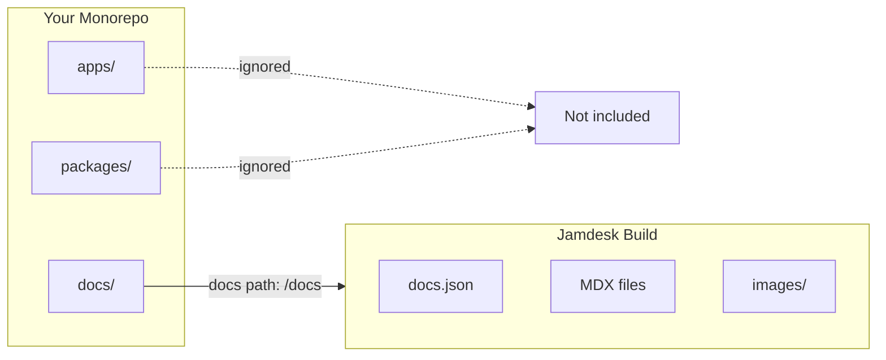

Keep your documentation alongside your code. Jamdesk works seamlessly with monorepos and any repository where docs aren't at the root.

<Note>
**Prerequisites:** You need a [Jamdesk project](/setup/creating-projects) connected to a [GitHub repository](/setup/connecting-github) before configuring monorepo support.
</Note>

## How Jamdesk Scopes Your Build



## Quick Setup

<Steps>
  <Step title="Open project settings">
    Go to your project in the [Jamdesk dashboard](https://dashboard.jamdesk.com) and navigate to **Settings**.
  </Step>

  <Step title="Enable monorepo mode">
    Under the **Git Repository** section, toggle on **Set up as monorepo**.

    <Frame>
      
    </Frame>
  </Step>

  <Step title="Enter your docs path">
    Specify the path to the directory containing your `docs.json` file.

    <Frame>
      
    </Frame>

    The preview shows where Jamdesk will look for your configuration file.
  </Step>

  <Step title="Save and rebuild">
    Click **Save Changes** to apply. Your next build will use the new path.
  </Step>
</Steps>

## Understanding the Docs Path

The docs path tells Jamdesk where to find your `docs.json` configuration file within the repository.

<Warning>
Enter only the directory path, not the filename. Use `docs` not `docs/docs.json`.
</Warning>

### Path Examples

| Repository Structure | Docs Path Value |
|---------------------|-----------------|
| `my-repo/docs/docs.json` | `docs` |
| `my-repo/packages/docs/docs.json` | `packages/docs` |
| `my-repo/apps/website/docs/docs.json` | `apps/website/docs` |
| `my-repo/documentation/docs.json` | `documentation` |

### What Gets Included

When you set a docs path, Jamdesk only processes files within that directory:

- **Content files** (`.mdx`, `.md`) are compiled into pages
- **Assets** in subdirectories (like `images/`) are included
- **Configuration** (`docs.json`) defines your site

Files outside the docs path are ignored during builds.

## Common Monorepo Patterns

Choose the pattern that matches your project structure:

<Tabs>
  <Tab title="Dedicated /docs">
    Documentation in a top-level directory.

    ```
    monorepo/
    ├── packages/
    ├── apps/
    └── docs/                    # Docs path: docs
        ├── docs.json
        ├── introduction.mdx
        └── guides/
    ```

    **Docs path:** `docs`
  </Tab>

  <Tab title="Package in /packages">
    Documentation as a workspace package.

    ```
    monorepo/
    ├── packages/
    │   ├── core/
    │   ├── cli/
    │   └── docs/                # Docs path: packages/docs
    │       ├── docs.json
    │       └── pages/
    └── apps/
    ```

    **Docs path:** `packages/docs`
  </Tab>

  <Tab title="Inside an App">
    Documentation nested within an application.

    ```
    monorepo/
    ├── apps/
    │   └── website/
    │       ├── src/
    │       └── docs/            # Docs path: apps/website/docs
    │           ├── docs.json
    │           └── introduction.mdx
    └── packages/
    ```

    **Docs path:** `apps/website/docs`
  </Tab>

  <Tab title="Custom Directory">
    Any custom directory name.

    ```
    monorepo/
    ├── src/
    ├── tests/
    └── documentation/           # Docs path: documentation
        ├── docs.json
        └── getting-started.mdx
    ```

    **Docs path:** `documentation`
  </Tab>
</Tabs>

## Working with Assets

Asset paths in `docs.json` are always relative to your docs directory, not the repository root.

### Example

If your docs are in `packages/docs/`:

```json packages/docs/docs.json
{
  "logo": {
    "light": "/images/logo.svg"
  },
  "favicon": "/images/favicon.svg"
}
```

These paths reference:
- `packages/docs/images/logo.svg`
- `packages/docs/images/favicon.svg`

<Warning>
Do not use absolute paths from the repository root. This will not work:

```json
"favicon": "/packages/docs/images/favicon.svg"
```
</Warning>

### In MDX Files

The same rule applies to images in your content:

```mdx

```

This references an image at `[docs-path]/images/tabs-preview.png`.

## Internal Links

Internal links work the same regardless of your repository structure. Use paths relative to your docs root:

```mdx
[See the quickstart guide](/quickstart)
[Installation steps](/quickstart#installation)
```

These paths match your navigation structure, not your file system.

## Build Behavior

Jamdesk only watches for changes within your configured docs path:

- Changes to `packages/docs/**` trigger a build
- Changes to `packages/core/**` do not trigger a build

This keeps builds fast and focused on documentation changes.

<Tip>
**Need to rebuild when other code changes?**

If you generate documentation from source code (like API docs from code comments), trigger a manual rebuild from the dashboard or set up a webhook in your CI pipeline.
</Tip>

## Workspace Tools Compatibility

Jamdesk works with all major monorepo tools. No special configuration is needed beyond setting the docs path.

| Tool | Supported |
|------|-----------|
| npm workspaces | Yes |
| Yarn workspaces | Yes |
| pnpm workspaces | Yes |
| Turborepo | Yes |
| Nx | Yes |
| Lerna | Yes |

## Troubleshooting

<AccordionGroup>
  <Accordion title="docs.json not found error" icon="circle-exclamation">
    1. Verify the exact path in your repository matches what you entered
    2. Ensure `docs.json` exists at that location
    3. Check for typos - paths are case-sensitive
    4. Remember: use `docs` not `docs/docs.json`

    **Quick check:** In your repository, the file should exist at `[your-docs-path]/docs.json`
  </Accordion>

  <Accordion title="Assets not loading" icon="image">
    Asset paths must be relative to your docs directory.

    **Correct** - relative to docs directory:
    ```json
    "favicon": "/images/favicon.svg"
    ```

    **Wrong** - absolute from repo root:
    ```json
    "favicon": "/packages/docs/images/favicon.svg"
    ```

    Check that your images actually exist in `[docs-path]/images/`.
  </Accordion>

  <Accordion title="Changes not triggering builds" icon="rotate">
    Only changes within your configured docs path trigger automatic builds.

    1. Verify you're modifying files inside the docs path
    2. Check that you're pushing to the correct branch
    3. View webhook delivery status in GitHub repository settings

    If you need builds triggered by changes outside the docs path, use manual rebuilds or CI webhooks.
  </Accordion>
</AccordionGroup>

## What's Next?

<Columns cols={2}>
  <Card title="Connect GitHub" icon="github" href="/setup/connecting-github">
    Link your repository for automatic builds
  </Card>
  <Card title="Directory Structure" icon="folder-tree" href="/setup/directory-structure">
    Organize your docs for scale
  </Card>
</Columns>
